```mermaid
flowchart TD
  characters_json_root["characters.json"]
  characters_json_root --> characters_json_base_param["base_param"]
  characters_json_root --> characters_json_cards["cards"]
  characters_json_root --> characters_json_id["id"]
  characters_json_root --> characters_json_image["image"]
  characters_json_root --> characters_json_in_date["in_date"]
  characters_json_root --> characters_json_label["label"]
  characters_json_root --> characters_json_masterly["masterly"]
  characters_json_root --> characters_json_name["name"]
  characters_json_root --> characters_json_profile["profile"]
  characters_json_root --> characters_json_reincarnation["reincarnation"]
  characters_json_root --> characters_json_restrict["restrict"]
  characters_json_root --> characters_json_ruby["ruby"]
  characters_json_root --> characters_json_team["team"]
  characters_json_root --> characters_json_w_image["w_image"]
```

```mermaid
flowchart TD
  styles_json_root["styles.json"]
  styles_json_root --> styles_json_ability_tree["ability_tree"]
  styles_json_root --> styles_json_another["another"]
  styles_json_root --> styles_json_base_param["base_param"]
  styles_json_root --> styles_json_bg["bg"]
  styles_json_root --> styles_json_chara["chara"]
  styles_json_root --> styles_json_chara_icon["chara_icon"]
  styles_json_root --> styles_json_chara_label["chara_label"]
  styles_json_root --> styles_json_desc["desc"]
  styles_json_root --> styles_json_desc_evo["desc_evo"]
  styles_json_root --> styles_json_elements["elements"]
  styles_json_root --> styles_json_generalize["generalize"]
  styles_json_root --> styles_json_growth_abi["growth_abi"]
  styles_json_root --> styles_json_id["id"]
  styles_json_root --> styles_json_image["image"]
  styles_json_root --> styles_json_in_date["in_date"]
  styles_json_root --> styles_json_label["label"]
  styles_json_root --> styles_json_limit_break["limit_break"]
  styles_json_root --> styles_json_lmv["lmv"]
  styles_json_root --> styles_json_lvl["lvl"]
  styles_json_root --> styles_json_lvt["lvt"]
  styles_json_root --> styles_json_mv["mv"]
  styles_json_root --> styles_json_name["name"]
  styles_json_root --> styles_json_pair_weapon["pair_weapon"]
  styles_json_root --> styles_json_passives["passives"]
  styles_json_root --> styles_json_piece["piece"]
  styles_json_root --> styles_json_release["release"]
  styles_json_root --> styles_json_resonance["resonance"]
  styles_json_root --> styles_json_role["role"]
  styles_json_root --> styles_json_roleabi["roleabi"]
  styles_json_root --> styles_json_skills["skills"]
  styles_json_root --> styles_json_strip["strip"]
  styles_json_root --> styles_json_team["team"]
  styles_json_root --> styles_json_tier["tier"]
  styles_json_root --> styles_json_type["type"]
  styles_json_root --> styles_json_weapon["weapon"]
```

```mermaid
flowchart TD
  skills_json_root["skills.json"]
  skills_json_root --> skills_json_auto_priority["auto_priority"]
  skills_json_root --> skills_json_card_form["card_form"]
  skills_json_root --> skills_json_chara["chara"]
  skills_json_root --> skills_json_cond["cond"]
  skills_json_root --> skills_json_consume_type["consume_type"]
  skills_json_root --> skills_json_desc["desc"]
  skills_json_root --> skills_json_effect["effect"]
  skills_json_root --> skills_json_hit_count["hit_count"]
  skills_json_root --> skills_json_hits["hits"]
  skills_json_root --> skills_json_id["id"]
  skills_json_root --> skills_json_image["image"]
  skills_json_root --> skills_json_in_date["in_date"]
  skills_json_root --> skills_json_is_adv["is_adv"]
  skills_json_root --> skills_json_is_restricted["is_restricted"]
  skills_json_root --> skills_json_iuc_cond["iuc_cond"]
  skills_json_root --> skills_json_label["label"]
  skills_json_root --> skills_json_max_level["max_level"]
  skills_json_root --> skills_json_name["name"]
  skills_json_root --> skills_json_overwrite["overwrite"]
  skills_json_root --> skills_json_overwrite_cond["overwrite_cond"]
  skills_json_root --> skills_json_parts["parts"]
  skills_json_root --> skills_json_passive["passive"]
  skills_json_root --> skills_json_role["role"]
  skills_json_root --> skills_json_sp_cost["sp_cost"]
  skills_json_root --> skills_json_style["style"]
  skills_json_root --> skills_json_target_type["target_type"]
  skills_json_root --> skills_json_team["team"]
  skills_json_root --> skills_json_use_count["use_count"]
```

```mermaid
flowchart TD
  passives_json_root["passives.json"]
  passives_json_root --> passives_json_activ_rate["activ_rate"]
  passives_json_root --> passives_json_auto_type["auto_type"]
  passives_json_root --> passives_json_card_form["card_form"]
  passives_json_root --> passives_json_category["category"]
  passives_json_root --> passives_json_chara["chara"]
  passives_json_root --> passives_json_condition["condition"]
  passives_json_root --> passives_json_ct["ct"]
  passives_json_root --> passives_json_desc["desc"]
  passives_json_root --> passives_json_effect["effect"]
  passives_json_root --> passives_json_id["id"]
  passives_json_root --> passives_json_image["image"]
  passives_json_root --> passives_json_in_date["in_date"]
  passives_json_root --> passives_json_info["info"]
  passives_json_root --> passives_json_label["label"]
  passives_json_root --> passives_json_labels["labels"]
  passives_json_root --> passives_json_lb["lb"]
  passives_json_root --> passives_json_limit["limit"]
  passives_json_root --> passives_json_max["max"]
  passives_json_root --> passives_json_name["name"]
  passives_json_root --> passives_json_parts["parts"]
  passives_json_root --> passives_json_pc["pc"]
  passives_json_root --> passives_json_skill["skill"]
  passives_json_root --> passives_json_style["style"]
  passives_json_root --> passives_json_team["team"]
  passives_json_root --> passives_json_timing["timing"]
```

# Field Tree

## characters.json

- records: 59
- unique_paths: 189

```text
└─ root
   ├─ base_param
   │  ├─ con
   │  │  └─ []
   │  ├─ dex
   │  │  └─ []
   │  ├─ dp
   │  │  └─ []
   │  ├─ hp
   │  │  └─ []
   │  ├─ level
   │  │  └─ []
   │  ├─ luk
   │  │  └─ []
   │  ├─ sp
   │  │  └─ []
   │  ├─ spr
   │  │  └─ []
   │  ├─ str
   │  │  └─ []
   │  └─ wis
   │     └─ []
   ├─ cards
   │  └─ []
   │     ├─ ele
   │     │  └─ []
   │     ├─ gabi
   │     │  ├─ l
   │     │  └─ n
   │     ├─ id
   │     ├─ image
   │     ├─ label
   │     ├─ name
   │     ├─ passives
   │     │  └─ []
   │     │     ├─ c
   │     │     ├─ e
   │     │     │  └─ []
   │     │     │     └─ []
   │     │     ├─ i
   │     │     ├─ l
   │     │     ├─ n
   │     │     ├─ s
   │     │     └─ t
   │     ├─ role
   │     ├─ skills
   │     │  └─ []
   │     │     ├─ c
   │     │     ├─ ct
   │     │     ├─ e
   │     │     │  └─ []
   │     │     │     └─ []
   │     │     ├─ i
   │     │     ├─ l
   │     │     ├─ n
   │     │     └─ u
   │     ├─ stats
   │     │  ├─ con
   │     │  ├─ dex
   │     │  ├─ dp
   │     │  ├─ hp
   │     │  ├─ luk
   │     │  ├─ sp
   │     │  ├─ spr
   │     │  ├─ str
   │     │  └─ wis
   │     ├─ tier
   │     └─ type
   ├─ id
   ├─ image
   ├─ in_date
   ├─ label
   ├─ masterly
   │  ├─ desc
   │  ├─ id
   │  ├─ in_date
   │  ├─ label
   │  ├─ missions
   │  │  └─ []
   │  │     ├─ category
   │  │     ├─ conditions
   │  │     │  └─ []
   │  │     │     ├─ label
   │  │     │     └─ value
   │  │     ├─ desc
   │  │     ├─ event
   │  │     │  ├─ a
   │  │     │  ├─ i
   │  │     │  └─ t
   │  │     ├─ id
   │  │     ├─ in_date
   │  │     ├─ label
   │  │     ├─ out_date
   │  │     ├─ reward
   │  │     └─ type
   │  └─ skill
   │     ├─ auto_priority
   │     ├─ card_form
   │     ├─ cond
   │     ├─ consume_type
   │     ├─ desc
   │     ├─ effect
   │     ├─ hit_count
   │     ├─ hits
   │     │  └─ []
   │     │     ├─ id
   │     │     ├─ power_ratio
   │     │     └─ type
   │     ├─ id
   │     ├─ in_date
   │     ├─ is_adv
   │     ├─ is_restricted
   │     ├─ iuc_cond
   │     ├─ label
   │     ├─ max_level
   │     ├─ name
   │     ├─ overwrite
   │     ├─ overwrite_cond
   │     ├─ parts
   │     │  └─ []
   │     │     ├─ cond
   │     │     ├─ diff_for_max
   │     │     ├─ dv
   │     │     ├─ effect
   │     │     │  ├─ category
   │     │     │  ├─ exitCond
   │     │     │  ├─ exitVal
   │     │     │  │  └─ []
   │     │     │  ├─ ir
   │     │     │  └─ limitType
   │     │     ├─ elements
   │     │     ├─ growth
   │     │     │  └─ []
   │     │     ├─ hit_condition
   │     │     ├─ hits
   │     │     │  └─ []
   │     │     │     ├─ id
   │     │     │     ├─ power_ratio
   │     │     │     └─ type
   │     │     ├─ multipliers
   │     │     │  ├─ dp
   │     │     │  ├─ dr
   │     │     │  └─ hp
   │     │     ├─ parameters
   │     │     │  ├─ con
   │     │     │  ├─ dex
   │     │     │  ├─ luk
   │     │     │  ├─ spr
   │     │     │  ├─ str
   │     │     │  └─ wis
   │     │     ├─ power
   │     │     │  └─ []
   │     │     ├─ skill_type
   │     │     ├─ sstl
   │     │     ├─ strval
   │     │     │  └─ []
   │     │     ├─ target_condition
   │     │     ├─ target_type
   │     │     ├─ type
   │     │     └─ value
   │     │        └─ []
   │     ├─ passive
   │     │  ├─ activ_rate
   │     │  ├─ auto_type
   │     │  ├─ condition
   │     │  ├─ effect
   │     │  ├─ limit
   │     │  └─ timing
   │     ├─ sp_cost
   │     ├─ target_type
   │     └─ use_count
   │        └─ []
   ├─ name
   ├─ profile
   │  ├─ bd
   │  ├─ bp
   │  ├─ cv
   │  ├─ desc
   │  ├─ hg
   │  ├─ sc
   │  └─ vo
   ├─ reincarnation
   ├─ restrict
   │  └─ []
   │     ├─ end
   │     └─ start
   ├─ ruby
   ├─ team
   └─ w_image
```



| path | type_counts | presence_rate | null_rate | occurrences |
|---|---:|---:|---:|---:|
| root | object:59 | 100.00% | 0.00% | 59 |
| root.base_param | object:59 | 100.00% | 0.00% | 59 |
| root.base_param.con | array:59 | 100.00% | 0.00% | 59 |
| root.base_param.con.[] | number:118 | 100.00% | 0.00% | 118 |
| root.base_param.dex | array:59 | 100.00% | 0.00% | 59 |
| root.base_param.dex.[] | number:118 | 100.00% | 0.00% | 118 |
| root.base_param.dp | array:59 | 100.00% | 0.00% | 59 |
| root.base_param.dp.[] | number:118 | 100.00% | 0.00% | 118 |
| root.base_param.hp | array:59 | 100.00% | 0.00% | 59 |
| root.base_param.hp.[] | number:118 | 100.00% | 0.00% | 118 |
| root.base_param.level | array:59 | 100.00% | 0.00% | 59 |
| root.base_param.level.[] | number:118 | 100.00% | 0.00% | 118 |
| root.base_param.luk | array:59 | 100.00% | 0.00% | 59 |
| root.base_param.luk.[] | number:118 | 100.00% | 0.00% | 118 |
| root.base_param.sp | array:59 | 100.00% | 0.00% | 59 |
| root.base_param.sp.[] | number:118 | 100.00% | 0.00% | 118 |
| root.base_param.spr | array:59 | 100.00% | 0.00% | 59 |
| root.base_param.spr.[] | number:118 | 100.00% | 0.00% | 118 |
| root.base_param.str | array:59 | 100.00% | 0.00% | 59 |
| root.base_param.str.[] | number:118 | 100.00% | 0.00% | 118 |
| root.base_param.wis | array:59 | 100.00% | 0.00% | 59 |
| root.base_param.wis.[] | number:118 | 100.00% | 0.00% | 118 |
| root.cards | array:59 | 100.00% | 0.00% | 59 |
| root.cards.[] | object:339 | 96.61% | 0.00% | 339 |
| root.cards.[].ele | array:339 | 96.61% | 0.00% | 339 |
| root.cards.[].ele.[] | string:179 | 91.53% | 0.00% | 179 |
| root.cards.[].gabi | object:289|null:50 | 96.61% | 14.75% | 339 |
| root.cards.[].gabi.l | string:289 | 96.61% | 0.00% | 289 |
| root.cards.[].gabi.n | string:289 | 96.61% | 0.00% | 289 |
| root.cards.[].id | number:339 | 96.61% | 0.00% | 339 |
| root.cards.[].image | string:339 | 96.61% | 0.00% | 339 |
| root.cards.[].label | string:339 | 96.61% | 0.00% | 339 |
| root.cards.[].name | string:339 | 96.61% | 0.00% | 339 |
| root.cards.[].passives | array:339 | 96.61% | 0.00% | 339 |
| root.cards.[].passives.[] | object:734 | 96.61% | 0.00% | 734 |
| root.cards.[].passives.[].c | string:734 | 96.61% | 0.00% | 734 |
| root.cards.[].passives.[].e | array:734 | 96.61% | 0.00% | 734 |
| root.cards.[].passives.[].e.[] | array:772 | 96.61% | 0.00% | 772 |
| root.cards.[].passives.[].e.[].[] | string:1631 | 96.61% | 0.00% | 1631 |
| root.cards.[].passives.[].i | number:734 | 96.61% | 0.00% | 734 |
| root.cards.[].passives.[].l | string:734 | 96.61% | 0.00% | 734 |
| root.cards.[].passives.[].n | string:734 | 96.61% | 0.00% | 734 |
| root.cards.[].passives.[].s | number:734 | 96.61% | 0.00% | 734 |
| root.cards.[].passives.[].t | string:734 | 96.61% | 0.00% | 734 |
| root.cards.[].role | string:339 | 96.61% | 0.00% | 339 |
| root.cards.[].skills | array:339 | 96.61% | 0.00% | 339 |
| root.cards.[].skills.[] | object:593 | 96.61% | 0.00% | 593 |
| root.cards.[].skills.[].c | number:593 | 96.61% | 0.00% | 593 |
| root.cards.[].skills.[].ct | string:593 | 96.61% | 0.00% | 593 |
| root.cards.[].skills.[].e | array:593 | 96.61% | 0.00% | 593 |
| root.cards.[].skills.[].e.[] | array:1024 | 96.61% | 0.00% | 1024 |
| root.cards.[].skills.[].e.[].[] | string:2357 | 96.61% | 0.00% | 2357 |
| root.cards.[].skills.[].i | number:593 | 96.61% | 0.00% | 593 |
| root.cards.[].skills.[].l | string:593 | 96.61% | 0.00% | 593 |
| root.cards.[].skills.[].n | string:593 | 96.61% | 0.00% | 593 |
| root.cards.[].skills.[].u | number:593 | 96.61% | 0.00% | 593 |
| root.cards.[].stats | object:339 | 96.61% | 0.00% | 339 |
| root.cards.[].stats.con | number:339 | 96.61% | 0.00% | 339 |
| root.cards.[].stats.dex | number:339 | 96.61% | 0.00% | 339 |
| root.cards.[].stats.dp | number:339 | 96.61% | 0.00% | 339 |
| root.cards.[].stats.hp | number:339 | 96.61% | 0.00% | 339 |
| root.cards.[].stats.luk | number:339 | 96.61% | 0.00% | 339 |
| root.cards.[].stats.sp | number:339 | 96.61% | 0.00% | 339 |
| root.cards.[].stats.spr | number:339 | 96.61% | 0.00% | 339 |
| root.cards.[].stats.str | number:339 | 96.61% | 0.00% | 339 |
| root.cards.[].stats.wis | number:339 | 96.61% | 0.00% | 339 |
| root.cards.[].tier | string:339 | 96.61% | 0.00% | 339 |
| root.cards.[].type | string:339 | 96.61% | 0.00% | 339 |
| root.id | number:59 | 100.00% | 0.00% | 59 |
| root.image | string:59 | 100.00% | 0.00% | 59 |
| root.in_date | string:59 | 100.00% | 0.00% | 59 |
| root.label | string:59 | 100.00% | 0.00% | 59 |
| root.masterly | null:35|object:24 | 100.00% | 59.32% | 59 |
| root.masterly.desc | string:24 | 40.68% | 0.00% | 24 |
| root.masterly.id | number:24 | 40.68% | 0.00% | 24 |
| root.masterly.in_date | string:24 | 40.68% | 0.00% | 24 |
| root.masterly.label | string:24 | 40.68% | 0.00% | 24 |
| root.masterly.missions | array:24 | 40.68% | 0.00% | 24 |
| root.masterly.missions.[] | object:72 | 40.68% | 0.00% | 72 |
| root.masterly.missions.[].category | string:72 | 40.68% | 0.00% | 72 |
| root.masterly.missions.[].conditions | array:72 | 40.68% | 0.00% | 72 |
| root.masterly.missions.[].conditions.[] | object:144 | 40.68% | 0.00% | 144 |
| root.masterly.missions.[].conditions.[].label | string:144 | 40.68% | 0.00% | 144 |
| root.masterly.missions.[].conditions.[].value | number:144 | 40.68% | 0.00% | 144 |
| root.masterly.missions.[].desc | string:72 | 40.68% | 0.00% | 72 |
| root.masterly.missions.[].event | object:72 | 40.68% | 0.00% | 72 |
| root.masterly.missions.[].event.a | string:72 | 40.68% | 0.00% | 72 |
| root.masterly.missions.[].event.i | string:72 | 40.68% | 0.00% | 72 |
| root.masterly.missions.[].event.t | string:72 | 40.68% | 0.00% | 72 |
| root.masterly.missions.[].id | number:72 | 40.68% | 0.00% | 72 |
| root.masterly.missions.[].in_date | string:72 | 40.68% | 0.00% | 72 |
| root.masterly.missions.[].label | string:72 | 40.68% | 0.00% | 72 |
| root.masterly.missions.[].out_date | string:72 | 40.68% | 0.00% | 72 |
| root.masterly.missions.[].reward | array:72 | 40.68% | 0.00% | 72 |
| root.masterly.missions.[].type | string:72 | 40.68% | 0.00% | 72 |
| root.masterly.skill | object:24 | 40.68% | 0.00% | 24 |
| root.masterly.skill.auto_priority | number:24 | 40.68% | 0.00% | 24 |
| root.masterly.skill.card_form | string:24 | 40.68% | 0.00% | 24 |
| root.masterly.skill.cond | string:24 | 40.68% | 0.00% | 24 |
| root.masterly.skill.consume_type | string:24 | 40.68% | 0.00% | 24 |
| root.masterly.skill.desc | string:24 | 40.68% | 0.00% | 24 |
| root.masterly.skill.effect | string:24 | 40.68% | 0.00% | 24 |
| root.masterly.skill.hit_count | number:24 | 40.68% | 0.00% | 24 |
| root.masterly.skill.hits | array:24 | 40.68% | 0.00% | 24 |
| root.masterly.skill.hits.[] | object:4 | 1.69% | 0.00% | 4 |
| root.masterly.skill.hits.[].id | number:4 | 1.69% | 0.00% | 4 |
| root.masterly.skill.hits.[].power_ratio | number:4 | 1.69% | 0.00% | 4 |
| root.masterly.skill.hits.[].type | string:4 | 1.69% | 0.00% | 4 |
| root.masterly.skill.id | number:24 | 40.68% | 0.00% | 24 |
| root.masterly.skill.in_date | string:24 | 40.68% | 0.00% | 24 |
| root.masterly.skill.is_adv | boolean:24 | 40.68% | 0.00% | 24 |
| root.masterly.skill.is_restricted | number:24 | 40.68% | 0.00% | 24 |
| root.masterly.skill.iuc_cond | string:24 | 40.68% | 0.00% | 24 |
| root.masterly.skill.label | string:24 | 40.68% | 0.00% | 24 |
| root.masterly.skill.max_level | number:24 | 40.68% | 0.00% | 24 |
| root.masterly.skill.name | string:24 | 40.68% | 0.00% | 24 |
| root.masterly.skill.overwrite | number:24 | 40.68% | 0.00% | 24 |
| root.masterly.skill.overwrite_cond | string:24 | 40.68% | 0.00% | 24 |
| root.masterly.skill.parts | array:24 | 40.68% | 0.00% | 24 |
| root.masterly.skill.parts.[] | object:43 | 40.68% | 0.00% | 43 |
| root.masterly.skill.parts.[].cond | string:43 | 40.68% | 0.00% | 43 |
| root.masterly.skill.parts.[].diff_for_max | number:43 | 40.68% | 0.00% | 43 |
| root.masterly.skill.parts.[].dv | number:43 | 40.68% | 0.00% | 43 |
| root.masterly.skill.parts.[].effect | object:43 | 40.68% | 0.00% | 43 |
| root.masterly.skill.parts.[].effect.category | string:43 | 40.68% | 0.00% | 43 |
| root.masterly.skill.parts.[].effect.exitCond | string:43 | 40.68% | 0.00% | 43 |
| root.masterly.skill.parts.[].effect.exitVal | array:43 | 40.68% | 0.00% | 43 |
| root.masterly.skill.parts.[].effect.exitVal.[] | number:86 | 40.68% | 0.00% | 86 |
| root.masterly.skill.parts.[].effect.ir | boolean:43 | 40.68% | 0.00% | 43 |
| root.masterly.skill.parts.[].effect.limitType | string:43 | 40.68% | 0.00% | 43 |
| root.masterly.skill.parts.[].elements | array:43 | 40.68% | 0.00% | 43 |
| root.masterly.skill.parts.[].growth | array:43 | 40.68% | 0.00% | 43 |
| root.masterly.skill.parts.[].growth.[] | number:38 | 13.56% | 0.00% | 38 |
| root.masterly.skill.parts.[].hit_condition | string:43 | 40.68% | 0.00% | 43 |
| root.masterly.skill.parts.[].hits | array:43 | 40.68% | 0.00% | 43 |
| root.masterly.skill.parts.[].hits.[] | object:11 | 11.86% | 0.00% | 11 |
| root.masterly.skill.parts.[].hits.[].id | number:11 | 11.86% | 0.00% | 11 |
| root.masterly.skill.parts.[].hits.[].power_ratio | number:11 | 11.86% | 0.00% | 11 |
| root.masterly.skill.parts.[].hits.[].type | string:11 | 11.86% | 0.00% | 11 |
| root.masterly.skill.parts.[].multipliers | object:43 | 40.68% | 0.00% | 43 |
| root.masterly.skill.parts.[].multipliers.dp | number:43 | 40.68% | 0.00% | 43 |
| root.masterly.skill.parts.[].multipliers.dr | number:43 | 40.68% | 0.00% | 43 |
| root.masterly.skill.parts.[].multipliers.hp | number:43 | 40.68% | 0.00% | 43 |
| root.masterly.skill.parts.[].parameters | object:43 | 40.68% | 0.00% | 43 |
| root.masterly.skill.parts.[].parameters.con | number:43 | 40.68% | 0.00% | 43 |
| root.masterly.skill.parts.[].parameters.dex | number:43 | 40.68% | 0.00% | 43 |
| root.masterly.skill.parts.[].parameters.luk | number:43 | 40.68% | 0.00% | 43 |
| root.masterly.skill.parts.[].parameters.spr | number:43 | 40.68% | 0.00% | 43 |
| root.masterly.skill.parts.[].parameters.str | number:43 | 40.68% | 0.00% | 43 |
| root.masterly.skill.parts.[].parameters.wis | number:43 | 40.68% | 0.00% | 43 |
| root.masterly.skill.parts.[].power | array:43 | 40.68% | 0.00% | 43 |
| root.masterly.skill.parts.[].power.[] | number:86 | 40.68% | 0.00% | 86 |
| root.masterly.skill.parts.[].skill_type | string:43 | 40.68% | 0.00% | 43 |
| root.masterly.skill.parts.[].sstl | null:43 | 40.68% | 100.00% | 43 |
| root.masterly.skill.parts.[].strval | array:43 | 40.68% | 0.00% | 43 |
| root.masterly.skill.parts.[].strval.[] | number:79|null:7 | 40.68% | 8.14% | 86 |
| root.masterly.skill.parts.[].target_condition | string:43 | 40.68% | 0.00% | 43 |
| root.masterly.skill.parts.[].target_type | string:43 | 40.68% | 0.00% | 43 |
| root.masterly.skill.parts.[].type | null:42|string:1 | 40.68% | 97.67% | 43 |
| root.masterly.skill.parts.[].value | array:43 | 40.68% | 0.00% | 43 |
| root.masterly.skill.parts.[].value.[] | number:86 | 40.68% | 0.00% | 86 |
| root.masterly.skill.passive | object:16|null:8 | 40.68% | 33.33% | 24 |
| root.masterly.skill.passive.activ_rate | number:16 | 27.12% | 0.00% | 16 |
| root.masterly.skill.passive.auto_type | string:16 | 27.12% | 0.00% | 16 |
| root.masterly.skill.passive.condition | string:16 | 27.12% | 0.00% | 16 |
| root.masterly.skill.passive.effect | string:16 | 27.12% | 0.00% | 16 |
| root.masterly.skill.passive.limit | number:16 | 27.12% | 0.00% | 16 |
| root.masterly.skill.passive.timing | string:16 | 27.12% | 0.00% | 16 |
| root.masterly.skill.sp_cost | number:24 | 40.68% | 0.00% | 24 |
| root.masterly.skill.target_type | string:24 | 40.68% | 0.00% | 24 |
| root.masterly.skill.use_count | number:16|array:8 | 40.68% | 0.00% | 24 |
| root.masterly.skill.use_count.[] | number:8 | 13.56% | 0.00% | 8 |
| root.name | string:59 | 100.00% | 0.00% | 59 |
| root.profile | object:57|null:2 | 100.00% | 3.39% | 59 |
| root.profile.bd | string:57 | 96.61% | 0.00% | 57 |
| root.profile.bp | string:57 | 96.61% | 0.00% | 57 |
| root.profile.cv | string:57 | 96.61% | 0.00% | 57 |
| root.profile.desc | string:57 | 96.61% | 0.00% | 57 |
| root.profile.hg | string:57 | 96.61% | 0.00% | 57 |
| root.profile.sc | string:57 | 96.61% | 0.00% | 57 |
| root.profile.vo | string:57 | 96.61% | 0.00% | 57 |
| root.reincarnation | number:59 | 100.00% | 0.00% | 59 |
| root.restrict | array:59 | 100.00% | 0.00% | 59 |
| root.restrict.[] | object:15 | 25.42% | 0.00% | 15 |
| root.restrict.[].end | string:15 | 25.42% | 0.00% | 15 |
| root.restrict.[].start | string:15 | 25.42% | 0.00% | 15 |
| root.ruby | string:59 | 100.00% | 0.00% | 59 |
| root.team | string:59 | 100.00% | 0.00% | 59 |
| root.w_image | string:59 | 100.00% | 0.00% | 59 |

## styles.json

- records: 339
- unique_paths: 639

```text
└─ root
   ├─ ability_tree
   │  └─ []
   │     ├─ ability_list
   │     │  └─ []
   │     │     ├─ category
   │     │     ├─ is_exclusive
   │     │     ├─ requires
   │     │     │  ├─ ci_num
   │     │     │  ├─ items
   │     │     │  │  └─ []
   │     │     │  │     ├─ item
   │     │     │  │     └─ num
   │     │     │  ├─ level
   │     │     │  └─ sc_num
   │     │     ├─ skill
   │     │     ├─ type
   │     │     ├─ value
   │     │     │  └─ []
   │     │     └─ value_type
   │     ├─ conditions
   │     │  └─ []
   │     ├─ label
   │     └─ name
   ├─ another
   │  ├─ bg
   │  ├─ chara
   │  ├─ chara_icon
   │  ├─ chara_label
   │  ├─ image
   │  ├─ label
   │  ├─ name
   │  ├─ role
   │  └─ weapon
   │     ├─ name
   │     └─ type
   ├─ base_param
   │  ├─ con
   │  ├─ dex
   │  ├─ dp
   │  ├─ hp
   │  ├─ luk
   │  ├─ sp
   │  ├─ spr
   │  ├─ str
   │  └─ wis
   ├─ bg
   ├─ chara
   ├─ chara_icon
   ├─ chara_label
   ├─ desc
   ├─ desc_evo
   ├─ elements
   │  └─ []
   ├─ generalize
   ├─ growth_abi
   │  ├─ l
   │  └─ n
   ├─ id
   ├─ image
   ├─ in_date
   ├─ label
   ├─ limit_break
   │  ├─ bonus_per_level
   │  │  └─ []
   │  │     ├─ bonus
   │  │     │  └─ []
   │  │     │     ├─ activ_rate
   │  │     │     ├─ auto_type
   │  │     │     ├─ card_form
   │  │     │     ├─ category
   │  │     │     ├─ condition
   │  │     │     ├─ ct
   │  │     │     ├─ desc
   │  │     │     ├─ effect
   │  │     │     ├─ id
   │  │     │     ├─ in_date
   │  │     │     ├─ info
   │  │     │     ├─ label
   │  │     │     ├─ labels
   │  │     │     ├─ limit
   │  │     │     ├─ name
   │  │     │     ├─ parts
   │  │     │     │  └─ []
   │  │     │     │     ├─ cond
   │  │     │     │     ├─ diff_for_max
   │  │     │     │     ├─ dv
   │  │     │     │     ├─ effect
   │  │     │     │     │  ├─ category
   │  │     │     │     │  ├─ exitCond
   │  │     │     │     │  ├─ exitVal
   │  │     │     │     │  │  └─ []
   │  │     │     │     │  ├─ ir
   │  │     │     │     │  └─ limitType
   │  │     │     │     ├─ elements
   │  │     │     │     │  └─ []
   │  │     │     │     ├─ growth
   │  │     │     │     ├─ hit_condition
   │  │     │     │     ├─ hits
   │  │     │     │     ├─ multipliers
   │  │     │     │     │  ├─ dp
   │  │     │     │     │  ├─ dr
   │  │     │     │     │  └─ hp
   │  │     │     │     ├─ parameters
   │  │     │     │     │  ├─ con
   │  │     │     │     │  ├─ dex
   │  │     │     │     │  ├─ luk
   │  │     │     │     │  ├─ spr
   │  │     │     │     │  ├─ str
   │  │     │     │     │  └─ wis
   │  │     │     │     ├─ power
   │  │     │     │     │  └─ []
   │  │     │     │     ├─ skill_type
   │  │     │     │     ├─ sstl
   │  │     │     │     ├─ strval
   │  │     │     │     │  └─ []
   │  │     │     │     │     ├─ activ_rate
   │  │     │     │     │     ├─ auto_type
   │  │     │     │     │     ├─ card_form
   │  │     │     │     │     ├─ category
   │  │     │     │     │     ├─ condition
   │  │     │     │     │     ├─ desc
   │  │     │     │     │     ├─ effect
   │  │     │     │     │     ├─ id
   │  │     │     │     │     ├─ in_date
   │  │     │     │     │     ├─ info
   │  │     │     │     │     ├─ is_restricted
   │  │     │     │     │     ├─ is_strval
   │  │     │     │     │     ├─ label
   │  │     │     │     │     ├─ labels
   │  │     │     │     │     ├─ limit
   │  │     │     │     │     ├─ name
   │  │     │     │     │     ├─ parts
   │  │     │     │     │     │  └─ []
   │  │     │     │     │     │     ├─ cond
   │  │     │     │     │     │     ├─ diff_for_max
   │  │     │     │     │     │     ├─ dv
   │  │     │     │     │     │     ├─ effect
   │  │     │     │     │     │     │  ├─ category
   │  │     │     │     │     │     │  ├─ exitCond
   │  │     │     │     │     │     │  ├─ exitVal
   │  │     │     │     │     │     │  │  └─ []
   │  │     │     │     │     │     │  ├─ ir
   │  │     │     │     │     │     │  └─ limitType
   │  │     │     │     │     │     ├─ elements
   │  │     │     │     │     │     ├─ growth
   │  │     │     │     │     │     ├─ hit_condition
   │  │     │     │     │     │     ├─ hits
   │  │     │     │     │     │     ├─ multipliers
   │  │     │     │     │     │     │  ├─ dp
   │  │     │     │     │     │     │  ├─ dr
   │  │     │     │     │     │     │  └─ hp
   │  │     │     │     │     │     ├─ parameters
   │  │     │     │     │     │     │  ├─ con
   │  │     │     │     │     │     │  ├─ dex
   │  │     │     │     │     │     │  ├─ luk
   │  │     │     │     │     │     │  ├─ spr
   │  │     │     │     │     │     │  ├─ str
   │  │     │     │     │     │     │  └─ wis
   │  │     │     │     │     │     ├─ power
   │  │     │     │     │     │     │  └─ []
   │  │     │     │     │     │     ├─ skill_type
   │  │     │     │     │     │     ├─ sstl
   │  │     │     │     │     │     ├─ strval
   │  │     │     │     │     │     │  └─ []
   │  │     │     │     │     │     ├─ target_condition
   │  │     │     │     │     │     ├─ target_type
   │  │     │     │     │     │     ├─ type
   │  │     │     │     │     │     └─ value
   │  │     │     │     │     │        └─ []
   │  │     │     │     │     ├─ sp_cost
   │  │     │     │     │     ├─ timing
   │  │     │     │     │     └─ use_count
   │  │     │     │     ├─ target_condition
   │  │     │     │     ├─ target_type
   │  │     │     │     ├─ type
   │  │     │     │     └─ value
   │  │     │     │        └─ []
   │  │     │     ├─ skill
   │  │     │     ├─ timing
   │  │     │     ├─ type
   │  │     │     ├─ value
   │  │     │     │  └─ []
   │  │     │     └─ value_type
   │  │     ├─ level_cap
   │  │     ├─ piece_num
   │  │     └─ step
   │  └─ stat_up_per_level
   ├─ lmv
   ├─ lvl
   ├─ lvt
   ├─ mv
   ├─ name
   ├─ pair_weapon
   ├─ passives
   │  └─ []
   │     ├─ activ_rate
   │     ├─ auto_type
   │     ├─ card_form
   │     ├─ category
   │     ├─ condition
   │     ├─ desc
   │     ├─ effect
   │     ├─ id
   │     ├─ in_date
   │     ├─ info
   │     ├─ label
   │     ├─ labels
   │     │  └─ []
   │     ├─ limit
   │     ├─ name
   │     ├─ parts
   │     │  └─ []
   │     │     ├─ cond
   │     │     ├─ diff_for_max
   │     │     ├─ dv
   │     │     ├─ effect
   │     │     │  ├─ category
   │     │     │  ├─ exitCond
   │     │     │  ├─ exitVal
   │     │     │  │  └─ []
   │     │     │  ├─ ir
   │     │     │  └─ limitType
   │     │     ├─ elements
   │     │     │  └─ []
   │     │     ├─ growth
   │     │     ├─ hit_condition
   │     │     ├─ hits
   │     │     ├─ multipliers
   │     │     │  ├─ dp
   │     │     │  ├─ dr
   │     │     │  └─ hp
   │     │     ├─ parameters
   │     │     │  ├─ con
   │     │     │  ├─ dex
   │     │     │  ├─ luk
   │     │     │  ├─ spr
   │     │     │  ├─ str
   │     │     │  └─ wis
   │     │     ├─ power
   │     │     │  └─ []
   │     │     ├─ skill_type
   │     │     ├─ sstl
   │     │     │  └─ []
   │     │     ├─ strval
   │     │     │  └─ []
   │     │     │     ├─ auto_priority
   │     │     │     ├─ card_form
   │     │     │     ├─ cond
   │     │     │     ├─ consume_type
   │     │     │     ├─ desc
   │     │     │     ├─ effect
   │     │     │     ├─ hit_count
   │     │     │     ├─ hits
   │     │     │     │  └─ []
   │     │     │     │     ├─ id
   │     │     │     │     ├─ power_ratio
   │     │     │     │     └─ type
   │     │     │     ├─ id
   │     │     │     ├─ in_date
   │     │     │     ├─ is_adv
   │     │     │     ├─ is_restricted
   │     │     │     ├─ is_strval
   │     │     │     ├─ iuc_cond
   │     │     │     ├─ label
   │     │     │     ├─ max_level
   │     │     │     ├─ name
   │     │     │     ├─ overwrite
   │     │     │     ├─ overwrite_cond
   │     │     │     ├─ parts
   │     │     │     │  └─ []
   │     │     │     │     ├─ cond
   │     │     │     │     ├─ diff_for_max
   │     │     │     │     ├─ dv
   │     │     │     │     ├─ effect
   │     │     │     │     │  ├─ category
   │     │     │     │     │  ├─ exitCond
   │     │     │     │     │  ├─ exitVal
   │     │     │     │     │  │  └─ []
   │     │     │     │     │  ├─ ir
   │     │     │     │     │  └─ limitType
   │     │     │     │     ├─ elements
   │     │     │     │     ├─ growth
   │     │     │     │     │  └─ []
   │     │     │     │     ├─ hit_condition
   │     │     │     │     ├─ hits
   │     │     │     │     │  └─ []
   │     │     │     │     │     ├─ id
   │     │     │     │     │     ├─ power_ratio
   │     │     │     │     │     └─ type
   │     │     │     │     ├─ multipliers
   │     │     │     │     │  ├─ dp
   │     │     │     │     │  ├─ dr
   │     │     │     │     │  └─ hp
   │     │     │     │     ├─ parameters
   │     │     │     │     │  ├─ con
   │     │     │     │     │  ├─ dex
   │     │     │     │     │  ├─ luk
   │     │     │     │     │  ├─ spr
   │     │     │     │     │  ├─ str
   │     │     │     │     │  └─ wis
   │     │     │     │     ├─ power
   │     │     │     │     │  └─ []
   │     │     │     │     ├─ skill_type
   │     │     │     │     ├─ sstl
   │     │     │     │     ├─ strval
   │     │     │     │     │  └─ []
   │     │     │     │     ├─ target_condition
   │     │     │     │     ├─ target_type
   │     │     │     │     ├─ type
   │     │     │     │     └─ value
   │     │     │     │        └─ []
   │     │     │     ├─ passive
   │     │     │     ├─ sp_cost
   │     │     │     ├─ target_type
   │     │     │     └─ use_count
   │     │     ├─ target_condition
   │     │     ├─ target_type
   │     │     ├─ type
   │     │     └─ value
   │     │        └─ []
   │     ├─ skill
   │     │  ├─ auto_priority
   │     │  ├─ card_form
   │     │  ├─ cond
   │     │  ├─ consume_type
   │     │  ├─ desc
   │     │  ├─ effect
   │     │  ├─ hit_count
   │     │  ├─ hits
   │     │  ├─ id
   │     │  ├─ in_date
   │     │  ├─ is_adv
   │     │  ├─ is_restricted
   │     │  ├─ iuc_cond
   │     │  ├─ label
   │     │  ├─ max_level
   │     │  ├─ name
   │     │  ├─ overwrite
   │     │  ├─ overwrite_cond
   │     │  ├─ parts
   │     │  │  └─ []
   │     │  │     ├─ cond
   │     │  │     ├─ diff_for_max
   │     │  │     ├─ dv
   │     │  │     ├─ effect
   │     │  │     │  ├─ category
   │     │  │     │  ├─ exitCond
   │     │  │     │  ├─ exitVal
   │     │  │     │  │  └─ []
   │     │  │     │  ├─ ir
   │     │  │     │  └─ limitType
   │     │  │     ├─ elements
   │     │  │     ├─ growth
   │     │  │     │  └─ []
   │     │  │     ├─ hit_condition
   │     │  │     ├─ hits
   │     │  │     ├─ multipliers
   │     │  │     │  ├─ dp
   │     │  │     │  ├─ dr
   │     │  │     │  └─ hp
   │     │  │     ├─ parameters
   │     │  │     │  ├─ con
   │     │  │     │  ├─ dex
   │     │  │     │  ├─ luk
   │     │  │     │  ├─ spr
   │     │  │     │  ├─ str
   │     │  │     │  └─ wis
   │     │  │     ├─ power
   │     │  │     │  └─ []
   │     │  │     ├─ skill_type
   │     │  │     ├─ sstl
   │     │  │     ├─ strval
   │     │  │     │  └─ []
   │     │  │     ├─ target_condition
   │     │  │     ├─ target_type
   │     │  │     ├─ type
   │     │  │     └─ value
   │     │  │        └─ []
   │     │  ├─ passive
   │     │  ├─ sp_cost
   │     │  ├─ target_type
   │     │  └─ use_count
   │     └─ timing
   ├─ piece
   │  ├─ almightyRate
   │  ├─ category
   │  ├─ currency
   │  ├─ id
   │  ├─ image
   │  ├─ is_item
   │  ├─ label
   │  ├─ limit
   │  ├─ location
   │  ├─ name
   │  ├─ price
   │  ├─ price_alt
   │  ├─ rarity
   │  ├─ sale
   │  ├─ text
   │  └─ value
   ├─ release
   ├─ resonance
   ├─ role
   ├─ roleabi
   │  ├─ desc
   │  ├─ label
   │  ├─ name
   │  └─ role
   ├─ skills
   │  └─ []
   │     ├─ auto_priority
   │     ├─ card_form
   │     ├─ cond
   │     ├─ consume_type
   │     ├─ desc
   │     ├─ effect
   │     ├─ hit_count
   │     ├─ hits
   │     │  └─ []
   │     │     ├─ id
   │     │     ├─ power_ratio
   │     │     └─ type
   │     ├─ id
   │     ├─ in_date
   │     ├─ is_adv
   │     ├─ is_restricted
   │     ├─ iuc_cond
   │     ├─ label
   │     ├─ max_level
   │     ├─ name
   │     ├─ overwrite
   │     ├─ overwrite_cond
   │     ├─ parts
   │     │  └─ []
   │     │     ├─ cond
   │     │     ├─ diff_for_max
   │     │     ├─ dv
   │     │     ├─ effect
   │     │     │  ├─ category
   │     │     │  ├─ exitCond
   │     │     │  ├─ exitVal
   │     │     │  │  └─ []
   │     │     │  ├─ ir
   │     │     │  └─ limitType
   │     │     ├─ elements
   │     │     │  └─ []
   │     │     ├─ growth
   │     │     │  └─ []
   │     │     ├─ hit_condition
   │     │     ├─ hits
   │     │     │  └─ []
   │     │     │     ├─ id
   │     │     │     ├─ power_ratio
   │     │     │     └─ type
   │     │     ├─ multipliers
   │     │     │  ├─ dp
   │     │     │  ├─ dr
   │     │     │  └─ hp
   │     │     ├─ parameters
   │     │     │  ├─ con
   │     │     │  ├─ dex
   │     │     │  ├─ luk
   │     │     │  ├─ spr
   │     │     │  ├─ str
   │     │     │  └─ wis
   │     │     ├─ power
   │     │     │  └─ []
   │     │     ├─ skill_type
   │     │     ├─ sstl
   │     │     │  └─ []
   │     │     ├─ strval
   │     │     │  └─ []
   │     │     │     ├─ auto_priority
   │     │     │     ├─ card_form
   │     │     │     ├─ cond
   │     │     │     ├─ consume_type
   │     │     │     ├─ desc
   │     │     │     ├─ effect
   │     │     │     ├─ hit_count
   │     │     │     ├─ hits
   │     │     │     │  └─ []
   │     │     │     │     ├─ id
   │     │     │     │     ├─ power_ratio
   │     │     │     │     └─ type
   │     │     │     ├─ id
   │     │     │     ├─ in_date
   │     │     │     ├─ is_adv
   │     │     │     ├─ is_restricted
   │     │     │     ├─ is_strval
   │     │     │     ├─ iuc_cond
   │     │     │     ├─ label
   │     │     │     ├─ max_level
   │     │     │     ├─ name
   │     │     │     ├─ overwrite
   │     │     │     ├─ overwrite_cond
   │     │     │     ├─ parts
   │     │     │     │  └─ []
   │     │     │     │     ├─ cond
   │     │     │     │     ├─ diff_for_max
   │     │     │     │     ├─ dv
   │     │     │     │     ├─ effect
   │     │     │     │     │  ├─ category
   │     │     │     │     │  ├─ exitCond
   │     │     │     │     │  ├─ exitVal
   │     │     │     │     │  │  └─ []
   │     │     │     │     │  ├─ ir
   │     │     │     │     │  └─ limitType
   │     │     │     │     ├─ elements
   │     │     │     │     │  └─ []
   │     │     │     │     ├─ growth
   │     │     │     │     │  └─ []
   │     │     │     │     ├─ hit_condition
   │     │     │     │     ├─ hits
   │     │     │     │     │  └─ []
   │     │     │     │     │     ├─ id
   │     │     │     │     │     ├─ power_ratio
   │     │     │     │     │     └─ type
   │     │     │     │     ├─ multipliers
   │     │     │     │     │  ├─ dp
   │     │     │     │     │  ├─ dr
   │     │     │     │     │  └─ hp
   │     │     │     │     ├─ parameters
   │     │     │     │     │  ├─ con
   │     │     │     │     │  ├─ dex
   │     │     │     │     │  ├─ luk
   │     │     │     │     │  ├─ spr
   │     │     │     │     │  ├─ str
   │     │     │     │     │  └─ wis
   │     │     │     │     ├─ power
   │     │     │     │     │  └─ []
   │     │     │     │     ├─ skill_type
   │     │     │     │     ├─ sstl
   │     │     │     │     ├─ strval
   │     │     │     │     │  └─ []
   │     │     │     │     │     ├─ auto_priority
   │     │     │     │     │     ├─ card_form
   │     │     │     │     │     ├─ cond
   │     │     │     │     │     ├─ consume_type
   │     │     │     │     │     ├─ desc
   │     │     │     │     │     ├─ effect
   │     │     │     │     │     ├─ hit_count
   │     │     │     │     │     ├─ hits
   │     │     │     │     │     │  └─ []
   │     │     │     │     │     │     ├─ id
   │     │     │     │     │     │     ├─ power_ratio
   │     │     │     │     │     │     └─ type
   │     │     │     │     │     ├─ id
   │     │     │     │     │     ├─ in_date
   │     │     │     │     │     ├─ is_adv
   │     │     │     │     │     ├─ is_restricted
   │     │     │     │     │     ├─ is_strval
   │     │     │     │     │     ├─ iuc_cond
   │     │     │     │     │     ├─ label
   │     │     │     │     │     ├─ max_level
   │     │     │     │     │     ├─ name
   │     │     │     │     │     ├─ overwrite
   │     │     │     │     │     ├─ overwrite_cond
   │     │     │     │     │     ├─ parts
   │     │     │     │     │     │  └─ []
   │     │     │     │     │     │     ├─ cond
   │     │     │     │     │     │     ├─ diff_for_max
   │     │     │     │     │     │     ├─ dv
   │     │     │     │     │     │     ├─ effect
   │     │     │     │     │     │     │  ├─ category
   │     │     │     │     │     │     │  ├─ exitCond
   │     │     │     │     │     │     │  ├─ exitVal
   │     │     │     │     │     │     │  │  └─ []
   │     │     │     │     │     │     │  ├─ ir
   │     │     │     │     │     │     │  └─ limitType
   │     │     │     │     │     │     ├─ elements
   │     │     │     │     │     │     │  └─ []
   │     │     │     │     │     │     ├─ growth
   │     │     │     │     │     │     │  └─ []
   │     │     │     │     │     │     ├─ hit_condition
   │     │     │     │     │     │     ├─ hits
   │     │     │     │     │     │     │  └─ []
   │     │     │     │     │     │     │     ├─ id
   │     │     │     │     │     │     │     ├─ power_ratio
   │     │     │     │     │     │     │     └─ type
   │     │     │     │     │     │     ├─ multipliers
   │     │     │     │     │     │     │  ├─ dp
   │     │     │     │     │     │     │  ├─ dr
   │     │     │     │     │     │     │  └─ hp
   │     │     │     │     │     │     ├─ parameters
   │     │     │     │     │     │     │  ├─ con
   │     │     │     │     │     │     │  ├─ dex
   │     │     │     │     │     │     │  ├─ luk
   │     │     │     │     │     │     │  ├─ spr
   │     │     │     │     │     │     │  ├─ str
   │     │     │     │     │     │     │  └─ wis
   │     │     │     │     │     │     ├─ power
   │     │     │     │     │     │     │  └─ []
   │     │     │     │     │     │     ├─ skill_type
   │     │     │     │     │     │     ├─ sstl
   │     │     │     │     │     │     ├─ strval
   │     │     │     │     │     │     │  └─ []
   │     │     │     │     │     │     ├─ target_condition
   │     │     │     │     │     │     ├─ target_type
   │     │     │     │     │     │     ├─ type
   │     │     │     │     │     │     └─ value
   │     │     │     │     │     │        └─ []
   │     │     │     │     │     ├─ passive
   │     │     │     │     │     ├─ sp_cost
   │     │     │     │     │     ├─ target_type
   │     │     │     │     │     └─ use_count
   │     │     │     │     ├─ target_condition
   │     │     │     │     ├─ target_type
   │     │     │     │     ├─ type
   │     │     │     │     └─ value
   │     │     │     │        └─ []
   │     │     │     ├─ passive
   │     │     │     ├─ sp_cost
   │     │     │     ├─ target_type
   │     │     │     └─ use_count
   │     │     │        └─ []
   │     │     ├─ target_condition
   │     │     ├─ target_type
   │     │     ├─ type
   │     │     └─ value
   │     │        └─ []
   │     ├─ passive
   │     │  ├─ activ_rate
   │     │  ├─ auto_type
   │     │  ├─ condition
   │     │  ├─ effect
   │     │  ├─ limit
   │     │  └─ timing
   │     ├─ sp_cost
   │     ├─ target_type
   │     └─ use_count
   │        └─ []
   ├─ strip
   ├─ team
   ├─ tier
   ├─ type
   └─ weapon
      ├─ name
      └─ type
```



| path | type_counts | presence_rate | null_rate | occurrences |
|---|---:|---:|---:|---:|
| root | object:339 | 100.00% | 0.00% | 339 |
| root.ability_tree | array:339 | 100.00% | 0.00% | 339 |
| root.ability_tree.[] | object:2527 | 100.00% | 0.00% | 2527 |
| root.ability_tree.[].ability_list | array:2527 | 100.00% | 0.00% | 2527 |
| root.ability_tree.[].ability_list.[] | object:25068 | 100.00% | 0.00% | 25068 |
| root.ability_tree.[].ability_list.[].category | string:25068 | 100.00% | 0.00% | 25068 |
| root.ability_tree.[].ability_list.[].is_exclusive | boolean:25068 | 100.00% | 0.00% | 25068 |
| root.ability_tree.[].ability_list.[].requires | object:25068 | 100.00% | 0.00% | 25068 |
| root.ability_tree.[].ability_list.[].requires.ci_num | number:25068 | 100.00% | 0.00% | 25068 |
| root.ability_tree.[].ability_list.[].requires.items | array:25068 | 100.00% | 0.00% | 25068 |
| root.ability_tree.[].ability_list.[].requires.items.[] | object:39522 | 100.00% | 0.00% | 39522 |
| root.ability_tree.[].ability_list.[].requires.items.[].item | string:39522 | 100.00% | 0.00% | 39522 |
| root.ability_tree.[].ability_list.[].requires.items.[].num | number:39522 | 100.00% | 0.00% | 39522 |
| root.ability_tree.[].ability_list.[].requires.level | number:25068 | 100.00% | 0.00% | 25068 |
| root.ability_tree.[].ability_list.[].requires.sc_num | number:25068 | 100.00% | 0.00% | 25068 |
| root.ability_tree.[].ability_list.[].skill | null:22106|number:2962 | 100.00% | 88.18% | 25068 |
| root.ability_tree.[].ability_list.[].type | string:25068 | 100.00% | 0.00% | 25068 |
| root.ability_tree.[].ability_list.[].value | array:25068 | 100.00% | 0.00% | 25068 |
| root.ability_tree.[].ability_list.[].value_type | string:25068 | 100.00% | 0.00% | 25068 |
| root.ability_tree.[].ability_list.[].value.[] | number:50136 | 100.00% | 0.00% | 50136 |
| root.ability_tree.[].conditions | null:1358|array:1169 | 100.00% | 53.74% | 2527 |
| root.ability_tree.[].conditions.[] | string:1169 | 99.71% | 0.00% | 1169 |
| root.ability_tree.[].label | string:2527 | 100.00% | 0.00% | 2527 |
| root.ability_tree.[].name | string:2527 | 100.00% | 0.00% | 2527 |
| root.another | null:338|object:1 | 100.00% | 99.71% | 339 |
| root.another.bg | string:1 | 0.29% | 0.00% | 1 |
| root.another.chara | string:1 | 0.29% | 0.00% | 1 |
| root.another.chara_icon | string:1 | 0.29% | 0.00% | 1 |
| root.another.chara_label | string:1 | 0.29% | 0.00% | 1 |
| root.another.image | string:1 | 0.29% | 0.00% | 1 |
| root.another.label | string:1 | 0.29% | 0.00% | 1 |
| root.another.name | string:1 | 0.29% | 0.00% | 1 |
| root.another.role | string:1 | 0.29% | 0.00% | 1 |
| root.another.weapon | object:1 | 0.29% | 0.00% | 1 |
| root.another.weapon.name | string:1 | 0.29% | 0.00% | 1 |
| root.another.weapon.type | string:1 | 0.29% | 0.00% | 1 |
| root.base_param | object:339 | 100.00% | 0.00% | 339 |
| root.base_param.con | number:339 | 100.00% | 0.00% | 339 |
| root.base_param.dex | number:339 | 100.00% | 0.00% | 339 |
| root.base_param.dp | number:339 | 100.00% | 0.00% | 339 |
| root.base_param.hp | number:339 | 100.00% | 0.00% | 339 |
| root.base_param.luk | number:339 | 100.00% | 0.00% | 339 |
| root.base_param.sp | number:339 | 100.00% | 0.00% | 339 |
| root.base_param.spr | number:339 | 100.00% | 0.00% | 339 |
| root.base_param.str | number:339 | 100.00% | 0.00% | 339 |
| root.base_param.wis | number:339 | 100.00% | 0.00% | 339 |
| root.bg | string:339 | 100.00% | 0.00% | 339 |
| root.chara | string:339 | 100.00% | 0.00% | 339 |
| root.chara_icon | string:339 | 100.00% | 0.00% | 339 |
| root.chara_label | string:339 | 100.00% | 0.00% | 339 |
| root.desc | string:339 | 100.00% | 0.00% | 339 |
| root.desc_evo | string:339 | 100.00% | 0.00% | 339 |
| root.elements | array:339 | 100.00% | 0.00% | 339 |
| root.elements.[] | string:179 | 51.92% | 0.00% | 179 |
| root.generalize | boolean:339 | 100.00% | 0.00% | 339 |
| root.growth_abi | object:289|null:50 | 100.00% | 14.75% | 339 |
| root.growth_abi.l | string:289 | 85.25% | 0.00% | 289 |
| root.growth_abi.n | string:289 | 85.25% | 0.00% | 289 |
| root.id | number:339 | 100.00% | 0.00% | 339 |
| root.image | string:339 | 100.00% | 0.00% | 339 |
| root.in_date | string:339 | 100.00% | 0.00% | 339 |
| root.label | string:339 | 100.00% | 0.00% | 339 |
| root.limit_break | object:339 | 100.00% | 0.00% | 339 |
| root.limit_break.bonus_per_level | array:339 | 100.00% | 0.00% | 339 |
| root.limit_break.bonus_per_level.[] | object:3039 | 100.00% | 0.00% | 3039 |
| root.limit_break.bonus_per_level.[].bonus | array:3039 | 100.00% | 0.00% | 3039 |
| root.limit_break.bonus_per_level.[].bonus.[] | object:734 | 100.00% | 0.00% | 734 |
| root.limit_break.bonus_per_level.[].bonus.[].activ_rate | number:588 | 100.00% | 0.00% | 588 |
| root.limit_break.bonus_per_level.[].bonus.[].auto_type | string:588 | 100.00% | 0.00% | 588 |
| root.limit_break.bonus_per_level.[].bonus.[].card_form | string:588 | 100.00% | 0.00% | 588 |
| root.limit_break.bonus_per_level.[].bonus.[].category | string:734 | 100.00% | 0.00% | 734 |
| root.limit_break.bonus_per_level.[].bonus.[].condition | string:588 | 100.00% | 0.00% | 588 |
| root.limit_break.bonus_per_level.[].bonus.[].ct | string:588 | 100.00% | 0.00% | 588 |
| root.limit_break.bonus_per_level.[].bonus.[].desc | string:588 | 100.00% | 0.00% | 588 |
| root.limit_break.bonus_per_level.[].bonus.[].effect | string:588 | 100.00% | 0.00% | 588 |
| root.limit_break.bonus_per_level.[].bonus.[].id | number:588 | 100.00% | 0.00% | 588 |
| root.limit_break.bonus_per_level.[].bonus.[].in_date | string:588 | 100.00% | 0.00% | 588 |
| root.limit_break.bonus_per_level.[].bonus.[].info | string:588 | 100.00% | 0.00% | 588 |
| root.limit_break.bonus_per_level.[].bonus.[].label | string:588 | 100.00% | 0.00% | 588 |
| root.limit_break.bonus_per_level.[].bonus.[].labels | null:588 | 100.00% | 100.00% | 588 |
| root.limit_break.bonus_per_level.[].bonus.[].limit | number:588 | 100.00% | 0.00% | 588 |
| root.limit_break.bonus_per_level.[].bonus.[].name | string:588 | 100.00% | 0.00% | 588 |
| root.limit_break.bonus_per_level.[].bonus.[].parts | array:588 | 100.00% | 0.00% | 588 |
| root.limit_break.bonus_per_level.[].bonus.[].parts.[] | object:607 | 100.00% | 0.00% | 607 |
| root.limit_break.bonus_per_level.[].bonus.[].parts.[].cond | string:607 | 100.00% | 0.00% | 607 |
| root.limit_break.bonus_per_level.[].bonus.[].parts.[].diff_for_max | number:607 | 100.00% | 0.00% | 607 |
| root.limit_break.bonus_per_level.[].bonus.[].parts.[].dv | number:607 | 100.00% | 0.00% | 607 |
| root.limit_break.bonus_per_level.[].bonus.[].parts.[].effect | object:607 | 100.00% | 0.00% | 607 |
| root.limit_break.bonus_per_level.[].bonus.[].parts.[].effect.category | string:607 | 100.00% | 0.00% | 607 |
| root.limit_break.bonus_per_level.[].bonus.[].parts.[].effect.exitCond | string:607 | 100.00% | 0.00% | 607 |
| root.limit_break.bonus_per_level.[].bonus.[].parts.[].effect.exitVal | array:607 | 100.00% | 0.00% | 607 |
| root.limit_break.bonus_per_level.[].bonus.[].parts.[].effect.exitVal.[] | number:1214 | 100.00% | 0.00% | 1214 |
| root.limit_break.bonus_per_level.[].bonus.[].parts.[].effect.ir | boolean:607 | 100.00% | 0.00% | 607 |
| root.limit_break.bonus_per_level.[].bonus.[].parts.[].effect.limitType | string:607 | 100.00% | 0.00% | 607 |
| root.limit_break.bonus_per_level.[].bonus.[].parts.[].elements | array:607 | 100.00% | 0.00% | 607 |
| root.limit_break.bonus_per_level.[].bonus.[].parts.[].elements.[] | string:57 | 16.22% | 0.00% | 57 |
| root.limit_break.bonus_per_level.[].bonus.[].parts.[].growth | array:607 | 100.00% | 0.00% | 607 |
| root.limit_break.bonus_per_level.[].bonus.[].parts.[].hit_condition | string:607 | 100.00% | 0.00% | 607 |
| root.limit_break.bonus_per_level.[].bonus.[].parts.[].hits | array:607 | 100.00% | 0.00% | 607 |
| root.limit_break.bonus_per_level.[].bonus.[].parts.[].multipliers | object:607 | 100.00% | 0.00% | 607 |
| root.limit_break.bonus_per_level.[].bonus.[].parts.[].multipliers.dp | number:607 | 100.00% | 0.00% | 607 |
| root.limit_break.bonus_per_level.[].bonus.[].parts.[].multipliers.dr | number:607 | 100.00% | 0.00% | 607 |
| root.limit_break.bonus_per_level.[].bonus.[].parts.[].multipliers.hp | number:607 | 100.00% | 0.00% | 607 |
| root.limit_break.bonus_per_level.[].bonus.[].parts.[].parameters | object:607 | 100.00% | 0.00% | 607 |
| root.limit_break.bonus_per_level.[].bonus.[].parts.[].parameters.con | number:607 | 100.00% | 0.00% | 607 |
| root.limit_break.bonus_per_level.[].bonus.[].parts.[].parameters.dex | number:607 | 100.00% | 0.00% | 607 |
| root.limit_break.bonus_per_level.[].bonus.[].parts.[].parameters.luk | number:607 | 100.00% | 0.00% | 607 |
| root.limit_break.bonus_per_level.[].bonus.[].parts.[].parameters.spr | number:607 | 100.00% | 0.00% | 607 |
| root.limit_break.bonus_per_level.[].bonus.[].parts.[].parameters.str | number:607 | 100.00% | 0.00% | 607 |
| root.limit_break.bonus_per_level.[].bonus.[].parts.[].parameters.wis | number:607 | 100.00% | 0.00% | 607 |
| root.limit_break.bonus_per_level.[].bonus.[].parts.[].power | array:607 | 100.00% | 0.00% | 607 |
| root.limit_break.bonus_per_level.[].bonus.[].parts.[].power.[] | number:1214 | 100.00% | 0.00% | 1214 |
| root.limit_break.bonus_per_level.[].bonus.[].parts.[].skill_type | string:607 | 100.00% | 0.00% | 607 |
| root.limit_break.bonus_per_level.[].bonus.[].parts.[].sstl | null:607 | 100.00% | 100.00% | 607 |
| root.limit_break.bonus_per_level.[].bonus.[].parts.[].strval | array:607 | 100.00% | 0.00% | 607 |
| root.limit_break.bonus_per_level.[].bonus.[].parts.[].strval.[] | number:1192|null:16|object:8 | 100.00% | 1.32% | 1216 |
| root.limit_break.bonus_per_level.[].bonus.[].parts.[].strval.[].activ_rate | number:6 | 0.59% | 0.00% | 6 |
| root.limit_break.bonus_per_level.[].bonus.[].parts.[].strval.[].auto_type | string:6 | 0.59% | 0.00% | 6 |
| root.limit_break.bonus_per_level.[].bonus.[].parts.[].strval.[].card_form | string:6 | 0.59% | 0.00% | 6 |
| root.limit_break.bonus_per_level.[].bonus.[].parts.[].strval.[].category | string:6 | 0.59% | 0.00% | 6 |
| root.limit_break.bonus_per_level.[].bonus.[].parts.[].strval.[].condition | string:6 | 0.59% | 0.00% | 6 |
| root.limit_break.bonus_per_level.[].bonus.[].parts.[].strval.[].desc | string:6 | 0.59% | 0.00% | 6 |
| root.limit_break.bonus_per_level.[].bonus.[].parts.[].strval.[].effect | string:6 | 0.59% | 0.00% | 6 |
| root.limit_break.bonus_per_level.[].bonus.[].parts.[].strval.[].id | number:8 | 1.18% | 0.00% | 8 |
| root.limit_break.bonus_per_level.[].bonus.[].parts.[].strval.[].in_date | string:6 | 0.59% | 0.00% | 6 |
| root.limit_break.bonus_per_level.[].bonus.[].parts.[].strval.[].info | string:6 | 0.59% | 0.00% | 6 |
| root.limit_break.bonus_per_level.[].bonus.[].parts.[].strval.[].is_restricted | number:6 | 0.59% | 0.00% | 6 |
| root.limit_break.bonus_per_level.[].bonus.[].parts.[].strval.[].is_strval | boolean:6 | 0.59% | 0.00% | 6 |
| root.limit_break.bonus_per_level.[].bonus.[].parts.[].strval.[].label | string:8 | 1.18% | 0.00% | 8 |
| root.limit_break.bonus_per_level.[].bonus.[].parts.[].strval.[].labels | null:6 | 0.59% | 100.00% | 6 |
| root.limit_break.bonus_per_level.[].bonus.[].parts.[].strval.[].limit | number:6 | 0.59% | 0.00% | 6 |
| root.limit_break.bonus_per_level.[].bonus.[].parts.[].strval.[].name | string:8 | 1.18% | 0.00% | 8 |
| root.limit_break.bonus_per_level.[].bonus.[].parts.[].strval.[].parts | array:6 | 0.59% | 0.00% | 6 |
| root.limit_break.bonus_per_level.[].bonus.[].parts.[].strval.[].parts.[] | object:6 | 0.59% | 0.00% | 6 |
| root.limit_break.bonus_per_level.[].bonus.[].parts.[].strval.[].parts.[].cond | string:6 | 0.59% | 0.00% | 6 |
| root.limit_break.bonus_per_level.[].bonus.[].parts.[].strval.[].parts.[].diff_for_max | number:6 | 0.59% | 0.00% | 6 |
| root.limit_break.bonus_per_level.[].bonus.[].parts.[].strval.[].parts.[].dv | number:6 | 0.59% | 0.00% | 6 |
| root.limit_break.bonus_per_level.[].bonus.[].parts.[].strval.[].parts.[].effect | object:6 | 0.59% | 0.00% | 6 |
| root.limit_break.bonus_per_level.[].bonus.[].parts.[].strval.[].parts.[].effect.category | string:6 | 0.59% | 0.00% | 6 |
| root.limit_break.bonus_per_level.[].bonus.[].parts.[].strval.[].parts.[].effect.exitCond | string:6 | 0.59% | 0.00% | 6 |
| root.limit_break.bonus_per_level.[].bonus.[].parts.[].strval.[].parts.[].effect.exitVal | array:6 | 0.59% | 0.00% | 6 |
| root.limit_break.bonus_per_level.[].bonus.[].parts.[].strval.[].parts.[].effect.exitVal.[] | number:12 | 0.59% | 0.00% | 12 |
| root.limit_break.bonus_per_level.[].bonus.[].parts.[].strval.[].parts.[].effect.ir | boolean:6 | 0.59% | 0.00% | 6 |
| root.limit_break.bonus_per_level.[].bonus.[].parts.[].strval.[].parts.[].effect.limitType | string:6 | 0.59% | 0.00% | 6 |
| root.limit_break.bonus_per_level.[].bonus.[].parts.[].strval.[].parts.[].elements | array:6 | 0.59% | 0.00% | 6 |
| root.limit_break.bonus_per_level.[].bonus.[].parts.[].strval.[].parts.[].growth | array:6 | 0.59% | 0.00% | 6 |
| root.limit_break.bonus_per_level.[].bonus.[].parts.[].strval.[].parts.[].hit_condition | string:6 | 0.59% | 0.00% | 6 |
| root.limit_break.bonus_per_level.[].bonus.[].parts.[].strval.[].parts.[].hits | array:6 | 0.59% | 0.00% | 6 |
| root.limit_break.bonus_per_level.[].bonus.[].parts.[].strval.[].parts.[].multipliers | object:6 | 0.59% | 0.00% | 6 |
| root.limit_break.bonus_per_level.[].bonus.[].parts.[].strval.[].parts.[].multipliers.dp | number:6 | 0.59% | 0.00% | 6 |
| root.limit_break.bonus_per_level.[].bonus.[].parts.[].strval.[].parts.[].multipliers.dr | number:6 | 0.59% | 0.00% | 6 |
| root.limit_break.bonus_per_level.[].bonus.[].parts.[].strval.[].parts.[].multipliers.hp | number:6 | 0.59% | 0.00% | 6 |
| root.limit_break.bonus_per_level.[].bonus.[].parts.[].strval.[].parts.[].parameters | object:6 | 0.59% | 0.00% | 6 |
| root.limit_break.bonus_per_level.[].bonus.[].parts.[].strval.[].parts.[].parameters.con | number:6 | 0.59% | 0.00% | 6 |
| root.limit_break.bonus_per_level.[].bonus.[].parts.[].strval.[].parts.[].parameters.dex | number:6 | 0.59% | 0.00% | 6 |
| root.limit_break.bonus_per_level.[].bonus.[].parts.[].strval.[].parts.[].parameters.luk | number:6 | 0.59% | 0.00% | 6 |
| root.limit_break.bonus_per_level.[].bonus.[].parts.[].strval.[].parts.[].parameters.spr | number:6 | 0.59% | 0.00% | 6 |
| root.limit_break.bonus_per_level.[].bonus.[].parts.[].strval.[].parts.[].parameters.str | number:6 | 0.59% | 0.00% | 6 |
| root.limit_break.bonus_per_level.[].bonus.[].parts.[].strval.[].parts.[].parameters.wis | number:6 | 0.59% | 0.00% | 6 |
| root.limit_break.bonus_per_level.[].bonus.[].parts.[].strval.[].parts.[].power | array:6 | 0.59% | 0.00% | 6 |
| root.limit_break.bonus_per_level.[].bonus.[].parts.[].strval.[].parts.[].power.[] | number:12 | 0.59% | 0.00% | 12 |
| root.limit_break.bonus_per_level.[].bonus.[].parts.[].strval.[].parts.[].skill_type | string:6 | 0.59% | 0.00% | 6 |
| root.limit_break.bonus_per_level.[].bonus.[].parts.[].strval.[].parts.[].sstl | null:6 | 0.59% | 100.00% | 6 |
| root.limit_break.bonus_per_level.[].bonus.[].parts.[].strval.[].parts.[].strval | array:6 | 0.59% | 0.00% | 6 |
| root.limit_break.bonus_per_level.[].bonus.[].parts.[].strval.[].parts.[].strval.[] | number:12 | 0.59% | 0.00% | 12 |
| root.limit_break.bonus_per_level.[].bonus.[].parts.[].strval.[].parts.[].target_condition | string:6 | 0.59% | 0.00% | 6 |
| root.limit_break.bonus_per_level.[].bonus.[].parts.[].strval.[].parts.[].target_type | string:6 | 0.59% | 0.00% | 6 |
| root.limit_break.bonus_per_level.[].bonus.[].parts.[].strval.[].parts.[].type | null:6 | 0.59% | 100.00% | 6 |
| root.limit_break.bonus_per_level.[].bonus.[].parts.[].strval.[].parts.[].value | array:6 | 0.59% | 0.00% | 6 |
| root.limit_break.bonus_per_level.[].bonus.[].parts.[].strval.[].parts.[].value.[] | number:12 | 0.59% | 0.00% | 12 |
| root.limit_break.bonus_per_level.[].bonus.[].parts.[].strval.[].sp_cost | number:6 | 0.59% | 0.00% | 6 |
| root.limit_break.bonus_per_level.[].bonus.[].parts.[].strval.[].timing | string:6 | 0.59% | 0.00% | 6 |
| root.limit_break.bonus_per_level.[].bonus.[].parts.[].strval.[].use_count | number:6 | 0.59% | 0.00% | 6 |
| root.limit_break.bonus_per_level.[].bonus.[].parts.[].target_condition | string:607 | 100.00% | 0.00% | 607 |
| root.limit_break.bonus_per_level.[].bonus.[].parts.[].target_type | string:607 | 100.00% | 0.00% | 607 |
| root.limit_break.bonus_per_level.[].bonus.[].parts.[].type | null:593|string:14 | 100.00% | 97.69% | 607 |
| root.limit_break.bonus_per_level.[].bonus.[].parts.[].value | array:607 | 100.00% | 0.00% | 607 |
| root.limit_break.bonus_per_level.[].bonus.[].parts.[].value.[] | number:1214 | 100.00% | 0.00% | 1214 |
| root.limit_break.bonus_per_level.[].bonus.[].skill | null:146 | 43.07% | 100.00% | 146 |
| root.limit_break.bonus_per_level.[].bonus.[].timing | string:588 | 100.00% | 0.00% | 588 |
| root.limit_break.bonus_per_level.[].bonus.[].type | string:146 | 43.07% | 0.00% | 146 |
| root.limit_break.bonus_per_level.[].bonus.[].value | array:146 | 43.07% | 0.00% | 146 |
| root.limit_break.bonus_per_level.[].bonus.[].value_type | string:146 | 43.07% | 0.00% | 146 |
| root.limit_break.bonus_per_level.[].bonus.[].value.[] | number:292 | 43.07% | 0.00% | 292 |
| root.limit_break.bonus_per_level.[].level_cap | number:3039 | 100.00% | 0.00% | 3039 |
| root.limit_break.bonus_per_level.[].piece_num | number:3039 | 100.00% | 0.00% | 3039 |
| root.limit_break.bonus_per_level.[].step | number:3039 | 100.00% | 0.00% | 3039 |
| root.limit_break.stat_up_per_level | number:339 | 100.00% | 0.00% | 339 |
| root.lmv | string:194|null:145 | 100.00% | 42.77% | 339 |
| root.lvl | string:194|null:145 | 100.00% | 42.77% | 339 |
| root.lvt | string:194|null:145 | 100.00% | 42.77% | 339 |
| root.mv | null:214|string:125 | 100.00% | 63.13% | 339 |
| root.name | string:339 | 100.00% | 0.00% | 339 |
| root.pair_weapon | string:339 | 100.00% | 0.00% | 339 |
| root.passives | array:339 | 100.00% | 0.00% | 339 |
| root.passives.[] | object:485 | 100.00% | 0.00% | 485 |
| root.passives.[].activ_rate | number:485 | 100.00% | 0.00% | 485 |
| root.passives.[].auto_type | string:485 | 100.00% | 0.00% | 485 |
| root.passives.[].card_form | string:485 | 100.00% | 0.00% | 485 |
| root.passives.[].category | string:485 | 100.00% | 0.00% | 485 |
| root.passives.[].condition | string:485 | 100.00% | 0.00% | 485 |
| root.passives.[].desc | string:485 | 100.00% | 0.00% | 485 |
| root.passives.[].effect | string:485 | 100.00% | 0.00% | 485 |
| root.passives.[].id | number:485 | 100.00% | 0.00% | 485 |
| root.passives.[].in_date | string:485 | 100.00% | 0.00% | 485 |
| root.passives.[].info | string:485 | 100.00% | 0.00% | 485 |
| root.passives.[].label | string:485 | 100.00% | 0.00% | 485 |
| root.passives.[].labels | null:484|array:1 | 100.00% | 99.79% | 485 |
| root.passives.[].labels.[] | string:2 | 0.29% | 0.00% | 2 |
| root.passives.[].limit | number:485 | 100.00% | 0.00% | 485 |
| root.passives.[].name | string:485 | 100.00% | 0.00% | 485 |
| root.passives.[].parts | array:484 | 100.00% | 0.00% | 484 |
| root.passives.[].parts.[] | object:504 | 100.00% | 0.00% | 504 |
| root.passives.[].parts.[].cond | string:504 | 100.00% | 0.00% | 504 |
| root.passives.[].parts.[].diff_for_max | number:504 | 100.00% | 0.00% | 504 |
| root.passives.[].parts.[].dv | number:504 | 100.00% | 0.00% | 504 |
| root.passives.[].parts.[].effect | object:504 | 100.00% | 0.00% | 504 |
| root.passives.[].parts.[].effect.category | string:504 | 100.00% | 0.00% | 504 |
| root.passives.[].parts.[].effect.exitCond | string:504 | 100.00% | 0.00% | 504 |
| root.passives.[].parts.[].effect.exitVal | array:504 | 100.00% | 0.00% | 504 |
| root.passives.[].parts.[].effect.exitVal.[] | number:1008 | 100.00% | 0.00% | 1008 |
| root.passives.[].parts.[].effect.ir | boolean:504 | 100.00% | 0.00% | 504 |
| root.passives.[].parts.[].effect.limitType | string:504 | 100.00% | 0.00% | 504 |
| root.passives.[].parts.[].elements | array:504 | 100.00% | 0.00% | 504 |
| root.passives.[].parts.[].elements.[] | string:30 | 8.85% | 0.00% | 30 |
| root.passives.[].parts.[].growth | array:504 | 100.00% | 0.00% | 504 |
| root.passives.[].parts.[].hit_condition | string:504 | 100.00% | 0.00% | 504 |
| root.passives.[].parts.[].hits | array:504 | 100.00% | 0.00% | 504 |
| root.passives.[].parts.[].multipliers | object:504 | 100.00% | 0.00% | 504 |
| root.passives.[].parts.[].multipliers.dp | number:504 | 100.00% | 0.00% | 504 |
| root.passives.[].parts.[].multipliers.dr | number:504 | 100.00% | 0.00% | 504 |
| root.passives.[].parts.[].multipliers.hp | number:504 | 100.00% | 0.00% | 504 |
| root.passives.[].parts.[].parameters | object:504 | 100.00% | 0.00% | 504 |
| root.passives.[].parts.[].parameters.con | number:504 | 100.00% | 0.00% | 504 |
| root.passives.[].parts.[].parameters.dex | number:504 | 100.00% | 0.00% | 504 |
| root.passives.[].parts.[].parameters.luk | number:504 | 100.00% | 0.00% | 504 |
| root.passives.[].parts.[].parameters.spr | number:504 | 100.00% | 0.00% | 504 |
| root.passives.[].parts.[].parameters.str | number:504 | 100.00% | 0.00% | 504 |
| root.passives.[].parts.[].parameters.wis | number:504 | 100.00% | 0.00% | 504 |
| root.passives.[].parts.[].power | array:504 | 100.00% | 0.00% | 504 |
| root.passives.[].parts.[].power.[] | number:1008 | 100.00% | 0.00% | 1008 |
| root.passives.[].parts.[].skill_type | string:504 | 100.00% | 0.00% | 504 |
| root.passives.[].parts.[].sstl | null:503|array:1 | 100.00% | 99.80% | 504 |
| root.passives.[].parts.[].sstl.[] | string:1 | 0.29% | 0.00% | 1 |
| root.passives.[].parts.[].strval | array:504 | 100.00% | 0.00% | 504 |
| root.passives.[].parts.[].strval.[] | number:988|null:19|object:1 | 100.00% | 1.88% | 1008 |
| root.passives.[].parts.[].strval.[].auto_priority | number:1 | 0.29% | 0.00% | 1 |
| root.passives.[].parts.[].strval.[].card_form | string:1 | 0.29% | 0.00% | 1 |
| root.passives.[].parts.[].strval.[].cond | string:1 | 0.29% | 0.00% | 1 |
| root.passives.[].parts.[].strval.[].consume_type | string:1 | 0.29% | 0.00% | 1 |
| root.passives.[].parts.[].strval.[].desc | string:1 | 0.29% | 0.00% | 1 |
| root.passives.[].parts.[].strval.[].effect | string:1 | 0.29% | 0.00% | 1 |
| root.passives.[].parts.[].strval.[].hit_count | number:1 | 0.29% | 0.00% | 1 |
| root.passives.[].parts.[].strval.[].hits | array:1 | 0.29% | 0.00% | 1 |
| root.passives.[].parts.[].strval.[].hits.[] | object:6 | 0.29% | 0.00% | 6 |
| root.passives.[].parts.[].strval.[].hits.[].id | number:6 | 0.29% | 0.00% | 6 |
| root.passives.[].parts.[].strval.[].hits.[].power_ratio | number:6 | 0.29% | 0.00% | 6 |
| root.passives.[].parts.[].strval.[].hits.[].type | string:6 | 0.29% | 0.00% | 6 |
| root.passives.[].parts.[].strval.[].id | number:1 | 0.29% | 0.00% | 1 |
| root.passives.[].parts.[].strval.[].in_date | string:1 | 0.29% | 0.00% | 1 |
| root.passives.[].parts.[].strval.[].is_adv | boolean:1 | 0.29% | 0.00% | 1 |
| root.passives.[].parts.[].strval.[].is_restricted | number:1 | 0.29% | 0.00% | 1 |
| root.passives.[].parts.[].strval.[].is_strval | boolean:1 | 0.29% | 0.00% | 1 |
| root.passives.[].parts.[].strval.[].iuc_cond | string:1 | 0.29% | 0.00% | 1 |
| root.passives.[].parts.[].strval.[].label | string:1 | 0.29% | 0.00% | 1 |
| root.passives.[].parts.[].strval.[].max_level | number:1 | 0.29% | 0.00% | 1 |
| root.passives.[].parts.[].strval.[].name | string:1 | 0.29% | 0.00% | 1 |
| root.passives.[].parts.[].strval.[].overwrite | number:1 | 0.29% | 0.00% | 1 |
| root.passives.[].parts.[].strval.[].overwrite_cond | string:1 | 0.29% | 0.00% | 1 |
| root.passives.[].parts.[].strval.[].parts | array:1 | 0.29% | 0.00% | 1 |
| root.passives.[].parts.[].strval.[].parts.[] | object:2 | 0.29% | 0.00% | 2 |
| root.passives.[].parts.[].strval.[].parts.[].cond | string:2 | 0.29% | 0.00% | 2 |
| root.passives.[].parts.[].strval.[].parts.[].diff_for_max | number:2 | 0.29% | 0.00% | 2 |
| root.passives.[].parts.[].strval.[].parts.[].dv | number:2 | 0.29% | 0.00% | 2 |
| root.passives.[].parts.[].strval.[].parts.[].effect | object:2 | 0.29% | 0.00% | 2 |
| root.passives.[].parts.[].strval.[].parts.[].effect.category | string:2 | 0.29% | 0.00% | 2 |
| root.passives.[].parts.[].strval.[].parts.[].effect.exitCond | string:2 | 0.29% | 0.00% | 2 |
| root.passives.[].parts.[].strval.[].parts.[].effect.exitVal | array:2 | 0.29% | 0.00% | 2 |
| root.passives.[].parts.[].strval.[].parts.[].effect.exitVal.[] | number:4 | 0.29% | 0.00% | 4 |
| root.passives.[].parts.[].strval.[].parts.[].effect.ir | boolean:2 | 0.29% | 0.00% | 2 |
| root.passives.[].parts.[].strval.[].parts.[].effect.limitType | string:2 | 0.29% | 0.00% | 2 |
| root.passives.[].parts.[].strval.[].parts.[].elements | array:2 | 0.29% | 0.00% | 2 |
| root.passives.[].parts.[].strval.[].parts.[].growth | array:2 | 0.29% | 0.00% | 2 |
| root.passives.[].parts.[].strval.[].parts.[].growth.[] | number:4 | 0.29% | 0.00% | 4 |
| root.passives.[].parts.[].strval.[].parts.[].hit_condition | string:2 | 0.29% | 0.00% | 2 |
| root.passives.[].parts.[].strval.[].parts.[].hits | array:2 | 0.29% | 0.00% | 2 |
| root.passives.[].parts.[].strval.[].parts.[].hits.[] | object:1 | 0.29% | 0.00% | 1 |
| root.passives.[].parts.[].strval.[].parts.[].hits.[].id | number:1 | 0.29% | 0.00% | 1 |
| root.passives.[].parts.[].strval.[].parts.[].hits.[].power_ratio | number:1 | 0.29% | 0.00% | 1 |
| root.passives.[].parts.[].strval.[].parts.[].hits.[].type | string:1 | 0.29% | 0.00% | 1 |
| root.passives.[].parts.[].strval.[].parts.[].multipliers | object:2 | 0.29% | 0.00% | 2 |
| root.passives.[].parts.[].strval.[].parts.[].multipliers.dp | number:2 | 0.29% | 0.00% | 2 |
| root.passives.[].parts.[].strval.[].parts.[].multipliers.dr | number:2 | 0.29% | 0.00% | 2 |
| root.passives.[].parts.[].strval.[].parts.[].multipliers.hp | number:2 | 0.29% | 0.00% | 2 |
| root.passives.[].parts.[].strval.[].parts.[].parameters | object:2 | 0.29% | 0.00% | 2 |
| root.passives.[].parts.[].strval.[].parts.[].parameters.con | number:2 | 0.29% | 0.00% | 2 |
| root.passives.[].parts.[].strval.[].parts.[].parameters.dex | number:2 | 0.29% | 0.00% | 2 |
| root.passives.[].parts.[].strval.[].parts.[].parameters.luk | number:2 | 0.29% | 0.00% | 2 |
| root.passives.[].parts.[].strval.[].parts.[].parameters.spr | number:2 | 0.29% | 0.00% | 2 |
| root.passives.[].parts.[].strval.[].parts.[].parameters.str | number:2 | 0.29% | 0.00% | 2 |
| root.passives.[].parts.[].strval.[].parts.[].parameters.wis | number:2 | 0.29% | 0.00% | 2 |
| root.passives.[].parts.[].strval.[].parts.[].power | array:2 | 0.29% | 0.00% | 2 |
| root.passives.[].parts.[].strval.[].parts.[].power.[] | number:4 | 0.29% | 0.00% | 4 |
| root.passives.[].parts.[].strval.[].parts.[].skill_type | string:2 | 0.29% | 0.00% | 2 |
| root.passives.[].parts.[].strval.[].parts.[].sstl | null:2 | 0.29% | 100.00% | 2 |
| root.passives.[].parts.[].strval.[].parts.[].strval | array:2 | 0.29% | 0.00% | 2 |
| root.passives.[].parts.[].strval.[].parts.[].strval.[] | number:4 | 0.29% | 0.00% | 4 |
| root.passives.[].parts.[].strval.[].parts.[].target_condition | string:2 | 0.29% | 0.00% | 2 |
| root.passives.[].parts.[].strval.[].parts.[].target_type | string:2 | 0.29% | 0.00% | 2 |
| root.passives.[].parts.[].strval.[].parts.[].type | string:1|null:1 | 0.29% | 50.00% | 2 |
| root.passives.[].parts.[].strval.[].parts.[].value | array:2 | 0.29% | 0.00% | 2 |
| root.passives.[].parts.[].strval.[].parts.[].value.[] | number:4 | 0.29% | 0.00% | 4 |
| root.passives.[].parts.[].strval.[].passive | null:1 | 0.29% | 100.00% | 1 |
| root.passives.[].parts.[].strval.[].sp_cost | number:1 | 0.29% | 0.00% | 1 |
| root.passives.[].parts.[].strval.[].target_type | string:1 | 0.29% | 0.00% | 1 |
| root.passives.[].parts.[].strval.[].use_count | number:1 | 0.29% | 0.00% | 1 |
| root.passives.[].parts.[].target_condition | string:504 | 100.00% | 0.00% | 504 |
| root.passives.[].parts.[].target_type | string:504 | 100.00% | 0.00% | 504 |
| root.passives.[].parts.[].type | null:504 | 100.00% | 100.00% | 504 |
| root.passives.[].parts.[].value | array:504 | 100.00% | 0.00% | 504 |
| root.passives.[].parts.[].value.[] | number:1008 | 100.00% | 0.00% | 1008 |
| root.passives.[].skill | object:1 | 0.29% | 0.00% | 1 |
| root.passives.[].skill.auto_priority | number:1 | 0.29% | 0.00% | 1 |
| root.passives.[].skill.card_form | string:1 | 0.29% | 0.00% | 1 |
| root.passives.[].skill.cond | string:1 | 0.29% | 0.00% | 1 |
| root.passives.[].skill.consume_type | string:1 | 0.29% | 0.00% | 1 |
| root.passives.[].skill.desc | string:1 | 0.29% | 0.00% | 1 |
| root.passives.[].skill.effect | string:1 | 0.29% | 0.00% | 1 |
| root.passives.[].skill.hit_count | number:1 | 0.29% | 0.00% | 1 |
| root.passives.[].skill.hits | array:1 | 0.29% | 0.00% | 1 |
| root.passives.[].skill.id | number:1 | 0.29% | 0.00% | 1 |
| root.passives.[].skill.in_date | string:1 | 0.29% | 0.00% | 1 |
| root.passives.[].skill.is_adv | boolean:1 | 0.29% | 0.00% | 1 |
| root.passives.[].skill.is_restricted | number:1 | 0.29% | 0.00% | 1 |
| root.passives.[].skill.iuc_cond | string:1 | 0.29% | 0.00% | 1 |
| root.passives.[].skill.label | string:1 | 0.29% | 0.00% | 1 |
| root.passives.[].skill.max_level | number:1 | 0.29% | 0.00% | 1 |
| root.passives.[].skill.name | string:1 | 0.29% | 0.00% | 1 |
| root.passives.[].skill.overwrite | number:1 | 0.29% | 0.00% | 1 |
| root.passives.[].skill.overwrite_cond | string:1 | 0.29% | 0.00% | 1 |
| root.passives.[].skill.parts | array:1 | 0.29% | 0.00% | 1 |
| root.passives.[].skill.parts.[] | object:1 | 0.29% | 0.00% | 1 |
| root.passives.[].skill.parts.[].cond | string:1 | 0.29% | 0.00% | 1 |
| root.passives.[].skill.parts.[].diff_for_max | number:1 | 0.29% | 0.00% | 1 |
| root.passives.[].skill.parts.[].dv | number:1 | 0.29% | 0.00% | 1 |
| root.passives.[].skill.parts.[].effect | object:1 | 0.29% | 0.00% | 1 |
| root.passives.[].skill.parts.[].effect.category | string:1 | 0.29% | 0.00% | 1 |
| root.passives.[].skill.parts.[].effect.exitCond | string:1 | 0.29% | 0.00% | 1 |
| root.passives.[].skill.parts.[].effect.exitVal | array:1 | 0.29% | 0.00% | 1 |
| root.passives.[].skill.parts.[].effect.exitVal.[] | number:2 | 0.29% | 0.00% | 2 |
| root.passives.[].skill.parts.[].effect.ir | boolean:1 | 0.29% | 0.00% | 1 |
| root.passives.[].skill.parts.[].effect.limitType | string:1 | 0.29% | 0.00% | 1 |
| root.passives.[].skill.parts.[].elements | array:1 | 0.29% | 0.00% | 1 |
| root.passives.[].skill.parts.[].growth | array:1 | 0.29% | 0.00% | 1 |
| root.passives.[].skill.parts.[].growth.[] | number:2 | 0.29% | 0.00% | 2 |
| root.passives.[].skill.parts.[].hit_condition | string:1 | 0.29% | 0.00% | 1 |
| root.passives.[].skill.parts.[].hits | array:1 | 0.29% | 0.00% | 1 |
| root.passives.[].skill.parts.[].multipliers | object:1 | 0.29% | 0.00% | 1 |
| root.passives.[].skill.parts.[].multipliers.dp | number:1 | 0.29% | 0.00% | 1 |
| root.passives.[].skill.parts.[].multipliers.dr | number:1 | 0.29% | 0.00% | 1 |
| root.passives.[].skill.parts.[].multipliers.hp | number:1 | 0.29% | 0.00% | 1 |
| root.passives.[].skill.parts.[].parameters | object:1 | 0.29% | 0.00% | 1 |
| root.passives.[].skill.parts.[].parameters.con | number:1 | 0.29% | 0.00% | 1 |
| root.passives.[].skill.parts.[].parameters.dex | number:1 | 0.29% | 0.00% | 1 |
| root.passives.[].skill.parts.[].parameters.luk | number:1 | 0.29% | 0.00% | 1 |
| root.passives.[].skill.parts.[].parameters.spr | number:1 | 0.29% | 0.00% | 1 |
| root.passives.[].skill.parts.[].parameters.str | number:1 | 0.29% | 0.00% | 1 |
| root.passives.[].skill.parts.[].parameters.wis | number:1 | 0.29% | 0.00% | 1 |
| root.passives.[].skill.parts.[].power | array:1 | 0.29% | 0.00% | 1 |
| root.passives.[].skill.parts.[].power.[] | number:2 | 0.29% | 0.00% | 2 |
| root.passives.[].skill.parts.[].skill_type | string:1 | 0.29% | 0.00% | 1 |
| root.passives.[].skill.parts.[].sstl | null:1 | 0.29% | 100.00% | 1 |
| root.passives.[].skill.parts.[].strval | array:1 | 0.29% | 0.00% | 1 |
| root.passives.[].skill.parts.[].strval.[] | number:2 | 0.29% | 0.00% | 2 |
| root.passives.[].skill.parts.[].target_condition | string:1 | 0.29% | 0.00% | 1 |
| root.passives.[].skill.parts.[].target_type | string:1 | 0.29% | 0.00% | 1 |
| root.passives.[].skill.parts.[].type | string:1 | 0.29% | 0.00% | 1 |
| root.passives.[].skill.parts.[].value | array:1 | 0.29% | 0.00% | 1 |
| root.passives.[].skill.parts.[].value.[] | number:2 | 0.29% | 0.00% | 2 |
| root.passives.[].skill.passive | null:1 | 0.29% | 100.00% | 1 |
| root.passives.[].skill.sp_cost | number:1 | 0.29% | 0.00% | 1 |
| root.passives.[].skill.target_type | string:1 | 0.29% | 0.00% | 1 |
| root.passives.[].skill.use_count | number:1 | 0.29% | 0.00% | 1 |
| root.passives.[].timing | string:485 | 100.00% | 0.00% | 485 |
| root.piece | object:339 | 100.00% | 0.00% | 339 |
| root.piece.almightyRate | number:339 | 100.00% | 0.00% | 339 |
| root.piece.category | string:339 | 100.00% | 0.00% | 339 |
| root.piece.currency | string:339 | 100.00% | 0.00% | 339 |
| root.piece.id | number:339 | 100.00% | 0.00% | 339 |
| root.piece.image | string:339 | 100.00% | 0.00% | 339 |
| root.piece.is_item | boolean:339 | 100.00% | 0.00% | 339 |
| root.piece.label | string:339 | 100.00% | 0.00% | 339 |
| root.piece.limit | number:339 | 100.00% | 0.00% | 339 |
| root.piece.location | string:339 | 100.00% | 0.00% | 339 |
| root.piece.name | string:339 | 100.00% | 0.00% | 339 |
| root.piece.price | number:339 | 100.00% | 0.00% | 339 |
| root.piece.price_alt | number:339 | 100.00% | 0.00% | 339 |
| root.piece.rarity | number:339 | 100.00% | 0.00% | 339 |
| root.piece.sale | number:339 | 100.00% | 0.00% | 339 |
| root.piece.text | string:339 | 100.00% | 0.00% | 339 |
| root.piece.value | number:339 | 100.00% | 0.00% | 339 |
| root.release | string:339 | 100.00% | 0.00% | 339 |
| root.resonance | string:339 | 100.00% | 0.00% | 339 |
| root.role | string:339 | 100.00% | 0.00% | 339 |
| root.roleabi | null:334|object:5 | 100.00% | 98.53% | 339 |
| root.roleabi.desc | string:5 | 1.47% | 0.00% | 5 |
| root.roleabi.label | string:5 | 1.47% | 0.00% | 5 |
| root.roleabi.name | string:5 | 1.47% | 0.00% | 5 |
| root.roleabi.role | string:5 | 1.47% | 0.00% | 5 |
| root.skills | array:339 | 100.00% | 0.00% | 339 |
| root.skills.[] | object:1266 | 100.00% | 0.00% | 1266 |
| root.skills.[].auto_priority | number:1266 | 100.00% | 0.00% | 1266 |
| root.skills.[].card_form | string:1266 | 100.00% | 0.00% | 1266 |
| root.skills.[].cond | string:1266 | 100.00% | 0.00% | 1266 |
| root.skills.[].consume_type | string:1266 | 100.00% | 0.00% | 1266 |
| root.skills.[].desc | string:1266 | 100.00% | 0.00% | 1266 |
| root.skills.[].effect | string:1266 | 100.00% | 0.00% | 1266 |
| root.skills.[].hit_count | number:1266 | 100.00% | 0.00% | 1266 |
| root.skills.[].hits | array:1266 | 100.00% | 0.00% | 1266 |
| root.skills.[].hits.[] | object:574 | 25.66% | 0.00% | 574 |
| root.skills.[].hits.[].id | number:574 | 25.66% | 0.00% | 574 |
| root.skills.[].hits.[].power_ratio | number:574 | 25.66% | 0.00% | 574 |
| root.skills.[].hits.[].type | string:574 | 25.66% | 0.00% | 574 |
| root.skills.[].id | number:1266 | 100.00% | 0.00% | 1266 |
| root.skills.[].in_date | string:1266 | 100.00% | 0.00% | 1266 |
| root.skills.[].is_adv | boolean:1266 | 100.00% | 0.00% | 1266 |
| root.skills.[].is_restricted | number:1266 | 100.00% | 0.00% | 1266 |
| root.skills.[].iuc_cond | string:1266 | 100.00% | 0.00% | 1266 |
| root.skills.[].label | string:1266 | 100.00% | 0.00% | 1266 |
| root.skills.[].max_level | number:1266 | 100.00% | 0.00% | 1266 |
| root.skills.[].name | string:1266 | 100.00% | 0.00% | 1266 |
| root.skills.[].overwrite | number:1266 | 100.00% | 0.00% | 1266 |
| root.skills.[].overwrite_cond | string:1266 | 100.00% | 0.00% | 1266 |
| root.skills.[].parts | array:1266 | 100.00% | 0.00% | 1266 |
| root.skills.[].parts.[] | object:1697 | 100.00% | 0.00% | 1697 |
| root.skills.[].parts.[].cond | string:1697 | 100.00% | 0.00% | 1697 |
| root.skills.[].parts.[].diff_for_max | number:1697 | 100.00% | 0.00% | 1697 |
| root.skills.[].parts.[].dv | number:1697 | 100.00% | 0.00% | 1697 |
| root.skills.[].parts.[].effect | object:1697 | 100.00% | 0.00% | 1697 |
| root.skills.[].parts.[].effect.category | string:1697 | 100.00% | 0.00% | 1697 |
| root.skills.[].parts.[].effect.exitCond | string:1697 | 100.00% | 0.00% | 1697 |
| root.skills.[].parts.[].effect.exitVal | array:1697 | 100.00% | 0.00% | 1697 |
| root.skills.[].parts.[].effect.exitVal.[] | number:3394 | 100.00% | 0.00% | 3394 |
| root.skills.[].parts.[].effect.ir | boolean:1697 | 100.00% | 0.00% | 1697 |
| root.skills.[].parts.[].effect.limitType | string:1697 | 100.00% | 0.00% | 1697 |
| root.skills.[].parts.[].elements | array:1697 | 100.00% | 0.00% | 1697 |
| root.skills.[].parts.[].elements.[] | string:309 | 50.74% | 0.00% | 309 |
| root.skills.[].parts.[].growth | array:1697 | 100.00% | 0.00% | 1697 |
| root.skills.[].parts.[].growth.[] | number:3324 | 100.00% | 0.00% | 3324 |
| root.skills.[].parts.[].hit_condition | string:1697 | 100.00% | 0.00% | 1697 |
| root.skills.[].parts.[].hits | array:1697 | 100.00% | 0.00% | 1697 |
| root.skills.[].parts.[].hits.[] | object:422 | 66.67% | 0.00% | 422 |
| root.skills.[].parts.[].hits.[].id | number:422 | 66.67% | 0.00% | 422 |
| root.skills.[].parts.[].hits.[].power_ratio | number:422 | 66.67% | 0.00% | 422 |
| root.skills.[].parts.[].hits.[].type | string:422 | 66.67% | 0.00% | 422 |
| root.skills.[].parts.[].multipliers | object:1697 | 100.00% | 0.00% | 1697 |
| root.skills.[].parts.[].multipliers.dp | number:1697 | 100.00% | 0.00% | 1697 |
| root.skills.[].parts.[].multipliers.dr | number:1697 | 100.00% | 0.00% | 1697 |
| root.skills.[].parts.[].multipliers.hp | number:1697 | 100.00% | 0.00% | 1697 |
| root.skills.[].parts.[].parameters | object:1697 | 100.00% | 0.00% | 1697 |
| root.skills.[].parts.[].parameters.con | number:1697 | 100.00% | 0.00% | 1697 |
| root.skills.[].parts.[].parameters.dex | number:1697 | 100.00% | 0.00% | 1697 |
| root.skills.[].parts.[].parameters.luk | number:1697 | 100.00% | 0.00% | 1697 |
| root.skills.[].parts.[].parameters.spr | number:1697 | 100.00% | 0.00% | 1697 |
| root.skills.[].parts.[].parameters.str | number:1697 | 100.00% | 0.00% | 1697 |
| root.skills.[].parts.[].parameters.wis | number:1697 | 100.00% | 0.00% | 1697 |
| root.skills.[].parts.[].power | array:1697 | 100.00% | 0.00% | 1697 |
| root.skills.[].parts.[].power.[] | number:3394 | 100.00% | 0.00% | 3394 |
| root.skills.[].parts.[].skill_type | string:1697 | 100.00% | 0.00% | 1697 |
| root.skills.[].parts.[].sstl | null:1694|array:3 | 100.00% | 99.82% | 1697 |
| root.skills.[].parts.[].sstl.[] | string:3 | 0.88% | 0.00% | 3 |
| root.skills.[].parts.[].strval | array:1697 | 100.00% | 0.00% | 1697 |
| root.skills.[].parts.[].strval.[] | number:3246|object:180|null:6 | 100.00% | 0.17% | 3432 |
| root.skills.[].parts.[].strval.[].auto_priority | number:180 | 17.70% | 0.00% | 180 |
| root.skills.[].parts.[].strval.[].card_form | string:180 | 17.70% | 0.00% | 180 |
| root.skills.[].parts.[].strval.[].cond | string:180 | 17.70% | 0.00% | 180 |
| root.skills.[].parts.[].strval.[].consume_type | string:180 | 17.70% | 0.00% | 180 |
| root.skills.[].parts.[].strval.[].desc | string:180 | 17.70% | 0.00% | 180 |
| root.skills.[].parts.[].strval.[].effect | string:180 | 17.70% | 0.00% | 180 |
| root.skills.[].parts.[].strval.[].hit_count | number:180 | 17.70% | 0.00% | 180 |
| root.skills.[].parts.[].strval.[].hits | array:180 | 17.70% | 0.00% | 180 |
| root.skills.[].parts.[].strval.[].hits.[] | object:696 | 11.80% | 0.00% | 696 |
| root.skills.[].parts.[].strval.[].hits.[].id | number:696 | 11.80% | 0.00% | 696 |
| root.skills.[].parts.[].strval.[].hits.[].power_ratio | number:696 | 11.80% | 0.00% | 696 |
| root.skills.[].parts.[].strval.[].hits.[].type | string:696 | 11.80% | 0.00% | 696 |
| root.skills.[].parts.[].strval.[].id | number:180 | 17.70% | 0.00% | 180 |
| root.skills.[].parts.[].strval.[].in_date | string:180 | 17.70% | 0.00% | 180 |
| root.skills.[].parts.[].strval.[].is_adv | boolean:180 | 17.70% | 0.00% | 180 |
| root.skills.[].parts.[].strval.[].is_restricted | number:180 | 17.70% | 0.00% | 180 |
| root.skills.[].parts.[].strval.[].is_strval | boolean:180 | 17.70% | 0.00% | 180 |
| root.skills.[].parts.[].strval.[].iuc_cond | string:180 | 17.70% | 0.00% | 180 |
| root.skills.[].parts.[].strval.[].label | string:180 | 17.70% | 0.00% | 180 |
| root.skills.[].parts.[].strval.[].max_level | number:180 | 17.70% | 0.00% | 180 |
| root.skills.[].parts.[].strval.[].name | string:180 | 17.70% | 0.00% | 180 |
| root.skills.[].parts.[].strval.[].overwrite | number:180 | 17.70% | 0.00% | 180 |
| root.skills.[].parts.[].strval.[].overwrite_cond | string:180 | 17.70% | 0.00% | 180 |
| root.skills.[].parts.[].strval.[].parts | array:180 | 17.70% | 0.00% | 180 |
| root.skills.[].parts.[].strval.[].parts.[] | object:413 | 17.70% | 0.00% | 413 |
| root.skills.[].parts.[].strval.[].parts.[].cond | string:413 | 17.70% | 0.00% | 413 |
| root.skills.[].parts.[].strval.[].parts.[].diff_for_max | number:413 | 17.70% | 0.00% | 413 |
| root.skills.[].parts.[].strval.[].parts.[].dv | number:413 | 17.70% | 0.00% | 413 |
| root.skills.[].parts.[].strval.[].parts.[].effect | object:413 | 17.70% | 0.00% | 413 |
| root.skills.[].parts.[].strval.[].parts.[].effect.category | string:413 | 17.70% | 0.00% | 413 |
| root.skills.[].parts.[].strval.[].parts.[].effect.exitCond | string:413 | 17.70% | 0.00% | 413 |
| root.skills.[].parts.[].strval.[].parts.[].effect.exitVal | array:413 | 17.70% | 0.00% | 413 |
| root.skills.[].parts.[].strval.[].parts.[].effect.exitVal.[] | number:826 | 17.70% | 0.00% | 826 |
| root.skills.[].parts.[].strval.[].parts.[].effect.ir | boolean:413 | 17.70% | 0.00% | 413 |
| root.skills.[].parts.[].strval.[].parts.[].effect.limitType | string:413 | 17.70% | 0.00% | 413 |
| root.skills.[].parts.[].strval.[].parts.[].elements | array:413 | 17.70% | 0.00% | 413 |
| root.skills.[].parts.[].strval.[].parts.[].elements.[] | string:192 | 13.27% | 0.00% | 192 |
| root.skills.[].parts.[].strval.[].parts.[].growth | array:413 | 17.70% | 0.00% | 413 |
| root.skills.[].parts.[].strval.[].parts.[].growth.[] | number:826 | 17.70% | 0.00% | 826 |
| root.skills.[].parts.[].strval.[].parts.[].hit_condition | string:413 | 17.70% | 0.00% | 413 |
| root.skills.[].parts.[].strval.[].parts.[].hits | array:413 | 17.70% | 0.00% | 413 |
| root.skills.[].parts.[].strval.[].parts.[].hits.[] | object:233 | 14.75% | 0.00% | 233 |
| root.skills.[].parts.[].strval.[].parts.[].hits.[].id | number:233 | 14.75% | 0.00% | 233 |
| root.skills.[].parts.[].strval.[].parts.[].hits.[].power_ratio | number:233 | 14.75% | 0.00% | 233 |
| root.skills.[].parts.[].strval.[].parts.[].hits.[].type | string:233 | 14.75% | 0.00% | 233 |
| root.skills.[].parts.[].strval.[].parts.[].multipliers | object:413 | 17.70% | 0.00% | 413 |
| root.skills.[].parts.[].strval.[].parts.[].multipliers.dp | number:413 | 17.70% | 0.00% | 413 |
| root.skills.[].parts.[].strval.[].parts.[].multipliers.dr | number:413 | 17.70% | 0.00% | 413 |
| root.skills.[].parts.[].strval.[].parts.[].multipliers.hp | number:413 | 17.70% | 0.00% | 413 |
| root.skills.[].parts.[].strval.[].parts.[].parameters | object:413 | 17.70% | 0.00% | 413 |
| root.skills.[].parts.[].strval.[].parts.[].parameters.con | number:413 | 17.70% | 0.00% | 413 |
| root.skills.[].parts.[].strval.[].parts.[].parameters.dex | number:413 | 17.70% | 0.00% | 413 |
| root.skills.[].parts.[].strval.[].parts.[].parameters.luk | number:413 | 17.70% | 0.00% | 413 |
| root.skills.[].parts.[].strval.[].parts.[].parameters.spr | number:413 | 17.70% | 0.00% | 413 |
| root.skills.[].parts.[].strval.[].parts.[].parameters.str | number:413 | 17.70% | 0.00% | 413 |
| root.skills.[].parts.[].strval.[].parts.[].parameters.wis | number:413 | 17.70% | 0.00% | 413 |
| root.skills.[].parts.[].strval.[].parts.[].power | array:413 | 17.70% | 0.00% | 413 |
| root.skills.[].parts.[].strval.[].parts.[].power.[] | number:826 | 17.70% | 0.00% | 826 |
| root.skills.[].parts.[].strval.[].parts.[].skill_type | string:413 | 17.70% | 0.00% | 413 |
| root.skills.[].parts.[].strval.[].parts.[].sstl | null:413 | 17.70% | 100.00% | 413 |
| root.skills.[].parts.[].strval.[].parts.[].strval | array:413 | 17.70% | 0.00% | 413 |
| root.skills.[].parts.[].strval.[].parts.[].strval.[] | number:824|object:2 | 17.70% | 0.00% | 826 |
| root.skills.[].parts.[].strval.[].parts.[].strval.[].auto_priority | number:2 | 0.29% | 0.00% | 2 |
| root.skills.[].parts.[].strval.[].parts.[].strval.[].card_form | string:2 | 0.29% | 0.00% | 2 |
| root.skills.[].parts.[].strval.[].parts.[].strval.[].cond | string:2 | 0.29% | 0.00% | 2 |
| root.skills.[].parts.[].strval.[].parts.[].strval.[].consume_type | string:2 | 0.29% | 0.00% | 2 |
| root.skills.[].parts.[].strval.[].parts.[].strval.[].desc | string:2 | 0.29% | 0.00% | 2 |
| root.skills.[].parts.[].strval.[].parts.[].strval.[].effect | string:2 | 0.29% | 0.00% | 2 |
| root.skills.[].parts.[].strval.[].parts.[].strval.[].hit_count | number:2 | 0.29% | 0.00% | 2 |
| root.skills.[].parts.[].strval.[].parts.[].strval.[].hits | array:2 | 0.29% | 0.00% | 2 |
| root.skills.[].parts.[].strval.[].parts.[].strval.[].hits.[] | object:10 | 0.29% | 0.00% | 10 |
| root.skills.[].parts.[].strval.[].parts.[].strval.[].hits.[].id | number:10 | 0.29% | 0.00% | 10 |
| root.skills.[].parts.[].strval.[].parts.[].strval.[].hits.[].power_ratio | number:10 | 0.29% | 0.00% | 10 |
| root.skills.[].parts.[].strval.[].parts.[].strval.[].hits.[].type | string:10 | 0.29% | 0.00% | 10 |
| root.skills.[].parts.[].strval.[].parts.[].strval.[].id | number:2 | 0.29% | 0.00% | 2 |
| root.skills.[].parts.[].strval.[].parts.[].strval.[].in_date | string:2 | 0.29% | 0.00% | 2 |
| root.skills.[].parts.[].strval.[].parts.[].strval.[].is_adv | boolean:2 | 0.29% | 0.00% | 2 |
| root.skills.[].parts.[].strval.[].parts.[].strval.[].is_restricted | number:2 | 0.29% | 0.00% | 2 |
| root.skills.[].parts.[].strval.[].parts.[].strval.[].is_strval | boolean:2 | 0.29% | 0.00% | 2 |
| root.skills.[].parts.[].strval.[].parts.[].strval.[].iuc_cond | string:2 | 0.29% | 0.00% | 2 |
| root.skills.[].parts.[].strval.[].parts.[].strval.[].label | string:2 | 0.29% | 0.00% | 2 |
| root.skills.[].parts.[].strval.[].parts.[].strval.[].max_level | number:2 | 0.29% | 0.00% | 2 |
| root.skills.[].parts.[].strval.[].parts.[].strval.[].name | string:2 | 0.29% | 0.00% | 2 |
| root.skills.[].parts.[].strval.[].parts.[].strval.[].overwrite | number:2 | 0.29% | 0.00% | 2 |
| root.skills.[].parts.[].strval.[].parts.[].strval.[].overwrite_cond | string:2 | 0.29% | 0.00% | 2 |
| root.skills.[].parts.[].strval.[].parts.[].strval.[].parts | array:2 | 0.29% | 0.00% | 2 |
| root.skills.[].parts.[].strval.[].parts.[].strval.[].parts.[] | object:3 | 0.29% | 0.00% | 3 |
| root.skills.[].parts.[].strval.[].parts.[].strval.[].parts.[].cond | string:3 | 0.29% | 0.00% | 3 |
| root.skills.[].parts.[].strval.[].parts.[].strval.[].parts.[].diff_for_max | number:3 | 0.29% | 0.00% | 3 |
| root.skills.[].parts.[].strval.[].parts.[].strval.[].parts.[].dv | number:3 | 0.29% | 0.00% | 3 |
| root.skills.[].parts.[].strval.[].parts.[].strval.[].parts.[].effect | object:3 | 0.29% | 0.00% | 3 |
| root.skills.[].parts.[].strval.[].parts.[].strval.[].parts.[].effect.category | string:3 | 0.29% | 0.00% | 3 |
| root.skills.[].parts.[].strval.[].parts.[].strval.[].parts.[].effect.exitCond | string:3 | 0.29% | 0.00% | 3 |
| root.skills.[].parts.[].strval.[].parts.[].strval.[].parts.[].effect.exitVal | array:3 | 0.29% | 0.00% | 3 |
| root.skills.[].parts.[].strval.[].parts.[].strval.[].parts.[].effect.exitVal.[] | number:6 | 0.29% | 0.00% | 6 |
| root.skills.[].parts.[].strval.[].parts.[].strval.[].parts.[].effect.ir | boolean:3 | 0.29% | 0.00% | 3 |
| root.skills.[].parts.[].strval.[].parts.[].strval.[].parts.[].effect.limitType | string:3 | 0.29% | 0.00% | 3 |
| root.skills.[].parts.[].strval.[].parts.[].strval.[].parts.[].elements | array:3 | 0.29% | 0.00% | 3 |
| root.skills.[].parts.[].strval.[].parts.[].strval.[].parts.[].elements.[] | string:2 | 0.29% | 0.00% | 2 |
| root.skills.[].parts.[].strval.[].parts.[].strval.[].parts.[].growth | array:3 | 0.29% | 0.00% | 3 |
| root.skills.[].parts.[].strval.[].parts.[].strval.[].parts.[].growth.[] | number:6 | 0.29% | 0.00% | 6 |
| root.skills.[].parts.[].strval.[].parts.[].strval.[].parts.[].hit_condition | string:3 | 0.29% | 0.00% | 3 |
| root.skills.[].parts.[].strval.[].parts.[].strval.[].parts.[].hits | array:3 | 0.29% | 0.00% | 3 |
| root.skills.[].parts.[].strval.[].parts.[].strval.[].parts.[].hits.[] | object:1 | 0.29% | 0.00% | 1 |
| root.skills.[].parts.[].strval.[].parts.[].strval.[].parts.[].hits.[].id | number:1 | 0.29% | 0.00% | 1 |
| root.skills.[].parts.[].strval.[].parts.[].strval.[].parts.[].hits.[].power_ratio | number:1 | 0.29% | 0.00% | 1 |
| root.skills.[].parts.[].strval.[].parts.[].strval.[].parts.[].hits.[].type | string:1 | 0.29% | 0.00% | 1 |
| root.skills.[].parts.[].strval.[].parts.[].strval.[].parts.[].multipliers | object:3 | 0.29% | 0.00% | 3 |
| root.skills.[].parts.[].strval.[].parts.[].strval.[].parts.[].multipliers.dp | number:3 | 0.29% | 0.00% | 3 |
| root.skills.[].parts.[].strval.[].parts.[].strval.[].parts.[].multipliers.dr | number:3 | 0.29% | 0.00% | 3 |
| root.skills.[].parts.[].strval.[].parts.[].strval.[].parts.[].multipliers.hp | number:3 | 0.29% | 0.00% | 3 |
| root.skills.[].parts.[].strval.[].parts.[].strval.[].parts.[].parameters | object:3 | 0.29% | 0.00% | 3 |
| root.skills.[].parts.[].strval.[].parts.[].strval.[].parts.[].parameters.con | number:3 | 0.29% | 0.00% | 3 |
| root.skills.[].parts.[].strval.[].parts.[].strval.[].parts.[].parameters.dex | number:3 | 0.29% | 0.00% | 3 |
| root.skills.[].parts.[].strval.[].parts.[].strval.[].parts.[].parameters.luk | number:3 | 0.29% | 0.00% | 3 |
| root.skills.[].parts.[].strval.[].parts.[].strval.[].parts.[].parameters.spr | number:3 | 0.29% | 0.00% | 3 |
| root.skills.[].parts.[].strval.[].parts.[].strval.[].parts.[].parameters.str | number:3 | 0.29% | 0.00% | 3 |
| root.skills.[].parts.[].strval.[].parts.[].strval.[].parts.[].parameters.wis | number:3 | 0.29% | 0.00% | 3 |
| root.skills.[].parts.[].strval.[].parts.[].strval.[].parts.[].power | array:3 | 0.29% | 0.00% | 3 |
| root.skills.[].parts.[].strval.[].parts.[].strval.[].parts.[].power.[] | number:6 | 0.29% | 0.00% | 6 |
| root.skills.[].parts.[].strval.[].parts.[].strval.[].parts.[].skill_type | string:3 | 0.29% | 0.00% | 3 |
| root.skills.[].parts.[].strval.[].parts.[].strval.[].parts.[].sstl | null:3 | 0.29% | 100.00% | 3 |
| root.skills.[].parts.[].strval.[].parts.[].strval.[].parts.[].strval | array:3 | 0.29% | 0.00% | 3 |
| root.skills.[].parts.[].strval.[].parts.[].strval.[].parts.[].strval.[] | number:6 | 0.29% | 0.00% | 6 |
| root.skills.[].parts.[].strval.[].parts.[].strval.[].parts.[].target_condition | string:3 | 0.29% | 0.00% | 3 |
| root.skills.[].parts.[].strval.[].parts.[].strval.[].parts.[].target_type | string:3 | 0.29% | 0.00% | 3 |
| root.skills.[].parts.[].strval.[].parts.[].strval.[].parts.[].type | string:2|null:1 | 0.29% | 33.33% | 3 |
| root.skills.[].parts.[].strval.[].parts.[].strval.[].parts.[].value | array:3 | 0.29% | 0.00% | 3 |
| root.skills.[].parts.[].strval.[].parts.[].strval.[].parts.[].value.[] | number:6 | 0.29% | 0.00% | 6 |
| root.skills.[].parts.[].strval.[].parts.[].strval.[].passive | null:2 | 0.29% | 100.00% | 2 |
| root.skills.[].parts.[].strval.[].parts.[].strval.[].sp_cost | number:2 | 0.29% | 0.00% | 2 |
| root.skills.[].parts.[].strval.[].parts.[].strval.[].target_type | string:2 | 0.29% | 0.00% | 2 |
| root.skills.[].parts.[].strval.[].parts.[].strval.[].use_count | number:2 | 0.29% | 0.00% | 2 |
| root.skills.[].parts.[].strval.[].parts.[].target_condition | string:413 | 17.70% | 0.00% | 413 |
| root.skills.[].parts.[].strval.[].parts.[].target_type | string:413 | 17.70% | 0.00% | 413 |
| root.skills.[].parts.[].strval.[].parts.[].type | null:274|string:139 | 17.70% | 66.34% | 413 |
| root.skills.[].parts.[].strval.[].parts.[].value | array:413 | 17.70% | 0.00% | 413 |
| root.skills.[].parts.[].strval.[].parts.[].value.[] | number:826 | 17.70% | 0.00% | 826 |
| root.skills.[].parts.[].strval.[].passive | null:180 | 17.70% | 100.00% | 180 |
| root.skills.[].parts.[].strval.[].sp_cost | number:180 | 17.70% | 0.00% | 180 |
| root.skills.[].parts.[].strval.[].target_type | string:180 | 17.70% | 0.00% | 180 |
| root.skills.[].parts.[].strval.[].use_count | array:110|number:70 | 17.70% | 0.00% | 180 |
| root.skills.[].parts.[].strval.[].use_count.[] | number:324 | 13.57% | 0.00% | 324 |
| root.skills.[].parts.[].target_condition | string:1697 | 100.00% | 0.00% | 1697 |
| root.skills.[].parts.[].target_type | string:1697 | 100.00% | 0.00% | 1697 |
| root.skills.[].parts.[].type | string:1035|null:662 | 100.00% | 39.01% | 1697 |
| root.skills.[].parts.[].value | array:1697 | 100.00% | 0.00% | 1697 |
| root.skills.[].parts.[].value.[] | number:3394 | 100.00% | 0.00% | 3394 |
| root.skills.[].passive | null:1240|object:26 | 100.00% | 97.95% | 1266 |
| root.skills.[].passive.activ_rate | number:26 | 7.67% | 0.00% | 26 |
| root.skills.[].passive.auto_type | string:26 | 7.67% | 0.00% | 26 |
| root.skills.[].passive.condition | string:26 | 7.67% | 0.00% | 26 |
| root.skills.[].passive.effect | string:26 | 7.67% | 0.00% | 26 |
| root.skills.[].passive.limit | number:26 | 7.67% | 0.00% | 26 |
| root.skills.[].passive.timing | string:26 | 7.67% | 0.00% | 26 |
| root.skills.[].sp_cost | number:1266 | 100.00% | 0.00% | 1266 |
| root.skills.[].target_type | string:1266 | 100.00% | 0.00% | 1266 |
| root.skills.[].use_count | number:979|array:287 | 100.00% | 0.00% | 1266 |
| root.skills.[].use_count.[] | number:903 | 61.95% | 0.00% | 903 |
| root.strip | string:339 | 100.00% | 0.00% | 339 |
| root.team | string:339 | 100.00% | 0.00% | 339 |
| root.tier | string:339 | 100.00% | 0.00% | 339 |
| root.type | string:339 | 100.00% | 0.00% | 339 |
| root.weapon | object:339 | 100.00% | 0.00% | 339 |
| root.weapon.name | string:339 | 100.00% | 0.00% | 339 |
| root.weapon.type | string:339 | 100.00% | 0.00% | 339 |

## skills.json

- records: 689
- unique_paths: 227

```text
└─ root
   ├─ auto_priority
   ├─ card_form
   ├─ chara
   ├─ cond
   ├─ consume_type
   ├─ desc
   ├─ effect
   ├─ hit_count
   ├─ hits
   │  └─ []
   │     ├─ id
   │     ├─ power_ratio
   │     └─ type
   ├─ id
   ├─ image
   ├─ in_date
   ├─ is_adv
   ├─ is_restricted
   ├─ iuc_cond
   ├─ label
   ├─ max_level
   ├─ name
   ├─ overwrite
   ├─ overwrite_cond
   ├─ parts
   │  └─ []
   │     ├─ cond
   │     ├─ diff_for_max
   │     ├─ dv
   │     ├─ effect
   │     │  ├─ category
   │     │  ├─ exitCond
   │     │  ├─ exitVal
   │     │  │  └─ []
   │     │  ├─ ir
   │     │  └─ limitType
   │     ├─ elements
   │     │  └─ []
   │     ├─ growth
   │     │  └─ []
   │     ├─ hit_condition
   │     ├─ hits
   │     │  └─ []
   │     │     ├─ id
   │     │     ├─ power_ratio
   │     │     └─ type
   │     ├─ multipliers
   │     │  ├─ dp
   │     │  ├─ dr
   │     │  └─ hp
   │     ├─ parameters
   │     │  ├─ con
   │     │  ├─ dex
   │     │  ├─ luk
   │     │  ├─ spr
   │     │  ├─ str
   │     │  └─ wis
   │     ├─ power
   │     │  └─ []
   │     ├─ skill_type
   │     ├─ sstl
   │     │  └─ []
   │     ├─ strval
   │     │  └─ []
   │     │     ├─ auto_priority
   │     │     ├─ card_form
   │     │     ├─ cond
   │     │     ├─ consume_type
   │     │     ├─ desc
   │     │     ├─ effect
   │     │     ├─ hit_count
   │     │     ├─ hits
   │     │     │  └─ []
   │     │     │     ├─ id
   │     │     │     ├─ power_ratio
   │     │     │     └─ type
   │     │     ├─ id
   │     │     ├─ in_date
   │     │     ├─ is_adv
   │     │     ├─ is_restricted
   │     │     ├─ is_strval
   │     │     ├─ iuc_cond
   │     │     ├─ label
   │     │     ├─ max_level
   │     │     ├─ name
   │     │     ├─ overwrite
   │     │     ├─ overwrite_cond
   │     │     ├─ parts
   │     │     │  └─ []
   │     │     │     ├─ cond
   │     │     │     ├─ diff_for_max
   │     │     │     ├─ dv
   │     │     │     ├─ effect
   │     │     │     │  ├─ category
   │     │     │     │  ├─ exitCond
   │     │     │     │  ├─ exitVal
   │     │     │     │  │  └─ []
   │     │     │     │  ├─ ir
   │     │     │     │  └─ limitType
   │     │     │     ├─ elements
   │     │     │     │  └─ []
   │     │     │     ├─ growth
   │     │     │     │  └─ []
   │     │     │     ├─ hit_condition
   │     │     │     ├─ hits
   │     │     │     │  └─ []
   │     │     │     │     ├─ id
   │     │     │     │     ├─ power_ratio
   │     │     │     │     └─ type
   │     │     │     ├─ multipliers
   │     │     │     │  ├─ dp
   │     │     │     │  ├─ dr
   │     │     │     │  └─ hp
   │     │     │     ├─ parameters
   │     │     │     │  ├─ con
   │     │     │     │  ├─ dex
   │     │     │     │  ├─ luk
   │     │     │     │  ├─ spr
   │     │     │     │  ├─ str
   │     │     │     │  └─ wis
   │     │     │     ├─ power
   │     │     │     │  └─ []
   │     │     │     ├─ skill_type
   │     │     │     ├─ sstl
   │     │     │     ├─ strval
   │     │     │     │  └─ []
   │     │     │     │     ├─ auto_priority
   │     │     │     │     ├─ card_form
   │     │     │     │     ├─ cond
   │     │     │     │     ├─ consume_type
   │     │     │     │     ├─ desc
   │     │     │     │     ├─ effect
   │     │     │     │     ├─ hit_count
   │     │     │     │     ├─ hits
   │     │     │     │     │  └─ []
   │     │     │     │     │     ├─ id
   │     │     │     │     │     ├─ power_ratio
   │     │     │     │     │     └─ type
   │     │     │     │     ├─ id
   │     │     │     │     ├─ in_date
   │     │     │     │     ├─ is_adv
   │     │     │     │     ├─ is_restricted
   │     │     │     │     ├─ is_strval
   │     │     │     │     ├─ iuc_cond
   │     │     │     │     ├─ label
   │     │     │     │     ├─ max_level
   │     │     │     │     ├─ name
   │     │     │     │     ├─ overwrite
   │     │     │     │     ├─ overwrite_cond
   │     │     │     │     ├─ parts
   │     │     │     │     │  └─ []
   │     │     │     │     │     ├─ cond
   │     │     │     │     │     ├─ diff_for_max
   │     │     │     │     │     ├─ dv
   │     │     │     │     │     ├─ effect
   │     │     │     │     │     │  ├─ category
   │     │     │     │     │     │  ├─ exitCond
   │     │     │     │     │     │  ├─ exitVal
   │     │     │     │     │     │  │  └─ []
   │     │     │     │     │     │  ├─ ir
   │     │     │     │     │     │  └─ limitType
   │     │     │     │     │     ├─ elements
   │     │     │     │     │     │  └─ []
   │     │     │     │     │     ├─ growth
   │     │     │     │     │     │  └─ []
   │     │     │     │     │     ├─ hit_condition
   │     │     │     │     │     ├─ hits
   │     │     │     │     │     │  └─ []
   │     │     │     │     │     │     ├─ id
   │     │     │     │     │     │     ├─ power_ratio
   │     │     │     │     │     │     └─ type
   │     │     │     │     │     ├─ multipliers
   │     │     │     │     │     │  ├─ dp
   │     │     │     │     │     │  ├─ dr
   │     │     │     │     │     │  └─ hp
   │     │     │     │     │     ├─ parameters
   │     │     │     │     │     │  ├─ con
   │     │     │     │     │     │  ├─ dex
   │     │     │     │     │     │  ├─ luk
   │     │     │     │     │     │  ├─ spr
   │     │     │     │     │     │  ├─ str
   │     │     │     │     │     │  └─ wis
   │     │     │     │     │     ├─ power
   │     │     │     │     │     │  └─ []
   │     │     │     │     │     ├─ skill_type
   │     │     │     │     │     ├─ sstl
   │     │     │     │     │     ├─ strval
   │     │     │     │     │     │  └─ []
   │     │     │     │     │     ├─ target_condition
   │     │     │     │     │     ├─ target_type
   │     │     │     │     │     ├─ type
   │     │     │     │     │     └─ value
   │     │     │     │     │        └─ []
   │     │     │     │     ├─ passive
   │     │     │     │     ├─ sp_cost
   │     │     │     │     ├─ target_type
   │     │     │     │     └─ use_count
   │     │     │     ├─ target_condition
   │     │     │     ├─ target_type
   │     │     │     ├─ type
   │     │     │     └─ value
   │     │     │        └─ []
   │     │     ├─ passive
   │     │     ├─ sp_cost
   │     │     ├─ target_type
   │     │     └─ use_count
   │     │        └─ []
   │     ├─ target_condition
   │     ├─ target_type
   │     ├─ type
   │     └─ value
   │        └─ []
   ├─ passive
   │  ├─ activ_rate
   │  ├─ auto_type
   │  ├─ condition
   │  ├─ effect
   │  ├─ limit
   │  └─ timing
   ├─ role
   ├─ sp_cost
   ├─ style
   ├─ target_type
   ├─ team
   └─ use_count
      └─ []
```



| path | type_counts | presence_rate | null_rate | occurrences |
|---|---:|---:|---:|---:|
| root | object:689 | 100.00% | 0.00% | 689 |
| root.auto_priority | number:689 | 100.00% | 0.00% | 689 |
| root.card_form | string:689 | 100.00% | 0.00% | 689 |
| root.chara | string:689 | 100.00% | 0.00% | 689 |
| root.cond | string:689 | 100.00% | 0.00% | 689 |
| root.consume_type | string:689 | 100.00% | 0.00% | 689 |
| root.desc | string:689 | 100.00% | 0.00% | 689 |
| root.effect | string:689 | 100.00% | 0.00% | 689 |
| root.hit_count | number:689 | 100.00% | 0.00% | 689 |
| root.hits | array:689 | 100.00% | 0.00% | 689 |
| root.hits.[] | object:571 | 14.80% | 0.00% | 571 |
| root.hits.[].id | number:571 | 14.80% | 0.00% | 571 |
| root.hits.[].power_ratio | number:571 | 14.80% | 0.00% | 571 |
| root.hits.[].type | string:571 | 14.80% | 0.00% | 571 |
| root.id | number:689 | 100.00% | 0.00% | 689 |
| root.image | string:689 | 100.00% | 0.00% | 689 |
| root.in_date | string:689 | 100.00% | 0.00% | 689 |
| root.is_adv | boolean:689 | 100.00% | 0.00% | 689 |
| root.is_restricted | number:689 | 100.00% | 0.00% | 689 |
| root.iuc_cond | string:689 | 100.00% | 0.00% | 689 |
| root.label | string:689 | 100.00% | 0.00% | 689 |
| root.max_level | number:689 | 100.00% | 0.00% | 689 |
| root.name | string:689 | 100.00% | 0.00% | 689 |
| root.overwrite | number:689 | 100.00% | 0.00% | 689 |
| root.overwrite_cond | string:689 | 100.00% | 0.00% | 689 |
| root.parts | array:689 | 100.00% | 0.00% | 689 |
| root.parts.[] | object:1120 | 100.00% | 0.00% | 1120 |
| root.parts.[].cond | string:1120 | 100.00% | 0.00% | 1120 |
| root.parts.[].diff_for_max | number:1120 | 100.00% | 0.00% | 1120 |
| root.parts.[].dv | number:1120 | 100.00% | 0.00% | 1120 |
| root.parts.[].effect | object:1120 | 100.00% | 0.00% | 1120 |
| root.parts.[].effect.category | string:1120 | 100.00% | 0.00% | 1120 |
| root.parts.[].effect.exitCond | string:1120 | 100.00% | 0.00% | 1120 |
| root.parts.[].effect.exitVal | array:1120 | 100.00% | 0.00% | 1120 |
| root.parts.[].effect.exitVal.[] | number:2240 | 100.00% | 0.00% | 2240 |
| root.parts.[].effect.ir | boolean:1120 | 100.00% | 0.00% | 1120 |
| root.parts.[].effect.limitType | string:1120 | 100.00% | 0.00% | 1120 |
| root.parts.[].elements | array:1120 | 100.00% | 0.00% | 1120 |
| root.parts.[].elements.[] | string:309 | 34.69% | 0.00% | 309 |
| root.parts.[].growth | array:1120 | 100.00% | 0.00% | 1120 |
| root.parts.[].growth.[] | number:2170 | 96.23% | 0.00% | 2170 |
| root.parts.[].hit_condition | string:1120 | 100.00% | 0.00% | 1120 |
| root.parts.[].hits | array:1120 | 100.00% | 0.00% | 1120 |
| root.parts.[].hits.[] | object:422 | 46.30% | 0.00% | 422 |
| root.parts.[].hits.[].id | number:422 | 46.30% | 0.00% | 422 |
| root.parts.[].hits.[].power_ratio | number:422 | 46.30% | 0.00% | 422 |
| root.parts.[].hits.[].type | string:422 | 46.30% | 0.00% | 422 |
| root.parts.[].multipliers | object:1120 | 100.00% | 0.00% | 1120 |
| root.parts.[].multipliers.dp | number:1120 | 100.00% | 0.00% | 1120 |
| root.parts.[].multipliers.dr | number:1120 | 100.00% | 0.00% | 1120 |
| root.parts.[].multipliers.hp | number:1120 | 100.00% | 0.00% | 1120 |
| root.parts.[].parameters | object:1120 | 100.00% | 0.00% | 1120 |
| root.parts.[].parameters.con | number:1120 | 100.00% | 0.00% | 1120 |
| root.parts.[].parameters.dex | number:1120 | 100.00% | 0.00% | 1120 |
| root.parts.[].parameters.luk | number:1120 | 100.00% | 0.00% | 1120 |
| root.parts.[].parameters.spr | number:1120 | 100.00% | 0.00% | 1120 |
| root.parts.[].parameters.str | number:1120 | 100.00% | 0.00% | 1120 |
| root.parts.[].parameters.wis | number:1120 | 100.00% | 0.00% | 1120 |
| root.parts.[].power | array:1120 | 100.00% | 0.00% | 1120 |
| root.parts.[].power.[] | number:2240 | 100.00% | 0.00% | 2240 |
| root.parts.[].skill_type | string:1120 | 100.00% | 0.00% | 1120 |
| root.parts.[].sstl | null:1117|array:3 | 100.00% | 99.73% | 1120 |
| root.parts.[].sstl.[] | string:3 | 0.44% | 0.00% | 3 |
| root.parts.[].strval | array:1120 | 100.00% | 0.00% | 1120 |
| root.parts.[].strval.[] | number:2092|object:180|null:6 | 100.00% | 0.26% | 2278 |
| root.parts.[].strval.[].auto_priority | number:180 | 10.45% | 0.00% | 180 |
| root.parts.[].strval.[].card_form | string:180 | 10.45% | 0.00% | 180 |
| root.parts.[].strval.[].cond | string:180 | 10.45% | 0.00% | 180 |
| root.parts.[].strval.[].consume_type | string:180 | 10.45% | 0.00% | 180 |
| root.parts.[].strval.[].desc | string:180 | 10.45% | 0.00% | 180 |
| root.parts.[].strval.[].effect | string:180 | 10.45% | 0.00% | 180 |
| root.parts.[].strval.[].hit_count | number:180 | 10.45% | 0.00% | 180 |
| root.parts.[].strval.[].hits | array:180 | 10.45% | 0.00% | 180 |
| root.parts.[].strval.[].hits.[] | object:696 | 6.24% | 0.00% | 696 |
| root.parts.[].strval.[].hits.[].id | number:696 | 6.24% | 0.00% | 696 |
| root.parts.[].strval.[].hits.[].power_ratio | number:696 | 6.24% | 0.00% | 696 |
| root.parts.[].strval.[].hits.[].type | string:696 | 6.24% | 0.00% | 696 |
| root.parts.[].strval.[].id | number:180 | 10.45% | 0.00% | 180 |
| root.parts.[].strval.[].in_date | string:180 | 10.45% | 0.00% | 180 |
| root.parts.[].strval.[].is_adv | boolean:180 | 10.45% | 0.00% | 180 |
| root.parts.[].strval.[].is_restricted | number:180 | 10.45% | 0.00% | 180 |
| root.parts.[].strval.[].is_strval | boolean:180 | 10.45% | 0.00% | 180 |
| root.parts.[].strval.[].iuc_cond | string:180 | 10.45% | 0.00% | 180 |
| root.parts.[].strval.[].label | string:180 | 10.45% | 0.00% | 180 |
| root.parts.[].strval.[].max_level | number:180 | 10.45% | 0.00% | 180 |
| root.parts.[].strval.[].name | string:180 | 10.45% | 0.00% | 180 |
| root.parts.[].strval.[].overwrite | number:180 | 10.45% | 0.00% | 180 |
| root.parts.[].strval.[].overwrite_cond | string:180 | 10.45% | 0.00% | 180 |
| root.parts.[].strval.[].parts | array:180 | 10.45% | 0.00% | 180 |
| root.parts.[].strval.[].parts.[] | object:413 | 10.45% | 0.00% | 413 |
| root.parts.[].strval.[].parts.[].cond | string:413 | 10.45% | 0.00% | 413 |
| root.parts.[].strval.[].parts.[].diff_for_max | number:413 | 10.45% | 0.00% | 413 |
| root.parts.[].strval.[].parts.[].dv | number:413 | 10.45% | 0.00% | 413 |
| root.parts.[].strval.[].parts.[].effect | object:413 | 10.45% | 0.00% | 413 |
| root.parts.[].strval.[].parts.[].effect.category | string:413 | 10.45% | 0.00% | 413 |
| root.parts.[].strval.[].parts.[].effect.exitCond | string:413 | 10.45% | 0.00% | 413 |
| root.parts.[].strval.[].parts.[].effect.exitVal | array:413 | 10.45% | 0.00% | 413 |
| root.parts.[].strval.[].parts.[].effect.exitVal.[] | number:826 | 10.45% | 0.00% | 826 |
| root.parts.[].strval.[].parts.[].effect.ir | boolean:413 | 10.45% | 0.00% | 413 |
| root.parts.[].strval.[].parts.[].effect.limitType | string:413 | 10.45% | 0.00% | 413 |
| root.parts.[].strval.[].parts.[].elements | array:413 | 10.45% | 0.00% | 413 |
| root.parts.[].strval.[].parts.[].elements.[] | string:192 | 7.26% | 0.00% | 192 |
| root.parts.[].strval.[].parts.[].growth | array:413 | 10.45% | 0.00% | 413 |
| root.parts.[].strval.[].parts.[].growth.[] | number:826 | 10.45% | 0.00% | 826 |
| root.parts.[].strval.[].parts.[].hit_condition | string:413 | 10.45% | 0.00% | 413 |
| root.parts.[].strval.[].parts.[].hits | array:413 | 10.45% | 0.00% | 413 |
| root.parts.[].strval.[].parts.[].hits.[] | object:233 | 8.42% | 0.00% | 233 |
| root.parts.[].strval.[].parts.[].hits.[].id | number:233 | 8.42% | 0.00% | 233 |
| root.parts.[].strval.[].parts.[].hits.[].power_ratio | number:233 | 8.42% | 0.00% | 233 |
| root.parts.[].strval.[].parts.[].hits.[].type | string:233 | 8.42% | 0.00% | 233 |
| root.parts.[].strval.[].parts.[].multipliers | object:413 | 10.45% | 0.00% | 413 |
| root.parts.[].strval.[].parts.[].multipliers.dp | number:413 | 10.45% | 0.00% | 413 |
| root.parts.[].strval.[].parts.[].multipliers.dr | number:413 | 10.45% | 0.00% | 413 |
| root.parts.[].strval.[].parts.[].multipliers.hp | number:413 | 10.45% | 0.00% | 413 |
| root.parts.[].strval.[].parts.[].parameters | object:413 | 10.45% | 0.00% | 413 |
| root.parts.[].strval.[].parts.[].parameters.con | number:413 | 10.45% | 0.00% | 413 |
| root.parts.[].strval.[].parts.[].parameters.dex | number:413 | 10.45% | 0.00% | 413 |
| root.parts.[].strval.[].parts.[].parameters.luk | number:413 | 10.45% | 0.00% | 413 |
| root.parts.[].strval.[].parts.[].parameters.spr | number:413 | 10.45% | 0.00% | 413 |
| root.parts.[].strval.[].parts.[].parameters.str | number:413 | 10.45% | 0.00% | 413 |
| root.parts.[].strval.[].parts.[].parameters.wis | number:413 | 10.45% | 0.00% | 413 |
| root.parts.[].strval.[].parts.[].power | array:413 | 10.45% | 0.00% | 413 |
| root.parts.[].strval.[].parts.[].power.[] | number:826 | 10.45% | 0.00% | 826 |
| root.parts.[].strval.[].parts.[].skill_type | string:413 | 10.45% | 0.00% | 413 |
| root.parts.[].strval.[].parts.[].sstl | null:413 | 10.45% | 100.00% | 413 |
| root.parts.[].strval.[].parts.[].strval | array:413 | 10.45% | 0.00% | 413 |
| root.parts.[].strval.[].parts.[].strval.[] | number:824|object:2 | 10.45% | 0.00% | 826 |
| root.parts.[].strval.[].parts.[].strval.[].auto_priority | number:2 | 0.15% | 0.00% | 2 |
| root.parts.[].strval.[].parts.[].strval.[].card_form | string:2 | 0.15% | 0.00% | 2 |
| root.parts.[].strval.[].parts.[].strval.[].cond | string:2 | 0.15% | 0.00% | 2 |
| root.parts.[].strval.[].parts.[].strval.[].consume_type | string:2 | 0.15% | 0.00% | 2 |
| root.parts.[].strval.[].parts.[].strval.[].desc | string:2 | 0.15% | 0.00% | 2 |
| root.parts.[].strval.[].parts.[].strval.[].effect | string:2 | 0.15% | 0.00% | 2 |
| root.parts.[].strval.[].parts.[].strval.[].hit_count | number:2 | 0.15% | 0.00% | 2 |
| root.parts.[].strval.[].parts.[].strval.[].hits | array:2 | 0.15% | 0.00% | 2 |
| root.parts.[].strval.[].parts.[].strval.[].hits.[] | object:10 | 0.15% | 0.00% | 10 |
| root.parts.[].strval.[].parts.[].strval.[].hits.[].id | number:10 | 0.15% | 0.00% | 10 |
| root.parts.[].strval.[].parts.[].strval.[].hits.[].power_ratio | number:10 | 0.15% | 0.00% | 10 |
| root.parts.[].strval.[].parts.[].strval.[].hits.[].type | string:10 | 0.15% | 0.00% | 10 |
| root.parts.[].strval.[].parts.[].strval.[].id | number:2 | 0.15% | 0.00% | 2 |
| root.parts.[].strval.[].parts.[].strval.[].in_date | string:2 | 0.15% | 0.00% | 2 |
| root.parts.[].strval.[].parts.[].strval.[].is_adv | boolean:2 | 0.15% | 0.00% | 2 |
| root.parts.[].strval.[].parts.[].strval.[].is_restricted | number:2 | 0.15% | 0.00% | 2 |
| root.parts.[].strval.[].parts.[].strval.[].is_strval | boolean:2 | 0.15% | 0.00% | 2 |
| root.parts.[].strval.[].parts.[].strval.[].iuc_cond | string:2 | 0.15% | 0.00% | 2 |
| root.parts.[].strval.[].parts.[].strval.[].label | string:2 | 0.15% | 0.00% | 2 |
| root.parts.[].strval.[].parts.[].strval.[].max_level | number:2 | 0.15% | 0.00% | 2 |
| root.parts.[].strval.[].parts.[].strval.[].name | string:2 | 0.15% | 0.00% | 2 |
| root.parts.[].strval.[].parts.[].strval.[].overwrite | number:2 | 0.15% | 0.00% | 2 |
| root.parts.[].strval.[].parts.[].strval.[].overwrite_cond | string:2 | 0.15% | 0.00% | 2 |
| root.parts.[].strval.[].parts.[].strval.[].parts | array:2 | 0.15% | 0.00% | 2 |
| root.parts.[].strval.[].parts.[].strval.[].parts.[] | object:3 | 0.15% | 0.00% | 3 |
| root.parts.[].strval.[].parts.[].strval.[].parts.[].cond | string:3 | 0.15% | 0.00% | 3 |
| root.parts.[].strval.[].parts.[].strval.[].parts.[].diff_for_max | number:3 | 0.15% | 0.00% | 3 |
| root.parts.[].strval.[].parts.[].strval.[].parts.[].dv | number:3 | 0.15% | 0.00% | 3 |
| root.parts.[].strval.[].parts.[].strval.[].parts.[].effect | object:3 | 0.15% | 0.00% | 3 |
| root.parts.[].strval.[].parts.[].strval.[].parts.[].effect.category | string:3 | 0.15% | 0.00% | 3 |
| root.parts.[].strval.[].parts.[].strval.[].parts.[].effect.exitCond | string:3 | 0.15% | 0.00% | 3 |
| root.parts.[].strval.[].parts.[].strval.[].parts.[].effect.exitVal | array:3 | 0.15% | 0.00% | 3 |
| root.parts.[].strval.[].parts.[].strval.[].parts.[].effect.exitVal.[] | number:6 | 0.15% | 0.00% | 6 |
| root.parts.[].strval.[].parts.[].strval.[].parts.[].effect.ir | boolean:3 | 0.15% | 0.00% | 3 |
| root.parts.[].strval.[].parts.[].strval.[].parts.[].effect.limitType | string:3 | 0.15% | 0.00% | 3 |
| root.parts.[].strval.[].parts.[].strval.[].parts.[].elements | array:3 | 0.15% | 0.00% | 3 |
| root.parts.[].strval.[].parts.[].strval.[].parts.[].elements.[] | string:2 | 0.15% | 0.00% | 2 |
| root.parts.[].strval.[].parts.[].strval.[].parts.[].growth | array:3 | 0.15% | 0.00% | 3 |
| root.parts.[].strval.[].parts.[].strval.[].parts.[].growth.[] | number:6 | 0.15% | 0.00% | 6 |
| root.parts.[].strval.[].parts.[].strval.[].parts.[].hit_condition | string:3 | 0.15% | 0.00% | 3 |
| root.parts.[].strval.[].parts.[].strval.[].parts.[].hits | array:3 | 0.15% | 0.00% | 3 |
| root.parts.[].strval.[].parts.[].strval.[].parts.[].hits.[] | object:1 | 0.15% | 0.00% | 1 |
| root.parts.[].strval.[].parts.[].strval.[].parts.[].hits.[].id | number:1 | 0.15% | 0.00% | 1 |
| root.parts.[].strval.[].parts.[].strval.[].parts.[].hits.[].power_ratio | number:1 | 0.15% | 0.00% | 1 |
| root.parts.[].strval.[].parts.[].strval.[].parts.[].hits.[].type | string:1 | 0.15% | 0.00% | 1 |
| root.parts.[].strval.[].parts.[].strval.[].parts.[].multipliers | object:3 | 0.15% | 0.00% | 3 |
| root.parts.[].strval.[].parts.[].strval.[].parts.[].multipliers.dp | number:3 | 0.15% | 0.00% | 3 |
| root.parts.[].strval.[].parts.[].strval.[].parts.[].multipliers.dr | number:3 | 0.15% | 0.00% | 3 |
| root.parts.[].strval.[].parts.[].strval.[].parts.[].multipliers.hp | number:3 | 0.15% | 0.00% | 3 |
| root.parts.[].strval.[].parts.[].strval.[].parts.[].parameters | object:3 | 0.15% | 0.00% | 3 |
| root.parts.[].strval.[].parts.[].strval.[].parts.[].parameters.con | number:3 | 0.15% | 0.00% | 3 |
| root.parts.[].strval.[].parts.[].strval.[].parts.[].parameters.dex | number:3 | 0.15% | 0.00% | 3 |
| root.parts.[].strval.[].parts.[].strval.[].parts.[].parameters.luk | number:3 | 0.15% | 0.00% | 3 |
| root.parts.[].strval.[].parts.[].strval.[].parts.[].parameters.spr | number:3 | 0.15% | 0.00% | 3 |
| root.parts.[].strval.[].parts.[].strval.[].parts.[].parameters.str | number:3 | 0.15% | 0.00% | 3 |
| root.parts.[].strval.[].parts.[].strval.[].parts.[].parameters.wis | number:3 | 0.15% | 0.00% | 3 |
| root.parts.[].strval.[].parts.[].strval.[].parts.[].power | array:3 | 0.15% | 0.00% | 3 |
| root.parts.[].strval.[].parts.[].strval.[].parts.[].power.[] | number:6 | 0.15% | 0.00% | 6 |
| root.parts.[].strval.[].parts.[].strval.[].parts.[].skill_type | string:3 | 0.15% | 0.00% | 3 |
| root.parts.[].strval.[].parts.[].strval.[].parts.[].sstl | null:3 | 0.15% | 100.00% | 3 |
| root.parts.[].strval.[].parts.[].strval.[].parts.[].strval | array:3 | 0.15% | 0.00% | 3 |
| root.parts.[].strval.[].parts.[].strval.[].parts.[].strval.[] | number:6 | 0.15% | 0.00% | 6 |
| root.parts.[].strval.[].parts.[].strval.[].parts.[].target_condition | string:3 | 0.15% | 0.00% | 3 |
| root.parts.[].strval.[].parts.[].strval.[].parts.[].target_type | string:3 | 0.15% | 0.00% | 3 |
| root.parts.[].strval.[].parts.[].strval.[].parts.[].type | string:2|null:1 | 0.15% | 33.33% | 3 |
| root.parts.[].strval.[].parts.[].strval.[].parts.[].value | array:3 | 0.15% | 0.00% | 3 |
| root.parts.[].strval.[].parts.[].strval.[].parts.[].value.[] | number:6 | 0.15% | 0.00% | 6 |
| root.parts.[].strval.[].parts.[].strval.[].passive | null:2 | 0.15% | 100.00% | 2 |
| root.parts.[].strval.[].parts.[].strval.[].sp_cost | number:2 | 0.15% | 0.00% | 2 |
| root.parts.[].strval.[].parts.[].strval.[].target_type | string:2 | 0.15% | 0.00% | 2 |
| root.parts.[].strval.[].parts.[].strval.[].use_count | number:2 | 0.15% | 0.00% | 2 |
| root.parts.[].strval.[].parts.[].target_condition | string:413 | 10.45% | 0.00% | 413 |
| root.parts.[].strval.[].parts.[].target_type | string:413 | 10.45% | 0.00% | 413 |
| root.parts.[].strval.[].parts.[].type | null:274|string:139 | 10.45% | 66.34% | 413 |
| root.parts.[].strval.[].parts.[].value | array:413 | 10.45% | 0.00% | 413 |
| root.parts.[].strval.[].parts.[].value.[] | number:826 | 10.45% | 0.00% | 826 |
| root.parts.[].strval.[].passive | null:180 | 10.45% | 100.00% | 180 |
| root.parts.[].strval.[].sp_cost | number:180 | 10.45% | 0.00% | 180 |
| root.parts.[].strval.[].target_type | string:180 | 10.45% | 0.00% | 180 |
| root.parts.[].strval.[].use_count | array:110|number:70 | 10.45% | 0.00% | 180 |
| root.parts.[].strval.[].use_count.[] | number:324 | 7.69% | 0.00% | 324 |
| root.parts.[].target_condition | string:1120 | 100.00% | 0.00% | 1120 |
| root.parts.[].target_type | string:1120 | 100.00% | 0.00% | 1120 |
| root.parts.[].type | null:662|string:458 | 100.00% | 59.11% | 1120 |
| root.parts.[].value | array:1120 | 100.00% | 0.00% | 1120 |
| root.parts.[].value.[] | number:2240 | 100.00% | 0.00% | 2240 |
| root.passive | null:663|object:26 | 100.00% | 96.23% | 689 |
| root.passive.activ_rate | number:26 | 3.77% | 0.00% | 26 |
| root.passive.auto_type | string:26 | 3.77% | 0.00% | 26 |
| root.passive.condition | string:26 | 3.77% | 0.00% | 26 |
| root.passive.effect | string:26 | 3.77% | 0.00% | 26 |
| root.passive.limit | number:26 | 3.77% | 0.00% | 26 |
| root.passive.timing | string:26 | 3.77% | 0.00% | 26 |
| root.role | string:545 | 79.10% | 0.00% | 545 |
| root.sp_cost | number:689 | 100.00% | 0.00% | 689 |
| root.style | string:689 | 100.00% | 0.00% | 689 |
| root.target_type | string:689 | 100.00% | 0.00% | 689 |
| root.team | string:689 | 100.00% | 0.00% | 689 |
| root.use_count | number:402|array:287 | 100.00% | 0.00% | 689 |
| root.use_count.[] | number:903 | 41.65% | 0.00% | 903 |

## passives.json

- records: 734
- unique_paths: 205

```text
└─ root
   ├─ activ_rate
   ├─ auto_type
   ├─ card_form
   ├─ category
   ├─ chara
   ├─ condition
   ├─ ct
   ├─ desc
   ├─ effect
   ├─ id
   ├─ image
   ├─ in_date
   ├─ info
   ├─ label
   ├─ labels
   │  └─ []
   ├─ lb
   ├─ limit
   ├─ max
   ├─ name
   ├─ parts
   │  └─ []
   │     ├─ cond
   │     ├─ diff_for_max
   │     ├─ dv
   │     ├─ effect
   │     │  ├─ category
   │     │  ├─ exitCond
   │     │  ├─ exitVal
   │     │  │  └─ []
   │     │  ├─ ir
   │     │  └─ limitType
   │     ├─ elements
   │     │  └─ []
   │     ├─ growth
   │     ├─ hit_condition
   │     ├─ hits
   │     ├─ multipliers
   │     │  ├─ dp
   │     │  ├─ dr
   │     │  └─ hp
   │     ├─ parameters
   │     │  ├─ con
   │     │  ├─ dex
   │     │  ├─ luk
   │     │  ├─ spr
   │     │  ├─ str
   │     │  └─ wis
   │     ├─ power
   │     │  └─ []
   │     ├─ skill_type
   │     ├─ sstl
   │     │  └─ []
   │     ├─ strval
   │     │  └─ []
   │     │     ├─ activ_rate
   │     │     ├─ auto_priority
   │     │     ├─ auto_type
   │     │     ├─ card_form
   │     │     ├─ category
   │     │     ├─ cond
   │     │     ├─ condition
   │     │     ├─ consume_type
   │     │     ├─ desc
   │     │     ├─ effect
   │     │     ├─ hit_count
   │     │     ├─ hits
   │     │     │  └─ []
   │     │     │     ├─ id
   │     │     │     ├─ power_ratio
   │     │     │     └─ type
   │     │     ├─ id
   │     │     ├─ in_date
   │     │     ├─ info
   │     │     ├─ is_adv
   │     │     ├─ is_restricted
   │     │     ├─ is_strval
   │     │     ├─ iuc_cond
   │     │     ├─ label
   │     │     ├─ labels
   │     │     ├─ limit
   │     │     ├─ max_level
   │     │     ├─ name
   │     │     ├─ overwrite
   │     │     ├─ overwrite_cond
   │     │     ├─ parts
   │     │     │  └─ []
   │     │     │     ├─ cond
   │     │     │     ├─ diff_for_max
   │     │     │     ├─ dv
   │     │     │     ├─ effect
   │     │     │     │  ├─ category
   │     │     │     │  ├─ exitCond
   │     │     │     │  ├─ exitVal
   │     │     │     │  │  └─ []
   │     │     │     │  ├─ ir
   │     │     │     │  └─ limitType
   │     │     │     ├─ elements
   │     │     │     ├─ growth
   │     │     │     │  └─ []
   │     │     │     ├─ hit_condition
   │     │     │     ├─ hits
   │     │     │     │  └─ []
   │     │     │     │     ├─ id
   │     │     │     │     ├─ power_ratio
   │     │     │     │     └─ type
   │     │     │     ├─ multipliers
   │     │     │     │  ├─ dp
   │     │     │     │  ├─ dr
   │     │     │     │  └─ hp
   │     │     │     ├─ parameters
   │     │     │     │  ├─ con
   │     │     │     │  ├─ dex
   │     │     │     │  ├─ luk
   │     │     │     │  ├─ spr
   │     │     │     │  ├─ str
   │     │     │     │  └─ wis
   │     │     │     ├─ power
   │     │     │     │  └─ []
   │     │     │     ├─ skill_type
   │     │     │     ├─ sstl
   │     │     │     ├─ strval
   │     │     │     │  └─ []
   │     │     │     ├─ target_condition
   │     │     │     ├─ target_type
   │     │     │     ├─ type
   │     │     │     └─ value
   │     │     │        └─ []
   │     │     ├─ passive
   │     │     ├─ sp_cost
   │     │     ├─ target_type
   │     │     ├─ timing
   │     │     └─ use_count
   │     ├─ target_condition
   │     ├─ target_type
   │     ├─ type
   │     └─ value
   │        └─ []
   ├─ pc
   ├─ skill
   │  ├─ auto_priority
   │  ├─ card_form
   │  ├─ cond
   │  ├─ consume_type
   │  ├─ desc
   │  ├─ effect
   │  ├─ hit_count
   │  ├─ hits
   │  ├─ id
   │  ├─ in_date
   │  ├─ is_adv
   │  ├─ is_restricted
   │  ├─ iuc_cond
   │  ├─ label
   │  ├─ max_level
   │  ├─ name
   │  ├─ overwrite
   │  ├─ overwrite_cond
   │  ├─ parts
   │  │  └─ []
   │  │     ├─ cond
   │  │     ├─ diff_for_max
   │  │     ├─ dv
   │  │     ├─ effect
   │  │     │  ├─ category
   │  │     │  ├─ exitCond
   │  │     │  ├─ exitVal
   │  │     │  │  └─ []
   │  │     │  ├─ ir
   │  │     │  └─ limitType
   │  │     ├─ elements
   │  │     ├─ growth
   │  │     │  └─ []
   │  │     ├─ hit_condition
   │  │     ├─ hits
   │  │     ├─ multipliers
   │  │     │  ├─ dp
   │  │     │  ├─ dr
   │  │     │  └─ hp
   │  │     ├─ parameters
   │  │     │  ├─ con
   │  │     │  ├─ dex
   │  │     │  ├─ luk
   │  │     │  ├─ spr
   │  │     │  ├─ str
   │  │     │  └─ wis
   │  │     ├─ power
   │  │     │  └─ []
   │  │     ├─ skill_type
   │  │     ├─ sstl
   │  │     ├─ strval
   │  │     │  └─ []
   │  │     ├─ target_condition
   │  │     ├─ target_type
   │  │     ├─ type
   │  │     └─ value
   │  │        └─ []
   │  ├─ passive
   │  ├─ sp_cost
   │  ├─ target_type
   │  └─ use_count
   ├─ style
   ├─ team
   └─ timing
```



| path | type_counts | presence_rate | null_rate | occurrences |
|---|---:|---:|---:|---:|
| root | object:734 | 100.00% | 0.00% | 734 |
| root.activ_rate | number:734 | 100.00% | 0.00% | 734 |
| root.auto_type | string:734 | 100.00% | 0.00% | 734 |
| root.card_form | string:734 | 100.00% | 0.00% | 734 |
| root.category | string:734 | 100.00% | 0.00% | 734 |
| root.chara | string:734 | 100.00% | 0.00% | 734 |
| root.condition | string:734 | 100.00% | 0.00% | 734 |
| root.ct | string:734 | 100.00% | 0.00% | 734 |
| root.desc | string:734 | 100.00% | 0.00% | 734 |
| root.effect | string:734 | 100.00% | 0.00% | 734 |
| root.id | number:734 | 100.00% | 0.00% | 734 |
| root.image | string:734 | 100.00% | 0.00% | 734 |
| root.in_date | string:734 | 100.00% | 0.00% | 734 |
| root.info | string:734 | 100.00% | 0.00% | 734 |
| root.label | string:734 | 100.00% | 0.00% | 734 |
| root.labels | null:733|array:1 | 100.00% | 99.86% | 734 |
| root.labels.[] | string:2 | 0.14% | 0.00% | 2 |
| root.lb | number:734 | 100.00% | 0.00% | 734 |
| root.limit | number:734 | 100.00% | 0.00% | 734 |
| root.max | number:734 | 100.00% | 0.00% | 734 |
| root.name | string:734 | 100.00% | 0.00% | 734 |
| root.parts | array:733 | 99.86% | 0.00% | 733 |
| root.parts.[] | object:772 | 99.86% | 0.00% | 772 |
| root.parts.[].cond | string:772 | 99.86% | 0.00% | 772 |
| root.parts.[].diff_for_max | number:772 | 99.86% | 0.00% | 772 |
| root.parts.[].dv | number:772 | 99.86% | 0.00% | 772 |
| root.parts.[].effect | object:772 | 99.86% | 0.00% | 772 |
| root.parts.[].effect.category | string:772 | 99.86% | 0.00% | 772 |
| root.parts.[].effect.exitCond | string:772 | 99.86% | 0.00% | 772 |
| root.parts.[].effect.exitVal | array:772 | 99.86% | 0.00% | 772 |
| root.parts.[].effect.exitVal.[] | number:1544 | 99.86% | 0.00% | 1544 |
| root.parts.[].effect.ir | boolean:772 | 99.86% | 0.00% | 772 |
| root.parts.[].effect.limitType | string:772 | 99.86% | 0.00% | 772 |
| root.parts.[].elements | array:772 | 99.86% | 0.00% | 772 |
| root.parts.[].elements.[] | string:87 | 11.85% | 0.00% | 87 |
| root.parts.[].growth | array:772 | 99.86% | 0.00% | 772 |
| root.parts.[].hit_condition | string:772 | 99.86% | 0.00% | 772 |
| root.parts.[].hits | array:772 | 99.86% | 0.00% | 772 |
| root.parts.[].multipliers | object:772 | 99.86% | 0.00% | 772 |
| root.parts.[].multipliers.dp | number:772 | 99.86% | 0.00% | 772 |
| root.parts.[].multipliers.dr | number:772 | 99.86% | 0.00% | 772 |
| root.parts.[].multipliers.hp | number:772 | 99.86% | 0.00% | 772 |
| root.parts.[].parameters | object:772 | 99.86% | 0.00% | 772 |
| root.parts.[].parameters.con | number:772 | 99.86% | 0.00% | 772 |
| root.parts.[].parameters.dex | number:772 | 99.86% | 0.00% | 772 |
| root.parts.[].parameters.luk | number:772 | 99.86% | 0.00% | 772 |
| root.parts.[].parameters.spr | number:772 | 99.86% | 0.00% | 772 |
| root.parts.[].parameters.str | number:772 | 99.86% | 0.00% | 772 |
| root.parts.[].parameters.wis | number:772 | 99.86% | 0.00% | 772 |
| root.parts.[].power | array:772 | 99.86% | 0.00% | 772 |
| root.parts.[].power.[] | number:1544 | 99.86% | 0.00% | 1544 |
| root.parts.[].skill_type | string:772 | 99.86% | 0.00% | 772 |
| root.parts.[].sstl | null:771|array:1 | 99.86% | 99.87% | 772 |
| root.parts.[].sstl.[] | string:1 | 0.14% | 0.00% | 1 |
| root.parts.[].strval | array:772 | 99.86% | 0.00% | 772 |
| root.parts.[].strval.[] | number:1502|null:35|object:9 | 99.86% | 2.26% | 1546 |
| root.parts.[].strval.[].activ_rate | number:6 | 0.27% | 0.00% | 6 |
| root.parts.[].strval.[].auto_priority | number:1 | 0.14% | 0.00% | 1 |
| root.parts.[].strval.[].auto_type | string:6 | 0.27% | 0.00% | 6 |
| root.parts.[].strval.[].card_form | string:7 | 0.41% | 0.00% | 7 |
| root.parts.[].strval.[].category | string:6 | 0.27% | 0.00% | 6 |
| root.parts.[].strval.[].cond | string:1 | 0.14% | 0.00% | 1 |
| root.parts.[].strval.[].condition | string:6 | 0.27% | 0.00% | 6 |
| root.parts.[].strval.[].consume_type | string:1 | 0.14% | 0.00% | 1 |
| root.parts.[].strval.[].desc | string:7 | 0.41% | 0.00% | 7 |
| root.parts.[].strval.[].effect | string:7 | 0.41% | 0.00% | 7 |
| root.parts.[].strval.[].hit_count | number:1 | 0.14% | 0.00% | 1 |
| root.parts.[].strval.[].hits | array:1 | 0.14% | 0.00% | 1 |
| root.parts.[].strval.[].hits.[] | object:6 | 0.14% | 0.00% | 6 |
| root.parts.[].strval.[].hits.[].id | number:6 | 0.14% | 0.00% | 6 |
| root.parts.[].strval.[].hits.[].power_ratio | number:6 | 0.14% | 0.00% | 6 |
| root.parts.[].strval.[].hits.[].type | string:6 | 0.14% | 0.00% | 6 |
| root.parts.[].strval.[].id | number:9 | 0.68% | 0.00% | 9 |
| root.parts.[].strval.[].in_date | string:7 | 0.41% | 0.00% | 7 |
| root.parts.[].strval.[].info | string:6 | 0.27% | 0.00% | 6 |
| root.parts.[].strval.[].is_adv | boolean:1 | 0.14% | 0.00% | 1 |
| root.parts.[].strval.[].is_restricted | number:7 | 0.41% | 0.00% | 7 |
| root.parts.[].strval.[].is_strval | boolean:7 | 0.41% | 0.00% | 7 |
| root.parts.[].strval.[].iuc_cond | string:1 | 0.14% | 0.00% | 1 |
| root.parts.[].strval.[].label | string:9 | 0.68% | 0.00% | 9 |
| root.parts.[].strval.[].labels | null:6 | 0.27% | 100.00% | 6 |
| root.parts.[].strval.[].limit | number:6 | 0.27% | 0.00% | 6 |
| root.parts.[].strval.[].max_level | number:1 | 0.14% | 0.00% | 1 |
| root.parts.[].strval.[].name | string:9 | 0.68% | 0.00% | 9 |
| root.parts.[].strval.[].overwrite | number:1 | 0.14% | 0.00% | 1 |
| root.parts.[].strval.[].overwrite_cond | string:1 | 0.14% | 0.00% | 1 |
| root.parts.[].strval.[].parts | array:7 | 0.41% | 0.00% | 7 |
| root.parts.[].strval.[].parts.[] | object:8 | 0.41% | 0.00% | 8 |
| root.parts.[].strval.[].parts.[].cond | string:8 | 0.41% | 0.00% | 8 |
| root.parts.[].strval.[].parts.[].diff_for_max | number:8 | 0.41% | 0.00% | 8 |
| root.parts.[].strval.[].parts.[].dv | number:8 | 0.41% | 0.00% | 8 |
| root.parts.[].strval.[].parts.[].effect | object:8 | 0.41% | 0.00% | 8 |
| root.parts.[].strval.[].parts.[].effect.category | string:8 | 0.41% | 0.00% | 8 |
| root.parts.[].strval.[].parts.[].effect.exitCond | string:8 | 0.41% | 0.00% | 8 |
| root.parts.[].strval.[].parts.[].effect.exitVal | array:8 | 0.41% | 0.00% | 8 |
| root.parts.[].strval.[].parts.[].effect.exitVal.[] | number:16 | 0.41% | 0.00% | 16 |
| root.parts.[].strval.[].parts.[].effect.ir | boolean:8 | 0.41% | 0.00% | 8 |
| root.parts.[].strval.[].parts.[].effect.limitType | string:8 | 0.41% | 0.00% | 8 |
| root.parts.[].strval.[].parts.[].elements | array:8 | 0.41% | 0.00% | 8 |
| root.parts.[].strval.[].parts.[].growth | array:8 | 0.41% | 0.00% | 8 |
| root.parts.[].strval.[].parts.[].growth.[] | number:4 | 0.14% | 0.00% | 4 |
| root.parts.[].strval.[].parts.[].hit_condition | string:8 | 0.41% | 0.00% | 8 |
| root.parts.[].strval.[].parts.[].hits | array:8 | 0.41% | 0.00% | 8 |
| root.parts.[].strval.[].parts.[].hits.[] | object:1 | 0.14% | 0.00% | 1 |
| root.parts.[].strval.[].parts.[].hits.[].id | number:1 | 0.14% | 0.00% | 1 |
| root.parts.[].strval.[].parts.[].hits.[].power_ratio | number:1 | 0.14% | 0.00% | 1 |
| root.parts.[].strval.[].parts.[].hits.[].type | string:1 | 0.14% | 0.00% | 1 |
| root.parts.[].strval.[].parts.[].multipliers | object:8 | 0.41% | 0.00% | 8 |
| root.parts.[].strval.[].parts.[].multipliers.dp | number:8 | 0.41% | 0.00% | 8 |
| root.parts.[].strval.[].parts.[].multipliers.dr | number:8 | 0.41% | 0.00% | 8 |
| root.parts.[].strval.[].parts.[].multipliers.hp | number:8 | 0.41% | 0.00% | 8 |
| root.parts.[].strval.[].parts.[].parameters | object:8 | 0.41% | 0.00% | 8 |
| root.parts.[].strval.[].parts.[].parameters.con | number:8 | 0.41% | 0.00% | 8 |
| root.parts.[].strval.[].parts.[].parameters.dex | number:8 | 0.41% | 0.00% | 8 |
| root.parts.[].strval.[].parts.[].parameters.luk | number:8 | 0.41% | 0.00% | 8 |
| root.parts.[].strval.[].parts.[].parameters.spr | number:8 | 0.41% | 0.00% | 8 |
| root.parts.[].strval.[].parts.[].parameters.str | number:8 | 0.41% | 0.00% | 8 |
| root.parts.[].strval.[].parts.[].parameters.wis | number:8 | 0.41% | 0.00% | 8 |
| root.parts.[].strval.[].parts.[].power | array:8 | 0.41% | 0.00% | 8 |
| root.parts.[].strval.[].parts.[].power.[] | number:16 | 0.41% | 0.00% | 16 |
| root.parts.[].strval.[].parts.[].skill_type | string:8 | 0.41% | 0.00% | 8 |
| root.parts.[].strval.[].parts.[].sstl | null:8 | 0.41% | 100.00% | 8 |
| root.parts.[].strval.[].parts.[].strval | array:8 | 0.41% | 0.00% | 8 |
| root.parts.[].strval.[].parts.[].strval.[] | number:16 | 0.41% | 0.00% | 16 |
| root.parts.[].strval.[].parts.[].target_condition | string:8 | 0.41% | 0.00% | 8 |
| root.parts.[].strval.[].parts.[].target_type | string:8 | 0.41% | 0.00% | 8 |
| root.parts.[].strval.[].parts.[].type | null:7|string:1 | 0.41% | 87.50% | 8 |
| root.parts.[].strval.[].parts.[].value | array:8 | 0.41% | 0.00% | 8 |
| root.parts.[].strval.[].parts.[].value.[] | number:16 | 0.41% | 0.00% | 16 |
| root.parts.[].strval.[].passive | null:1 | 0.14% | 100.00% | 1 |
| root.parts.[].strval.[].sp_cost | number:7 | 0.41% | 0.00% | 7 |
| root.parts.[].strval.[].target_type | string:1 | 0.14% | 0.00% | 1 |
| root.parts.[].strval.[].timing | string:6 | 0.27% | 0.00% | 6 |
| root.parts.[].strval.[].use_count | number:7 | 0.41% | 0.00% | 7 |
| root.parts.[].target_condition | string:772 | 99.86% | 0.00% | 772 |
| root.parts.[].target_type | string:772 | 99.86% | 0.00% | 772 |
| root.parts.[].type | null:758|string:14 | 99.86% | 98.19% | 772 |
| root.parts.[].value | array:772 | 99.86% | 0.00% | 772 |
| root.parts.[].value.[] | number:1544 | 99.86% | 0.00% | 1544 |
| root.pc | number:734 | 100.00% | 0.00% | 734 |
| root.skill | object:1 | 0.14% | 0.00% | 1 |
| root.skill.auto_priority | number:1 | 0.14% | 0.00% | 1 |
| root.skill.card_form | string:1 | 0.14% | 0.00% | 1 |
| root.skill.cond | string:1 | 0.14% | 0.00% | 1 |
| root.skill.consume_type | string:1 | 0.14% | 0.00% | 1 |
| root.skill.desc | string:1 | 0.14% | 0.00% | 1 |
| root.skill.effect | string:1 | 0.14% | 0.00% | 1 |
| root.skill.hit_count | number:1 | 0.14% | 0.00% | 1 |
| root.skill.hits | array:1 | 0.14% | 0.00% | 1 |
| root.skill.id | number:1 | 0.14% | 0.00% | 1 |
| root.skill.in_date | string:1 | 0.14% | 0.00% | 1 |
| root.skill.is_adv | boolean:1 | 0.14% | 0.00% | 1 |
| root.skill.is_restricted | number:1 | 0.14% | 0.00% | 1 |
| root.skill.iuc_cond | string:1 | 0.14% | 0.00% | 1 |
| root.skill.label | string:1 | 0.14% | 0.00% | 1 |
| root.skill.max_level | number:1 | 0.14% | 0.00% | 1 |
| root.skill.name | string:1 | 0.14% | 0.00% | 1 |
| root.skill.overwrite | number:1 | 0.14% | 0.00% | 1 |
| root.skill.overwrite_cond | string:1 | 0.14% | 0.00% | 1 |
| root.skill.parts | array:1 | 0.14% | 0.00% | 1 |
| root.skill.parts.[] | object:1 | 0.14% | 0.00% | 1 |
| root.skill.parts.[].cond | string:1 | 0.14% | 0.00% | 1 |
| root.skill.parts.[].diff_for_max | number:1 | 0.14% | 0.00% | 1 |
| root.skill.parts.[].dv | number:1 | 0.14% | 0.00% | 1 |
| root.skill.parts.[].effect | object:1 | 0.14% | 0.00% | 1 |
| root.skill.parts.[].effect.category | string:1 | 0.14% | 0.00% | 1 |
| root.skill.parts.[].effect.exitCond | string:1 | 0.14% | 0.00% | 1 |
| root.skill.parts.[].effect.exitVal | array:1 | 0.14% | 0.00% | 1 |
| root.skill.parts.[].effect.exitVal.[] | number:2 | 0.14% | 0.00% | 2 |
| root.skill.parts.[].effect.ir | boolean:1 | 0.14% | 0.00% | 1 |
| root.skill.parts.[].effect.limitType | string:1 | 0.14% | 0.00% | 1 |
| root.skill.parts.[].elements | array:1 | 0.14% | 0.00% | 1 |
| root.skill.parts.[].growth | array:1 | 0.14% | 0.00% | 1 |
| root.skill.parts.[].growth.[] | number:2 | 0.14% | 0.00% | 2 |
| root.skill.parts.[].hit_condition | string:1 | 0.14% | 0.00% | 1 |
| root.skill.parts.[].hits | array:1 | 0.14% | 0.00% | 1 |
| root.skill.parts.[].multipliers | object:1 | 0.14% | 0.00% | 1 |
| root.skill.parts.[].multipliers.dp | number:1 | 0.14% | 0.00% | 1 |
| root.skill.parts.[].multipliers.dr | number:1 | 0.14% | 0.00% | 1 |
| root.skill.parts.[].multipliers.hp | number:1 | 0.14% | 0.00% | 1 |
| root.skill.parts.[].parameters | object:1 | 0.14% | 0.00% | 1 |
| root.skill.parts.[].parameters.con | number:1 | 0.14% | 0.00% | 1 |
| root.skill.parts.[].parameters.dex | number:1 | 0.14% | 0.00% | 1 |
| root.skill.parts.[].parameters.luk | number:1 | 0.14% | 0.00% | 1 |
| root.skill.parts.[].parameters.spr | number:1 | 0.14% | 0.00% | 1 |
| root.skill.parts.[].parameters.str | number:1 | 0.14% | 0.00% | 1 |
| root.skill.parts.[].parameters.wis | number:1 | 0.14% | 0.00% | 1 |
| root.skill.parts.[].power | array:1 | 0.14% | 0.00% | 1 |
| root.skill.parts.[].power.[] | number:2 | 0.14% | 0.00% | 2 |
| root.skill.parts.[].skill_type | string:1 | 0.14% | 0.00% | 1 |
| root.skill.parts.[].sstl | null:1 | 0.14% | 100.00% | 1 |
| root.skill.parts.[].strval | array:1 | 0.14% | 0.00% | 1 |
| root.skill.parts.[].strval.[] | number:2 | 0.14% | 0.00% | 2 |
| root.skill.parts.[].target_condition | string:1 | 0.14% | 0.00% | 1 |
| root.skill.parts.[].target_type | string:1 | 0.14% | 0.00% | 1 |
| root.skill.parts.[].type | string:1 | 0.14% | 0.00% | 1 |
| root.skill.parts.[].value | array:1 | 0.14% | 0.00% | 1 |
| root.skill.parts.[].value.[] | number:2 | 0.14% | 0.00% | 2 |
| root.skill.passive | null:1 | 0.14% | 100.00% | 1 |
| root.skill.sp_cost | number:1 | 0.14% | 0.00% | 1 |
| root.skill.target_type | string:1 | 0.14% | 0.00% | 1 |
| root.skill.use_count | number:1 | 0.14% | 0.00% | 1 |
| root.style | string:734 | 100.00% | 0.00% | 734 |
| root.team | string:734 | 100.00% | 0.00% | 734 |
| root.timing | string:734 | 100.00% | 0.00% | 734 |

