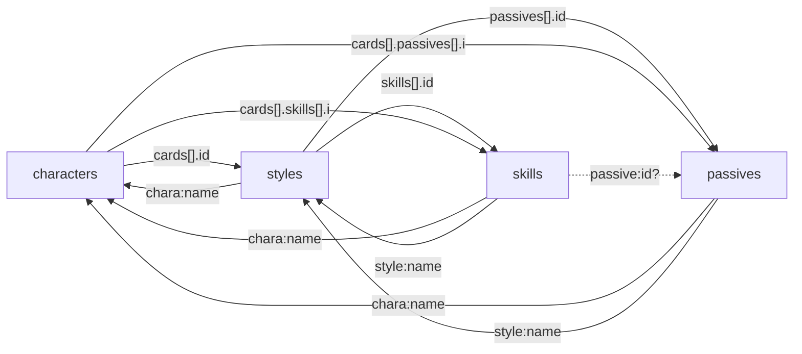

# Relation Map

## Join Candidates (主候補/副候補)

| level | from | to | containment | jaccard | intersection | from_cardinality | to_cardinality |
|---|---|---|---:|---:|---:|---:|---:|
| primary | characters.json:root.cards.[].id | styles.json:root.id | 100.00% | 100.00% | 339 | 339 | 339 |
| primary | characters.json:root.cards.[].name | styles.json:root.name | 100.00% | 100.00% | 339 | 339 | 339 |
| primary | characters.json:root.cards.[].name | skills.json:root.style | 100.00% | 100.00% | 339 | 339 | 339 |
| primary | characters.json:root.cards.[].name | passives.json:root.style | 100.00% | 100.00% | 339 | 339 | 339 |
| primary | characters.json:root.team | styles.json:root.team | 100.00% | 100.00% | 10 | 10 | 10 |
| primary | styles.json:root.id | characters.json:root.cards.[].id | 100.00% | 100.00% | 339 | 339 | 339 |
| primary | styles.json:root.name | characters.json:root.cards.[].name | 100.00% | 100.00% | 339 | 339 | 339 |
| primary | styles.json:root.name | skills.json:root.style | 100.00% | 100.00% | 339 | 339 | 339 |
| primary | styles.json:root.name | passives.json:root.style | 100.00% | 100.00% | 339 | 339 | 339 |
| primary | styles.json:root.chara | skills.json:root.chara | 100.00% | 100.00% | 57 | 57 | 57 |
| primary | styles.json:root.chara | passives.json:root.chara | 100.00% | 100.00% | 57 | 57 | 57 |
| primary | styles.json:root.team | characters.json:root.team | 100.00% | 100.00% | 10 | 10 | 10 |
| primary | skills.json:root.chara | styles.json:root.chara | 100.00% | 100.00% | 57 | 57 | 57 |
| primary | skills.json:root.chara | passives.json:root.chara | 100.00% | 100.00% | 57 | 57 | 57 |
| primary | skills.json:root.style | characters.json:root.cards.[].name | 100.00% | 100.00% | 339 | 339 | 339 |
| primary | skills.json:root.style | styles.json:root.name | 100.00% | 100.00% | 339 | 339 | 339 |
| primary | skills.json:root.style | passives.json:root.style | 100.00% | 100.00% | 339 | 339 | 339 |
| primary | skills.json:root.team | passives.json:root.team | 100.00% | 100.00% | 10 | 10 | 10 |
| primary | passives.json:root.chara | styles.json:root.chara | 100.00% | 100.00% | 57 | 57 | 57 |
| primary | passives.json:root.chara | skills.json:root.chara | 100.00% | 100.00% | 57 | 57 | 57 |
| primary | passives.json:root.style | characters.json:root.cards.[].name | 100.00% | 100.00% | 339 | 339 | 339 |
| primary | passives.json:root.style | styles.json:root.name | 100.00% | 100.00% | 339 | 339 | 339 |
| primary | passives.json:root.style | skills.json:root.style | 100.00% | 100.00% | 339 | 339 | 339 |
| primary | passives.json:root.team | skills.json:root.team | 100.00% | 100.00% | 10 | 10 | 10 |
| primary | skills.json:root.id | styles.json:root.skills.[].id | 100.00% | 97.45% | 689 | 689 | 707 |
| primary | styles.json:root.chara | characters.json:root.name | 100.00% | 96.61% | 57 | 57 | 59 |
| primary | skills.json:root.chara | characters.json:root.name | 100.00% | 96.61% | 57 | 57 | 59 |
| primary | passives.json:root.chara | characters.json:root.name | 100.00% | 96.61% | 57 | 57 | 59 |
| primary | characters.json:root.cards.[].skills.[].i | skills.json:root.id | 100.00% | 86.07% | 593 | 593 | 689 |
| primary | characters.json:root.cards.[].skills.[].i | styles.json:root.skills.[].id | 100.00% | 83.88% | 593 | 593 | 707 |
| primary | passives.json:root.skill.id | skills.json:root.id | 100.00% | 0.15% | 1 | 1 | 689 |
| primary | passives.json:root.skill.id | styles.json:root.skills.[].id | 100.00% | 0.14% | 1 | 1 | 707 |
| primary | styles.json:root.passives.[].id | characters.json:root.cards.[].passives.[].i | 99.07% | 36.81% | 106 | 107 | 287 |
| secondary | styles.json:root.skills.[].id | skills.json:root.id | 97.45% | 97.45% | 689 | 707 | 689 |
| secondary | characters.json:root.name | styles.json:root.chara | 96.61% | 96.61% | 57 | 59 | 57 |
| secondary | characters.json:root.name | skills.json:root.chara | 96.61% | 96.61% | 57 | 59 | 57 |
| secondary | characters.json:root.name | passives.json:root.chara | 96.61% | 96.61% | 57 | 59 | 57 |
| secondary | characters.json:root.team | skills.json:root.team | 90.00% | 81.82% | 9 | 10 | 10 |
| secondary | characters.json:root.team | passives.json:root.team | 90.00% | 81.82% | 9 | 10 | 10 |
| secondary | styles.json:root.team | skills.json:root.team | 90.00% | 81.82% | 9 | 10 | 10 |
| secondary | styles.json:root.team | passives.json:root.team | 90.00% | 81.82% | 9 | 10 | 10 |
| secondary | skills.json:root.team | characters.json:root.team | 90.00% | 81.82% | 9 | 10 | 10 |
| secondary | skills.json:root.team | styles.json:root.team | 90.00% | 81.82% | 9 | 10 | 10 |
| secondary | passives.json:root.team | characters.json:root.team | 90.00% | 81.82% | 9 | 10 | 10 |
| secondary | passives.json:root.team | styles.json:root.team | 90.00% | 81.82% | 9 | 10 | 10 |
| secondary | skills.json:root.id | characters.json:root.cards.[].skills.[].i | 86.07% | 86.07% | 593 | 689 | 593 |
| candidate | styles.json:root.skills.[].id | characters.json:root.cards.[].skills.[].i | 83.88% | 83.88% | 593 | 707 | 593 |
| candidate | characters.json:root.cards.[].passives.[].i | styles.json:root.passives.[].id | 36.93% | 36.81% | 106 | 287 | 107 |

## Integrity Checks

| relation | level | child_total | child_unique | parent_unique | orphan_total | orphan_unique | joinable_rate | orphan_examples |
|---|---|---:|---:|---:|---:|---:|---:|---|
| styles.chara -> characters.name | primary | 339 | 57 | 59 | 0 | 0 | 100.00% |  |
| skills.chara -> characters.name | primary | 689 | 57 | 59 | 0 | 0 | 100.00% |  |
| passives.chara -> characters.name | primary | 734 | 57 | 59 | 0 | 0 | 100.00% |  |
| skills.style -> styles.name | primary | 689 | 339 | 339 | 0 | 0 | 100.00% |  |
| passives.style -> styles.name | primary | 734 | 339 | 339 | 0 | 0 | 100.00% |  |
| characters.cards[].id -> styles.id | primary | 339 | 339 | 339 | 0 | 0 | 100.00% |  |
| styles.skills[].id -> skills.id | primary | 1266 | 707 | 689 | 25 | 18 | 98.03% | 46041401, 46041491, 46050201, 46050291, 46040101, 46040191, 46040201, 46040291, 46040301, 46040391 |
| styles.passives[].id -> passives.id | primary | 485 | 107 | 711 | 485 | 107 | 0.00% | 57000002, 57001081, 57001123, 57001143, 57001165, 57001264, 57001265, 57001302, 57001121, 57001153 |
| characters.cards[].skills[].i -> skills.id | secondary | 593 | 593 | 689 | 0 | 0 | 100.00% |  |
| characters.cards[].passives[].i -> passives.id | secondary | 734 | 287 | 711 | 734 | 287 | 0.00% | 57001021, 57001004, 57001002, 57001051, 57001016, 57001035, 57001027, 57001062, 57001081, 57001064 |
| skills.passive -> passives.id | secondary | 0 | 0 | 711 | 0 | 0 | 0.00% |  |
| passives.skill.id -> skills.id | secondary | 1 | 1 | 689 | 0 | 0 | 100.00% |  |

## Reference Consistency (重複/同名異ID)

| file | duplicate_ids | same_name_diff_id | duplicate_examples | same_name_diff_id_examples |
|---|---:|---:|---|---|
| characters.json | 0 | 0 |  |  |
| styles.json | 0 | 0 |  |  |
| skills.json | 0 | 9 |  | 通常攻撃:46001101/46001201/46001301/46001401/46001501/46001701/46002101/46002201/46002301/46002401/46002501/46002601/46003101/46003201/46003301/46003401/46003501/46003601/46004101/46004201/46004301/46004401/46004501/46004601/46005101/46005201/46005301/46005401/46005501/46005601/46006101/46006201/46006301/46006401/46006501/46006601/46007101/46007201/46007301/46007401/46007501/46007601/46008101/46008201/46008301/46008401/46008501/46008601; リカバー:46001104/46001702/46003204/46004403/46005402/46006602/46007102; 指揮行動:46001134/46002112/46004125/46007110/46041503; 追撃:46001191/46001291/46001391/46001491/46001591/46001791/46002191/46002291/46002391/46002491/46002591/46002691/46003191/46003291/46003391/46003491/46003591/46003691/46004191/46004291/46004391/46004491/46004591/46004691/46005191/46005291/46005391/46005491/46005591/46005691/46006191/46006291/46006391/46006491/46006591/46006691/46007191/46007291/46007391/46007491/46007591/46007691/46008191/46008291/46008391/46008491/46008591/46008691; クールダウン:46001205/46001308/46005103/46007504; エンハンス:46001402/46002402/46003603/46005202/46006402/46007302/46008202; フィルエンハンス:46001404/46002408/46003606/46005204; フィルリカバー:46001703/46004410/46005404/46007104/46008505; プロヴォーク:46002103/46003203 |
| passives.json | 23 | 77 | 100110800(2); 100111000(2); 100120900(2); 100150900(2); 100150903(2); 100210400(2); 100210800(2); 100220500(2); 100220700(2); 100310800(2) | 疾風:100110105/100120203/100310105/100530203/100550105/100550203/100720203/100760503/100830105/100860603; 堅忍:100110203/100110301/100210203/100250203/100320503/100440203/100610203/100740203/100840203/100840403; 勇猛:100110303/100130203/100150203/100310503/100330203/100350203/100450303/100460203/100630203/100650203/100850603; 閃光:100110401/100110501/100110701/100110801/100110901/100120301/100120401/100120501/100120701/100120801/100120901/100130301/100130501/100130601/100130701/100130801/100140301/100140401/100140501/100140601/100140801/100150301/100150401/100150501/100150701/100150801/100150901/100170301/100170501/100170601/100170701/100170801/100171001/100210301/100210401/100210501/100210801/100210901/100220301/100220401/100220501/100230301/100230401/100230601/100230701/100240301/100240401/100240601/100240701/100250301/100250401/100250501/100250601/100260301/100260401/100310301/100310401/100310601/100310701/100320301/100320401/100320601/100320701/100330301/100330401/100330501/100330601/100340301/100340401/100340501/100350301/100350401/100350501/100350601/100350701/100360301/100360401/100360501/100360601/100360701/100410301/100410401/100410601/100410701/100420301/100420401/100420501/100430301/100430401/100430501/100430701/100440301/100440401/100440601/100450301/100450401/100450501/100450701/100460301/100460501/100460601/100510301/100510401/100520301/100520501/100520601/100530301/100530401/100540301/100540501/100540701/100550301/100550401/100550501/100560301/100560501/100560601/100560701/100610301/100610401/100610601/100620301/100620501/100620601/100630301/100630401/100640301/100650301/100650401/100650501/100660301/100710301/100710401/100710601/100720301/100730301/100730401/100740301/100740401/100740501/100750301/100750401/100750501/100760301/100760401/100810301/100810501/100810601/100820301/100820401/100820501/100820701/100830301/100830401/100830701/100840301/100840501/100840601/100850301/100850401/100850501/100860301/100860401/100860501/100860701/101010301/101020301/102010301/102010401/102020301/102020401/102030301/102060301/102070301; 英雄の凱歌:100110403/100140403/100170503/100310403/100410303/100810303; 星空:100110503/100320303; 吉報:100110603/100170203/100360203/100440503/100510203/100520403/100540403/100560203/100620203/100720603/100820603/100860203/102040203; 雷の波動:100110700/100120500/100130800/100210400/100810300/100860400; 雷の強威:100110703/100260403/100410403/100850403; プレイボール:100111000/100220700/100450800 |

## Graph

