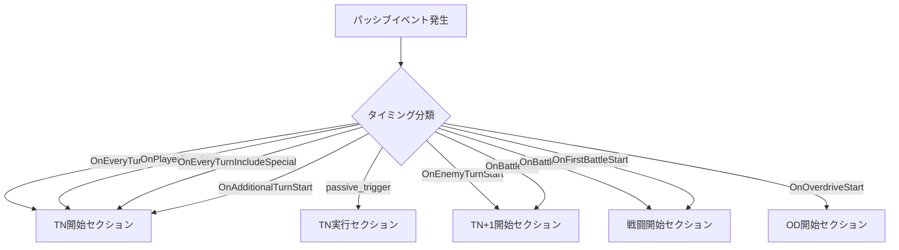

# パッシブログ出力機能 WBS (Work Breakdown Structure)

**作成日**: 2026年3月22日  
**対象バージョン**: ui-next（現在のメイン実装対象）  
**目的**: 全ターンにわたるパッシブ発火状況の可視化

---

## 1. 問題の概要

### 1.1 現象
- **1ターン目**: Passive Logウィンドウにパッシブの発火状況がテキスト出力される
- **2ターン目以降**: Passive Logウィンドウに出力されない

### 1.2 影響範囲
- ユーザーが2ターン目以降のパッシブ発火状況を確認できない
- デバッグやゲーム理解の観点で情報が不足する
- 旧UIと新UIの機能格差が発生している

---

## 2. 原因分析

### 2.1 技術的な根本原因

**ファイル**: `ui-next/utils/passive-debug-log.js`  
**関数**: `buildPassiveDebugLogRows`

現在の実装は以下のイベントのみを処理：
```javascript
const battleStartEvents = nextEvents.filter((event) => 
  battleStartTimings.includes(event.timing)
);
```

つまり：
- ✅ `OnBattleStart` イベントは処理される（1ターン目に表示）
- ❌ 2ターン目以降のイベント（`OnEveryTurn`, `OnPlayerTurnStart` 等）は無視される

### 2.2 旧UIと新UIの比較

| 項目 | 旧UI (ui/) | 新UI (ui-next/) |
|------|-----------|----------------|
| パッシブログ表示 | 全ターン表示 | 1ターン目のみ |
| 実装方式 | 毎ターンDOM生成 | 戦闘開始時のみ生成 |
| 更新タイミング | 各ターン終了後 | 戦闘開始時のみ |

---

## 3. 全パッシブタイミングの洗い出し

### 3.1 json/passives.json から抽出されたタイミング一覧

| タイミング名 | 発火タイミング | 分類 | 表示セクション |
|-------------|--------------|------|--------------|
| `None` | 条件付き発火 | アクション中 | 「T{N}実行」 |
| `OnEveryTurn` | 毎ターン開始時 | ターン開始 | 「T{N}開始」 |
| `OnEveryTurnIncludeSpecial` | 毎ターン（特殊状態含む） | ターン開始 | 「T{N}開始」 |
| `OnPlayerTurnStart` | プレイヤーターン開始時 | ターン開始 | 「T{N}開始」 |
| `OnAdditionalTurnStart` | EXターン開始時 | ターン開始 | 「T{N}開始」 |
| `OnEnemyTurnStart` | 敵ターン開始時 | ターン境界 | 「T{N+1}開始」 |
| `OnBattleStart` | 戦闘開始時 | 戦闘開始 | 「戦闘開始」 |
| `OnFirstBattleStart` | 最初の戦闘開始時 | 戦闘開始 | 「戦闘開始」 |
| `OnOverdriveStart` | OD開始時 | OD開始 | 「OD開始」 |
| `OnBattleWin` | 戦闘勝利時 | ターン境界 | 「戦闘終了」 |

### 3.2 タイミング分類定義

```javascript
// ターン開始イベント（各ターンの最初に表示）
const TURN_START_TIMINGS = [
  'OnEveryTurn',
  'OnEveryTurnIncludeSpecial',
  'OnPlayerTurnStart',
  'OnAdditionalTurnStart'
];

// アクション中イベント（sourceフィールドで識別）
const ACTION_TIMINGS = ['passive_trigger'];

// ターン境界イベント（ターン終了時のイベント）
const BOUNDARY_TIMINGS = ['OnEnemyTurnStart', 'OnBattleWin'];

// 戦闘開始イベント
const BATTLE_START_TIMINGS = ['OnBattleStart', 'OnFirstBattleStart'];

// OD開始イベント
const OD_START_TIMINGS = ['OnOverdriveStart'];
```

---

## 4. 解決策の設計

### 4.1 表示フローの再設計



### 4.2 セクション定義

| セクション名 | 説明 | 表示タイミング |
|-------------|------|--------------|
| 「戦闘開始」 | 戦闘開始時に発火するパッシブ | ターン1の前に表示 |
| 「T{N}開始」 | ターンN開始時に発火するパッシブ | ターンNの前に表示 |
| 「T{N}実行」 | ターンN実行中に発火するパッシブ | スキル実行後に表示 |
| 「T{N+1}開始」 | ターンN終了時に発火するパッシブ | ターンN終了後に表示 |
| 「OD開始」 | OD開始時に発火するパッシブ | OD開始時に表示 |
| 「戦闘終了」 | 戦闘終了時に発火するパッシブ | 戦闘終了時に表示 |

---

## 5. WBS (Work Breakdown Structure)

### 5.1 フェーズ1: 実装設計（完了済み）

- [x] パッシブログの現在の実装方法を調査
- [x] 1ターン目のみ表示される原因を特定
- [x] 旧UIと新UIの実装の違いを把握
- [x] 新UIで2ターン目以降のパッシブイベントが表示されない原因を特定
- [x] 解決策の設計：タイミングに基づく正確な分類フローを策定
- [x] json/passives.jsonから実際のタイミングを抽出して分類を確認
- [x] 既存の関連ドキュメントを確認

### 5.2 フェーズ2: 実装（未着手）

#### タスク2.1: タイミング定数の定義
- [ ] `ui-next/utils/passive-debug-log.js` にタイミング定数を追加
  - [ ] `TURN_START_TIMINGS` 定数の定義
  - [ ] `ACTION_TIMINGS` 定数の定義
  - [ ] `BOUNDARY_TIMINGS` 定数の定義
  - [ ] `BATTLE_START_TIMINGS` 定数の定義（既存）
  - [ ] `OD_START_TIMINGS` 定数の定義
  - [ ] 定数の `Object.freeze` による不変化

#### タスク2.2: buildPassiveDebugLogRows関数の修正
- [ ] 現在の実装を確認
- [ ] ターン開始イベントのフィルタリングロジックを追加
  - [ ] `OnEveryTurn` イベントを抽出
  - [ ] `OnEveryTurnIncludeSpecial` イベントを抽出
  - [ ] `OnPlayerTurnStart` イベントを抽出
  - [ ] `OnAdditionalTurnStart` イベントを抽出
- [ ] アクション中イベントのフィルタリングロジックを追加
  - [ ] `source: 'passive_trigger'` イベントを抽出
- [ ] ターン境界イベントのフィルタリングロジックを追加
  - [ ] `OnEnemyTurnStart` イベントを抽出
  - [ ] `OnBattleWin` イベントを抽出
- [ ] OD開始イベントのフィルタリングロジックを追加
  - [ ] `OnOverdriveStart` イベントを抽出
- [ ] 各イベントグループのセクションヘッダーを作成
- [ ] イベントリストのソート順序を調整

#### タスク2.3: イベントグループの統合
- [ ] 全てのイベントグループを統合
- [ ] ターン順序を保持しつつ、セクションでグループ化
- [ ] 重複排除ロジックの確認（必要な場合）
- [ ] 空のセクションを非表示にするオプションの検討

#### タスク2.4: UI表示の調整
- [ ] 各セクションの表示形式を確認
- [ ] ターン番号の正確な表示（T1, T2, ...）
- [ ] 長いパッシブ名の表示調整
- [ ] スクロール位置の最適化（最新のイベントにフォーカス）

### 5.3 フェーズ3: テスト（未着手）

#### タスク3.1: 単体テスト
- [ ] 各タイミング定数が正しい値を持つことを確認
- [ ] `buildPassiveDebugLogRows` 関数の出力をテスト
  - [ ] `OnEveryTurn` イベントが正しくフィルタリングされる
  - [ ] `OnEveryTurnIncludeSpecial` イベントが正しくフィルタリングされる
  - [ ] `OnPlayerTurnStart` イベントが正しくフィルタリングされる
  - [ ] `OnAdditionalTurnStart` イベントが正しくフィルタリングされる
  - [ ] `passive_trigger` イベントが正しくフィルタリングされる
  - [ ] `OnEnemyTurnStart` イベントが正しくフィルタリングされる
  - [ ] `OnBattleWin` イベントが正しくフィルタリングされる
  - [ ] `OnBattleStart` イベントが正しくフィルタリングされる
  - [ ] `OnFirstBattleStart` イベントが正しくフィルタリングされる
  - [ ] `OnOverdriveStart` イベントが正しくフィルタリングされる

#### タスク3.2: 統合テスト
- [ ] シンプルな1ターンシナリオ
  - [ ] 戦闘開始パッシブが表示される
  - [ ] ターン1開始パッシブが表示される
- [ ] 3ターンシナリオ
  - [ ] ターン1のパッシブが正しく表示される
  - [ ] ターン2のパッシブが正しく表示される
  - [ ] ターン3のパッシブが正しく表示される
- [ ] EXターンを含むシナリオ
  - [ ] EXターン開始パッシブが表示される
- [ ] ODを含むシナリオ
  - [ ] OD開始パッシブが表示される
- [ ] 複数のパッシブが同時に発火するシナリオ
  - [ ] 全てのパッシブが正しく表示される
  - [ ] 表示順序が適切である

#### タスク3.3: 実データテスト
- [ ] 実際のキャラクターパッシブを確認
  - [ ] 「閃光」パッシブ（茅森月歌）: OnEveryTurn
  - [ ] 「先陣」パッシブ: OnBattleStart
  - [ ] その他のパッシブ
- [ ] 実戦闘データとの照合
  - [ ] パッシブ発火のタイミングが正しい
  - [ ] パッシブの効果が正しい
- [ ] エッジケースの確認
  - [ ] 条件付きパッシブ（IsFront等）の表示
  - [ ] 複数の条件を持つパッシブの表示

### 5.4 フェーズ4: ドキュメント更新（未着手）

#### タスク4.1: 技術ドキュメント
- [ ] `ui-next/utils/passive-debug-log.js` のJSDocを更新
  - [ ] 関数の説明を更新
  - [ ] タイミング定数の説明を追加
  - [ ] 返り値の構造を説明
- [ ] パッシブタイミングの仕様ドキュメントを更新
  - [ ] `docs/active/passive_timing_reference.md` に新しいタイミング情報を追加
  - [ ] 表示ロジックの説明を追加

#### タスク4.2: ユーザードキュメント
- [ ] ヘルプマニュアルにパッシブログの説明を追加
  - [ ] 各セクションの意味
  - [ ] タイミングの解説
  - [ ] 使用例

### 5.5 フェーズ5: コードレビューとリファクタリング（未着手）

#### タスク5.1: コードレビュー
- [ ] 実装コードのレビュー
  - [ ] コードの一貫性
  - [ ] 命名規則
  - [ ] コメントの品質
- [ ] テストコードのレビュー
  - [ ] カバレッジ
  - [ ] テストケースの網羅性

#### タスク5.2: リファクタリング
- [ ] 重複コードの削除
- [ ] 関数の分割（必要な場合）
- [ ] パフォーマンスの最適化（必要な場合）
- [ ] 型定義の追加（TypeScript移行を考慮）

### 5.6 フェーズ6: リリース準備（未着手）

#### タスク6.1: リリースノート作成
- [ ] 変更点のまとめ
- [ ] 新機能の説明
- [ ] 既知の問題（あれば）
- [ ] 互換性情報

#### タスク6.2: リリース確認
- [ ] 全てのテストがパスする
- [ ] ドキュメントが更新されている
- [ ] コードレビューが完了している
- [ ] マージ先のブランチで動作確認

---

## 6. 技術的な詳細

### 6.1 実装方針

```javascript
// ui-next/utils/passive-debug-log.js

// タイミング定数
const TURN_START_TIMINGS = Object.freeze([
  'OnEveryTurn',
  'OnEveryTurnIncludeSpecial',
  'OnPlayerTurnStart',
  'OnAdditionalTurnStart'
]);

const ACTION_TIMINGS = Object.freeze(['passive_trigger']);

const BOUNDARY_TIMINGS = Object.freeze([
  'OnEnemyTurnStart',
  'OnBattleWin'
]);

const BATTLE_START_TIMINGS = Object.freeze([
  'OnBattleStart',
  'OnFirstBattleStart'
]);

const OD_START_TIMINGS = Object.freeze(['OnOverdriveStart']);

// フィルタリングロジック
const turnStartEvents = nextEvents.filter((event) => 
  TURN_START_TIMINGS.includes(event.timing)
);

const actionEvents = nextEvents.filter((event) => 
  ACTION_TIMINGS.includes(event.source)
);

const boundaryEvents = nextEvents.filter((event) => 
  BOUNDARY_TIMINGS.includes(event.timing)
);

const battleStartEvents = nextEvents.filter((event) => 
  BATTLE_START_TIMINGS.includes(event.timing)
);

const odStartEvents = nextEvents.filter((event) => 
  OD_START_TIMINGS.includes(event.timing)
);

// セクション作成
const sections = [];

if (battleStartEvents.length > 0) {
  sections.push({
    title: '戦闘開始',
    events: battleStartEvents
  });
}

// ターンごとのセクション作成
for (let turn = 1; turn <= maxTurn; turn++) {
  const turnEvents = turnStartEvents.filter(e => e.turn === turn);
  const actionEventsForTurn = actionEvents.filter(e => e.turn === turn);
  const boundaryEventsForTurn = boundaryEvents.filter(e => e.turn === turn);
  
  if (turnEvents.length > 0) {
    sections.push({
      title: `T${turn}開始`,
      events: turnEvents
    });
  }
  
  if (actionEventsForTurn.length > 0) {
    sections.push({
      title: `T${turn}実行`,
      events: actionEventsForTurn
    });
  }
  
  if (boundaryEventsForTurn.length > 0) {
    sections.push({
      title: `T${turn + 1}開始`,
      events: boundaryEventsForTurn
    });
  }
}

if (odStartEvents.length > 0) {
  sections.push({
    title: 'OD開始',
    events: odStartEvents
  });
}
```

### 6.2 既知の制約事項

1. **イベントの順序**: イベントの発生順序は `passive_events` 配列の順序に依存
2. **タイミングの重複**: 複数のタイミングで同じパッシブが発火する場合、重複して表示される可能性
3. **パフォーマンス**: 大量のパッシブイベントがある場合、表示が遅くなる可能性
4. **条件付きパッシブ**: 条件によって発火しないパッシブは、ロジック上は存在するが表示されない

---

## 7. スケジュールの見積もり

| フェーズ | 見積もり時間 | 依存関係 |
|---------|------------|---------|
| フェーズ1: 実装設計 | 完了済み | - |
| フェーズ2: 実装 | 2-3時間 | フェーズ1 |
| フェーズ3: テスト | 2-3時間 | フェーズ2 |
| フェーズ4: ドキュメント更新 | 1-2時間 | フェーズ2 |
| フェーズ5: コードレビュー | 1-2時間 | フェーズ3,4 |
| フェーズ6: リリース準備 | 1時間 | フェーズ5 |
| **合計** | **8-13時間** | - |

---

## 8. リスクと軽減策

| リスク | 影響 | 軽減策 |
|-------|------|--------|
| タイミング定義の誤り | 高 | 実データとの照合テストを実施 |
| パフォーマンスの悪化 | 中 | 大量のイベントを含むテストケースを作成 |
| 既存機能への影響 | 中 | リグレッションテストを実施 |
| ドキュメントの不整合 | 低 | コードとドキュメントの同期を維持 |

---

## 9. 成功基準

### 9.1 機能要件
- ✅ 全てのパッシブタイミングが正しく表示される
- ✅ 2ターン目以降のパッシブイベントが表示される
- ✅ 各セクションが適切なタイミングで表示される

### 9.2 非機能要件
- ✅ パフォーマンスが悪化しない（3秒以内に表示完了）
- ✅ UIが使いやすい（直感的なセクション分け）
- ✅ コードが保守可能（適切な抽象化とドキュメント）

### 9.3 品質要件
- ✅ 全てのテストがパスする
- ✅ コードレビューが承認される
- ✅ ドキュメントが完全である

---

## 10. 付録

### 10.1 関連ファイル
- `ui-next/utils/passive-debug-log.js`: 主要な実装ファイル
- `json/passives.json`: パッシブデータ
- `docs/active/passive_timing_bug_analysis_20260321.md`: 関連するバグ分析レポート
- `docs/active/passive_timing_reference.md`: パッシブタイミングの参考ドキュメント

### 10.2 関連コミット
- TBD（実装後に更新）

### 10.3 用語集
- **パッシブタイミング**: パッシブスキルが発火するタイミング（OnEveryTurn等）
- **セクション**: パッシブログの表示グループ（戦闘開始、T1開始等）
- **イベント**: 個々のパッシブ発火レコード

---

**WBS終了**