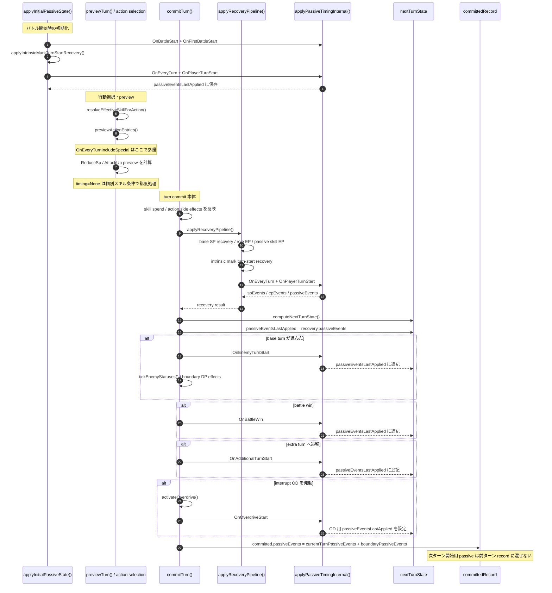

# Passive Timing Reference

> **ステータス**: 🟢 進行中 | 📅 最終更新: 2026-03-08

## 1. 今回の修正が場当たりではない理由

- `commitTurn()` の `committedRecord.passiveEvents` を、`state.turnState.passiveEventsLastApplied` と boundary で新規発火した passive に限定しました。
- これにより T1 の `committedRecord` に T2 開始時の `OnEveryTurn` / `OnPlayerTurnStart` が逆流しなくなります。
- つまりテスト期待値だけを変えたのではなく、`src/turn/turn-controller.js` の記録責務を修正しています。

## 2. `passives.json` に存在する timing 一覧

| timing | 件数 | Desc から読める日本語説明 | 現在コードでの主な評価入口 | 代表例 |
| --- | ---: | --- | --- | --- |
| None | 1 | ターン境界ではなく、個別の行動・スキル条件に連動して評価される即時系。 | 個別処理で都度参照。汎用の `applyPassiveTimingInternal()` 境界には乗らない。 | 湯めぐり(100640500) |
| OnFirstBattleStart | 108 | 初戦開始時に一度だけ評価され、その後は戦闘をまたいで保持される常設寄りの付与が多い。 | `applyInitialPassiveState()` -> `applyPassiveTimingInternal(BATTLE_START_PASSIVE_TIMINGS)` | 雷の波動(100110700), 即応の型(100110804), プレイボール(100111000) |
| OnBattleStart | 84 | 各バトル開始時に評価される。1戦ごとに入り直す初動バフ・初期SP付与。 | `applyInitialPassiveState()` -> `applyPassiveTimingInternal(BATTLE_START_PASSIVE_TIMINGS)` | 疾風(100110105), 疾風(100120203), 烈風(100120603) |
| OnEveryTurn | 290 | 通常ターンの開始処理で評価される。SP/DP/ODの自動回復や継続的な付与。 | `applyInitialPassiveState()` と `applyRecoveryPipeline()` -> `applyPassiveTimingInternal(TURN_START_PASSIVE_TIMINGS)` | 閃光(100110401), 閃光(100110501), 吉報(100110603) |
| OnPlayerTurnStart | 198 | 行動開始時に評価される。攻撃前提の火力条件や行動選択時に効くバフ。 | `applyInitialPassiveState()` と `applyRecoveryPipeline()` -> `applyPassiveTimingInternal(TURN_START_PASSIVE_TIMINGS)` | 勇猛(100110303), 英雄の凱歌(100110403), 星空(100110503) |
| OnEnemyTurnStart | 31 | 敵行動開始境界で評価される。防御系・被弾前提の備え。 | `commitTurn()` で base turn が進んだときに `applyPassiveTimingInternal("OnEnemyTurnStart")` | 堅忍(100110203), 堅忍(100110301), 不屈の魂(100111000) |
| OnAdditionalTurnStart | 10 | 追加ターンへ入る瞬間に評価される。EX専用のSP軽減や補助。 | `commitTurn()` / `grantExtraTurn()` で `applyPassiveTimingInternal("OnAdditionalTurnStart")` | クイックリキャスト(100330503), アフターサービス(100360700), 優美なる剣舞(100410703) |
| OnOverdriveStart | 9 | OD発動時に評価される。OD突入直後の強化やSP補充。 | `activateOverdrive()` 内で EP 付与後に passive event を記録 | 専心(100260203), 専心(100450203), 専心(100510303) |
| OnBattleWin | 4 | 勝利確定時に評価される。戦闘後リソース回復。 | `commitTurn()` で敵全滅を検知したときに `applyPassiveTimingInternal("OnBattleWin")` | 勝利のカリーを食べましょう(100840600), おかわりもどうぞ(100840603), 愛情の料理(100860700) |
| OnEveryTurnIncludeSpecial | 5 | 通常 turn-start ではなく、行動選択時の消費SP補正や preview modifier で参照される特殊系。 | `resolveEffectiveSkillForAction()` と `previewActionEntries()` から `resolvePassiveReduceSpForMember()` / `resolvePassiveAttackUpForMember()` を参照 | 絶唱(100110903), ポジショニング(100150800), 勇姿(100720700) |

## 3. 実装上の時系列

## 4. timing ごとの補足

- `OnEveryTurn` と `OnPlayerTurnStart` は、現実装では同じ `TURN_START_PASSIVE_TIMINGS` 配列でまとめて処理されています。json 上の名称差はありますが、コード上は同じ turn-start pipeline に乗ります。
- `OnEveryTurnIncludeSpecial` は turn-start pipeline には入っていません。SP 消費軽減や preview modifier のような行動選択時効果を読むための別系統です。
- `None` は timing 境界イベントではなく、個別のスキル条件・追加効果判定で参照されるデータです。
- `OnFirstBattleStart` には Desc が `初戦開始時` ではなく `常時` や `スキル使用後` と書かれているものも含まれます。json の timing は「発火そのもの」より「戦闘開始時に登録・常設化するカテゴリ」として扱う方が実態に近いです。

## 5. condition 一覧（raw, unique）

- unique 条件数は `63`、空 condition を含めると `64` パターンです。
- ここでは whitespace 差もそのまま残しています。データ上は別文字列なので、将来正規化するなら別途判断が必要です。

| condition | 件数 | timing | 代表例 |
| --- | ---: | --- | --- |
| `(empty)` | 155 | OnAdditionalTurnStart, OnBattleStart, OnBattleWin, OnEnemyTurnStart, OnEveryTurn, OnFirstBattleStart, OnOverdriveStart, OnPlayerTurnStart | 雷の波動(100110700), 即応の型(100110804) |
| `ConquestBikeLevel()>=80` | 1 | OnPlayerTurnStart | 自慢のフロートバイク(101020300) |
| `ConsumeSp()<=8` | 1 | None | 湯めぐり(100640500) |
| `CountBC(IsDead()==0 && IsPlayer()==0 && BreakDownTurn()>0)>0` | 3 | OnPlayerTurnStart | まな板の鯉(100560700), チャンス(100810600) |
| `CountBC(IsDead()==0 && IsPlayer()==0 && BreakDownTurn()>0)>0 && IsFront()` | 1 | OnPlayerTurnStart | マッドサイエンティスト(100310700) |
| `CountBC(IsDead()==0 && IsPlayer()==0&&BreakDownTurn()>0)>0` | 2 | OnEveryTurnIncludeSpecial, OnPlayerTurnStart | ポジショニング(100150800), うなぎのぼり(100560703) |
| `CountBC(IsDead()==0 && IsPlayer()==0&&BreakDownTurn()>0)>0 && IsFront()` | 1 | OnPlayerTurnStart | 目覚めの一曲(102070303) |
| `CountBC(IsPlayer() && SpecialStatusCountByType(124)>0)>0` | 1 | OnEveryTurn | イノセント・ヴェール(100860503) |
| `CountBC(IsPlayer() && SpecialStatusCountByType(155) > 0)>0` | 3 | OnEveryTurn | いざ進軍！(100310801), いざ進軍！(100310903) |
| `CountBC(IsPlayer() && SpecialStatusCountByType(155) >= 1)>=6` | 2 | OnEveryTurn | 魔王軍の大攻勢！(100310804), 世界征服の始まりでゲス！(100340604) |
| `CountBC(IsPlayer() && SpecialStatusCountByType(25) > 0)>0` | 1 | OnEveryTurnIncludeSpecial | 勇姿(100720700) |
| `CountBC(IsPlayer() && SpecialStatusCountByType(79)>0)>0` | 1 | OnEveryTurn | 脱出術(100650500) |
| `CountBC(IsPlayer() && Token()>3)>0` | 1 | OnEveryTurn | 勝勢(100410801) |
| `CountBC(IsPlayer() &&IsNatureElement(Fire)==1)>=3` | 3 | OnBattleStart, OnFirstBattleStart | 火炎の護り(100210500), 火炎の極意(100220400) |
| `CountBC(IsPlayer() &&IsNatureElement(Ice)==1)>=4` | 1 | OnEveryTurn | ハロウィンナイト(100171003) |
| `CountBC(IsPlayer() &&IsNatureElement(Light)==1)>=3` | 1 | OnFirstBattleStart | 光転(100640400) |
| `CountBC(IsPlayer()==0 && IsDead()==0 && IsBroken() == 1)>0` | 1 | OnEveryTurn | アルゴリズム(100120904) |
| `CountBC(IsPlayer()==0&&IsDead()==0&&IsBroken()==1&&DamageRate()>=200.0)>0` | 2 | OnEveryTurn, OnPlayerTurnStart | ラストリゾート(100310703), 戦機(100620500) |
| `CountBC(IsPlayer()==1&&IsAttackNormal()==0 && ConsumeSp()<=8)>0` | 2 | OnPlayerTurnStart | お前達、やっておしまい！(100310803), 悪の軍団は最強でゲス！(100340601) |
| `CountBC(IsPlayer()==1&&IsAttackNormal()==0 && ConsumeSp()>=15)>0` | 1 | OnPlayerTurnStart | 胸の高鳴り(100710603) |
| `CountBC(MotivationLevel() >= 4) > 0` | 2 | OnPlayerTurnStart | スペシャルタッグ(100111003), スペシャルタッグ(100220703) |
| `DpRate()<=0.3 && IsFront()` | 1 | OnPlayerTurnStart | 陽動作戦(102030210) |
| `DpRate()<=0.5` | 1 | OnPlayerTurnStart | 破滅願望(100530400) |
| `DpRate()<=0.5 && IsFront()` | 17 | OnEnemyTurnStart, OnEveryTurn, OnPlayerTurnStart | 忍耐(100170105), 忍耐(100170903) |
| `DpRate()==0.0 && IsFront()` | 12 | OnEnemyTurnStart, OnEveryTurn, OnPlayerTurnStart | 堅忍(100110203), 堅忍(100110301) |
| `DpRate()>=0.5 && IsFront()` | 8 | OnPlayerTurnStart | 勇気(100120105), 勇気(100220105) |
| `DpRate()>=0.8 && IsFront()` | 9 | OnPlayerTurnStart | 雷の采配(100170603), 壮烈(100350303) |
| `DpRate()>=0.8 && IsFront()==0` | 1 | OnPlayerTurnStart | 光の応援(100640403) |
| `DpRate()>=1.0 && IsFront()` | 14 | OnEnemyTurnStart, OnPlayerTurnStart | 勇猛(100110303), 勇猛(100130203) |
| `DpRate()>=1.01` | 1 | OnEveryTurn | 旺盛(100720501) |
| `DpRate()>1.495` | 1 | OnEveryTurn | 気分爽快(100850503) |
| `Ep()>=10` | 1 | OnEveryTurnIncludeSpecial | トルクマキシマム(101020304) |
| `FireMarkLevel()>=6` | 1 | OnEveryTurn | 猛火の進撃(100430703) |
| `IceMarkLevel()>=6` | 1 | OnEveryTurn | 氷嵐の進撃(100210903) |
| `IsAttackNormal()==0 && ConsumeSp()<=8` | 1 | OnPlayerTurnStart | 静かなプレッシャー(100360703) |
| `IsBroken()==0` | 1 | OnFirstBattleStart | メイクアップ(100620600) |
| `IsFront()` | 407 | OnBattleStart, OnEnemyTurnStart, OnEveryTurn, OnOverdriveStart, OnPlayerTurnStart | 疾風(100110105), 閃光(100110401) |
| `IsFront() && CountBC(IsPlayer() && SpecialStatusCountByType(124)>0)>0` | 1 | OnEveryTurn | エンゲージリンク(100860500) |
| `IsFront() && IsAttackNormal()==0 && ConsumeSp()<=8` | 4 | OnPlayerTurnStart | クイックショット(100220603), 無常風(100330603) |
| `IsFront() == 0` | 1 | OnEveryTurn | きまぐれエール(100640603) |
| `IsFront()&&CountBC(IsPlayer()==0&&IsDead()==0&&SpecialStatusCountByType(12)>0)>0\|\|CountBC(IsPlayer()==0&&IsDead()==0&&SpecialStatusCountByType(57)>0)>0` | 2 | OnPlayerTurnStart | 鋭気(100440403), 鋭気(100610403) |
| `IsFront()==0` | 10 | OnBattleStart, OnEveryTurn | 後方救護(100240603), 死霊の囁き(100330600) |
| `IsReinforcedMode()` | 1 | OnPlayerTurnStart | 鬼道(101010300) |
| `IsTerritory(ReviveTerritory)==1` | 2 | OnEveryTurn, OnEveryTurnIncludeSpecial | 方円(100820700), 鋒矢(100820703) |
| `IsZone(Fire)==1` | 1 | OnEveryTurn | インパスト(100520500) |
| `MoraleLevel()>=6` | 2 | OnPlayerTurnStart | 夢中(100210800), 武運長久(100210800) |
| `MoraleLevel()>=6 && IsFront()` | 2 | OnEveryTurn | みなぎる士気(100220610), みなぎる士気(100250500) |
| `MotivationLevel() == 5` | 2 | OnEnemyTurnStart | 不屈の魂(100111000), 明鏡止水(100220700) |
| `MotivationLevel() > 3` | 1 | OnEveryTurn | 怪童(100111001) |
| `MotivationLevel() >= 4` | 1 | OnEveryTurn | 球界の頭脳(100450803) |
| `OverDriveGauge() < 0` | 1 | OnEveryTurn | V字回復(100610603) |
| `OverDriveGauge() < 100` | 1 | OnEveryTurn | 奔走(100610600) |
| `PlayedSkillCount(MAikawaSkill54)>=1` | 1 | OnPlayerTurnStart | サイキックハイ(100130703) |
| `Random()<0.3 && IsFront()` | 4 | OnPlayerTurnStart | 野生の勘(100130503), 野生の勘(100230303) |
| `Sp()<=0` | 2 | OnEveryTurn, OnPlayerTurnStart | 春風(100830500), 好転(102060300) |
| `Sp()<=3 && IsFront()` | 10 | OnEveryTurn | 好機(100140105), 好機(100240503) |
| `Sp()>=10 && IsFront()` | 5 | OnPlayerTurnStart | 決意(100150603), 決意(100210105) |
| `Sp()>=15 && IsFront()` | 11 | OnPlayerTurnStart | 決心(100120303), 決心(100120503) |
| `SpecialStatusCountByType(122)>0 && IsFront()` | 1 | OnPlayerTurnStart | 演舞(100230403) |
| `SpecialStatusCountByType(144)>0` | 2 | OnEveryTurn, OnEveryTurnIncludeSpecial | レゾナンス(100110900), 絶唱(100110903) |
| `SpecialStatusCountByType(164)>0 && IsFront()` | 1 | OnPlayerTurnStart | 耽美(100620603) |
| `SpecialStatusCountByType(20)==0` | 1 | OnPlayerTurnStart | 二度咲き(100420500) |
| `SpecialStatusCountByType(25)>0` | 5 | OnEveryTurn | 充填(100720500), 広域充填(100720701) |
| `SpecialStatusCountByType(78)>0 && IsFront()` | 2 | OnPlayerTurnStart | 心眼の境地(100110800), 王の眼差し(100110800) |
