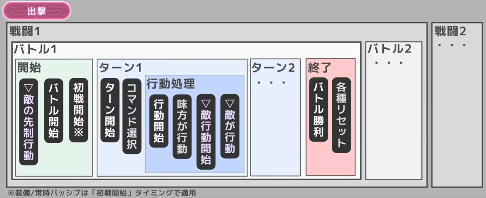

## 1. 【出撃】スコープ（最上位層）
編成を選択して出撃してから、終了（帰還）するまでの最も大きな枠組みです。この中に複数の「戦闘」が内包されます。

### 1-1. 【戦闘】スコープ
エンカウントからリザルト画面までの枠組みです。ダンジョン移動などを挟むと「戦闘2」へ移行します。1つの「戦闘」の中には、WAVEに相当する複数の「バトル」が内包されます。

#### 【バトル】スコープ（戦闘内のWAVE処理）
個々の敵グループとの戦闘処理です。このスコープ内で「開始」「ターン（ループ）」「終了」のフェーズが順に実行されます。

**① 開始フェーズ**
バトルに突入した直後の処理です。
* **▽敵の先制行動**：味方の処理より最優先で行われます。
    * *UI Next 実装注記: Enemy Setup の `Turn0(先制攻撃) > 開幕フィールド` は、このタイミングで `zoneState` に反映されます。*
* **バトル開始**：味方のバトル開始時スキルが処理されます。
* **初戦開始※**：1回の「戦闘」における1回目の「バトル（バトル1）」でのみ発生します。
    * *※装備／常時パッシブは「初戦開始」タイミングで適用されます。*

**② ターンフェーズ（ターン1, ターン2...）**
コマンド入力と実際の行動が行われるメインループです。
* **ターン開始**：ターン開始時の効果が処理されます。
* **コマンド選択**：プレイヤーによる入力受付状態です。
* **行動処理（サブブロック）**
    * **行動開始**：「行動開始」ボタンを押下した直後の処理です。
    * **味方が行動**：選択した味方のスキル等が実行されます。
    * **▽敵行動開始**：敵側の行動開始時処理です。
    * **▽敵が行動**：敵の実際の攻撃等が実行されます。

**③ 終了フェーズ**
そのバトル（WAVE）の敵を全滅させた際の処理です。
* **バトル勝利**：勝利時発動のスキル（回復など）が処理されます。
* **各種リセット**：OD回数などのリセットが行われます。ここを抜けると「バトル2」へ進むか、「戦闘」自体が終了します。

---

システムとして組む場合、この四角い枠組み（コンテナ）の包含関係と、左から右へ流れる発動タイミングをそのまま関数の呼び出し順やイベントのトリガーとして設計すると、処理の矛盾が起きにくくなります。

