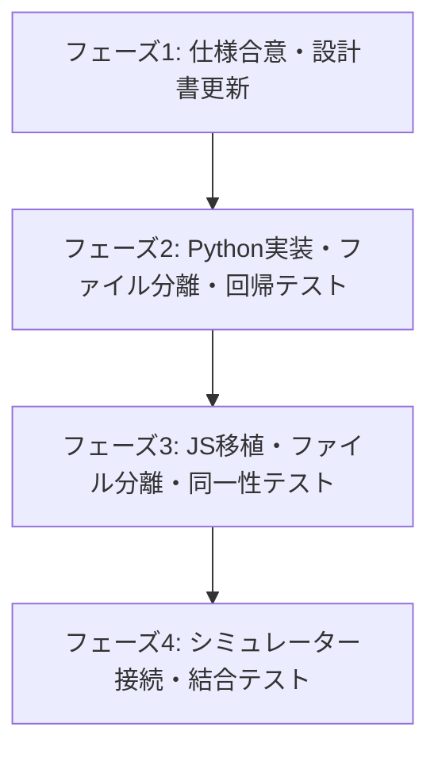

# 高度破壊率仕様 拡張設計書 & WBS (`docs/advanced_destruction_mechanics_spec.md`)

## 1. 概要と背景
本ドキュメントは、グラフィカル戦闘シミュレータ `hbr_battle_simulator` と戦闘計算エンジン `hbr_calc` を統合するにあたり、以下の高度な破壊率（Destruction Rate）関連アビリティ・装備効果を正しく連携・計算するためのインターフェース設計、現行実装とのギャップ分析、および実装に向けた WBS を定義するものです。

### 対象とする高度破壊率メカニクス
1. **ブラストピアスの装備有無と破壊率ボーナス**:
   - 装備有無による静的な補正（+15% = 0.15）に加え、将来の上位アクセサリーや動的なボーナス設定を許容するインターフェースの設計。
2. **共鳴スロットの共鳴アビリティの破壊率ボーナス**:
   - 共鳴アビリティ（例: 特定属性の破壊率上昇+10%など）によるパッシブな破壊率蓄積量上昇効果。
3. **超ブレイク/強ブレイクによる破壊率上限超越**:
   - 敵固有の破壊率上限値（通常は 300%〜450% 等）を一時的または恒常的に超越して蓄積できるアビリティ効果（例: 上限+100%など）。
4. **ナイトキルエッジ等のダメージ計算時の一時的破壊率上書き**:
   - 敵の「現在の内部的な破壊率」とは異なる「一時的にバフやアビリティ効果で引き上げられた破壊率」を用いてダメージ計算を行う仕様（ダメージ計算のみに適用され、実際の敵の破壊率は変動しない）。

---

## 2. アーキテクチャ設計：ダメージ計算と破壊率計算のソース分離

ダメージ計算と破壊率シミュレーションは、入力スキーマ、計算タイミング、アルゴリズムの責任範囲が完全に独立しています。コードの肥大化を防ぎ、保守性を高めるため、**ダメージ計算モジュールと破壊率計算モジュールを物理的にファイルを分けて分離・管理**します。

### 2.1 Python版 (`engine/` ディレクトリ配下)
共通のマスタデータロードや検索ユーティリティをベースクラスまたは共通モジュールに切り出し、それぞれ別個のエンジンクラスとして定義します。

* `engine/base_engine.py` (新規):
  - マスタデータ（styles, skills, enemies）の読み込み・キャッシュ
  - 共通ヘルパー関数（`_find_skill`, `_flatten_parts`, `resolve_effect_power` 等）
* `engine/damage_calc_engine.py` (既存から分離・縮小):
  - `DamageCalculatorEngine` クラス（`calculate_damage` のみを担当）
* `engine/destruction_calc_engine.py` (新規):
  - `DestructionCalculatorEngine` クラス（`calculate_destruction` のみを担当）

### 2.2 JavaScript/TypeScript版 (`src/domain/` ディレクトリ配下)
モジュール管理の容易化のため、共通のヘルパー関数群を別ファイルにエクスポートします。

* `src/domain/calculator-helpers.js` (新規):
  - `findSkill`, `flattenSkillParts`, `resolveEffectPower`, `toNumber` などの共通ロジック
* `src/domain/damage-calculator.js` (既存から分離・縮小):
  - `calculateDamage` 関数のみ（ダメージ計算を担当）
* `src/domain/destruction-calculator.js` (新規):
  - `calculateDestruction` 関数のみ（破壊率シミュレーションを担当）

---

## 3. インターフェース設計（データの洗い出し）

ゲームエンジン（シミュレーター側）と計算エンジン（`hbr_calc` 側）でやりとりするデータの拡張定義です。

### 3.1 ダメージ計算入力 (`DamageInputContext`) への拡張
ダメージ計算時に特定のスキル（ナイトキルエッジなど）が「現在の敵の破壊率とは異なる、アビリティ恩恵分を加算または上書きした一時的な破壊率」を用いてダメージを算出するためのパラメータを追加します。

- `defender.destructionRateOverride` (number, optional):
  - **説明**: アビリティやスキル効果等により上書きされた一時的なダメージ計算用破壊率（例: `4.5` = 450%）。
  - **動作ルール**: 指定がある場合、`defender.destructionRate` の代わりにこの値を使用してダメージの乗算を行います。

#### `DamageInputContext` スキーマ（抜粋）
```typescript
interface DamageInputContext {
  attacker: {
    // 既存のパラメータ
  };
  defender: {
    enemyId: number;
    destructionRate: number;         // 内部的な現在の敵の破壊率（例: 2.5 = 250%）
    destructionRateOverride?: number; // 【新規】アビリティ等により上書きされた一時的な計算用破壊率（例: 4.5 = 450%）
    // ...
  };
  // ...
}
```

### 3.2 破壊率計算入力 (`DestructionInputContext`) への拡張
破壊率蓄積シミュレーション時に、装備・アビリティ・超越効果を正確に反映させるためのパラメータを追加します。

- `attacker.accessoryDestructionRateBonus` (number, optional):
  - **説明**: アクセサリーによる破壊率上昇量ボーナス値（例: `0.15` = +15%）。
  - **動作ルール**: 未指定の場合は、従来の `attacker.accessories` 配列に `'BlastPierce'` または `'ブラストピアス'` が含まれているかどうかの文字列判定（`0.15`）にフォールバックします。
- `attacker.resonanceDestructionRateBonus` (number, optional):
  - **説明**: 共鳴アビリティ（共鳴スロット）による破壊率上昇量ボーナス（例: `0.10` = +10%）。
  - **動作ルール**: 最終基本破壊率の算出時に乗算因子として適用されます。
- `attacker.destructionLimitExceedBonus` (number, optional):
  - **説明**: 超ブレイク・強ブレイク等の上限超越効果による、破壊率上限の追加加算値（例: `1.0` = +100%）。
  - **動作ルール**: 敵固有の破壊上限値に加算された上で、シミュレーション時のクランプ処理の上限として適用されます。

#### `DestructionInputContext` スキーマ（抜粋）
```typescript
interface DestructionInputContext {
  attacker: {
    styleId: number;
    accessories?: Array<string>;
    accessoryDestructionRateBonus?: number; // 【新規】アクセサリーによる破壊率上昇量ボーナス値（例: 0.15 = +15%）
    resonanceDestructionRateBonus?: number; // 【新規】共鳴アビリティ（共鳴スロット）による破壊率上昇量ボーナス（例: 0.10 = +10%）
    destructionLimitExceedBonus?: number;   // 【新規】上限超越効果による、破壊率上限の追加加算値（例: 1.0 = +100%）
    statusEffects: Array<{
      statusType: 'DestructionUp';
      // ...
    }>;
  };
  defender: {
    enemyId: number;
    destructionRate: number;                // 攻撃開始前の実際の破壊率
    destructionLimit?: number;              // 敵の破壊上限値（未指定時はマスタ等から自動取得）
    dp: number;
    destructionResist?: number;
    destructionMultiplier?: number;
  };
  skill: {
    skillId: number | null;
    name: string;
    level?: number;
  };
  hits: Array<{
    damage: number;
    isMultiHit: boolean;
    hitRatio: number;
  }>;
}
```

### 3.3 破壊率計算出力 (`DestructionResult`) への拡張
計算内訳の透明性を担保するため、追加された補正因子の最終的な解決値を `breakdown` に含めて返却します。

- `breakdown.accessoryBonus` (number): 解決されたアクセサリー破壊率ボーナス値（例: `0.15`）
- `breakdown.resonanceBonus` (number): 解決された共鳴アビリティ破壊率ボーナス値（例: `0.10`）
- `breakdown.limitExceedBonus` (number): 解決された破壊上限超越ボーナス値（例: `1.0`）

#### `DestructionResult` スキーマ（抜粋）
```typescript
interface DestructionResult {
  destructionRate: number;      // 攻撃完了後の最終破壊率（倍率表記。例: 2.6905 = 269.05%）
  breakdown: {
    baseDestruction: number;       // バフ・ロール・アクセサリー・共鳴補正適用後の基本破壊率 ($D_{\text{base}}$)
    finalBaseDestruction: number;  // 最終基本破壊率（耐性適用後, $D_{\text{final\_base}}$）
    blasterCorrection: number;     // ブラスター補正（スロープ補正適用後の倍率補正。例: 2.0 = +200%）
    buffMultiplier: number;        // 破壊率バフの合計割合（例: 0.30 = +30%）
    accessoryBonus: number;        // 【新規】解決されたアクセサリーボーナス値（例: 0.15）
    resonanceBonus: number;        // 【新規】解決された共鳴アビリティボーナス値（例: 0.10）
    limitExceedBonus: number;      // 【新規】解決された破壊上限超越ボーナス値（例: 1.0）
    ignoredEffects: Array<{
      statusType: string;
      skillName: string;
      side: 'attacker' | 'defender' | 'context';
    }>;
  };
}
```

---

## 4. 現行実装の受容性調査とギャップ分析

現行の Python エンジン（`engine/damage_calc_engine.py`）および JS エンジン（`src/domain/damage-calculator.js`）の実装を基に、追加パラメータをどのように受け止め、計算に反映させるべきかの調査結果です。

### 4.1 一時的破壊率上書き (`destructionRateOverride`) の受容
- **影響を受ける関数**: `calculate_damage` (Python) / `calculateDamage` (JS)
- **変更ロジック (JS版での適用例)**:
  ```javascript
  // 変更前
  const destructionRate = toNumber(defender.destructionRate, 1.0);
  
  // 変更後
  const destructionRate = hasValue(defender.destructionRateOverride)
    ? toNumber(defender.destructionRateOverride, 1.0)
    : toNumber(defender.destructionRate, 1.0);
  ```
- **結論**: 非常に低い実装リスクで完全に受容可能です。

### 4.2 ブラストピアスの動的ボーナス (`accessoryDestructionRateBonus`) の受容
- **影響を受ける関数**: `calculate_destruction` (Python) / `calculateDestruction` (JS)
- **変更ロジック (Python版での適用例)**:
  ```python
  acc_bonus = attacker_data.get("accessoryDestructionRateBonus")
  if acc_bonus is not None:
      blaster_correction += float(acc_bonus)
  else:
      accs = attacker_data.get("accessories", [])
      if any(a in ["BlastPierce", "ブラストピアス"] for a in accs):
          blaster_correction += 0.15
  ```
- **結論**: 後方互換性を維持したまま、完全に受容可能です。

### 4.3 共鳴アビリティの破壊率ボーナス (`resonanceDestructionRateBonus`) の受容
- **影響を受ける関数**: `calculate_destruction` (Python) / `calculateDestruction` (JS)
- **変更ロジック (数式への反映)**:
  $$D_{\text{final\_base}} = D_{\text{base}} \times (1.0 - \text{destructionResist}) \times \text{destructionMultiplier} \times (1.0 + \text{resonanceDestructionRateBonus})$$
- **結論**: 計算モデルに新規の乗算因子として組み込むことで、現行設計を崩さずに綺麗に受容可能です。

### 4.4 破壊上限超越 (`destructionLimitExceedBonus`) の受容
- **影響を受ける関数**: `calculate_destruction` (Python) / `calculateDestruction` (JS)
- **変更ロジック (Python版での適用例)**:
  ```python
  limit_exceed = float(attacker_data.get("destructionLimitExceedBonus", 0.0))
  final_dest_limit = float(dest_limit) + limit_exceed
  ...
  destruction_rate = min(final_dest_limit, destruction_rate + add_i)
  ```
- **結論**: 上限クランプの直前にボーナスを加算するだけであり、アルゴリズムへの影響は極めて小さく、安全に受容可能です。

---

## 5. 段階的検証プロセスに基づく実装・検証 WBS

本拡張仕様を安全に開発・検証し、100%の信頼性を担保するための Work Breakdown Structure です。
本プロジェクトの「三段階の信頼性検証プロセス」に完全準拠して進めます。



### 📋 タスクリスト

#### 🔴 フェーズ1: 詳細設計と仕様合意（Level 1: Excel仕様確認・インターフェース決定）
- `[x]` **T4.1.1: ゲーム内「超ブレイク/強ブレイク」および「共鳴アビリティ」の計算方式の最終アサーション**
  - 共鳴アビリティの破壊率上昇が他のバフと加算か乗算であるか、超ブレイクの拡張上限がどのように適用されるかを再確認する。（※乗算枠、上限直接加算として確定）
- `[x]` **T4.1.2: インターフェース設計書の正式更新**
  - `docs/destruction_design_specification.md` および `docs/destruction_calculation_model.md` に、本拡張設計書（`docs/advanced_destruction_mechanics_spec.md`）の数式とスキーマ変更を反映・同期させる。

#### 🟡 フェーズ2: Pythonエンジンの拡張とファイル分離・Level 2 検証（Python信頼性 100%）
- `[x]` **T4.2.1: Pythonエンジンのファイル分離・整理**
  - 共通のマスタ処理・ヘルパー関数を `engine/base_engine.py` に切り出す。
  - ダメージ計算を `engine/damage_calc_engine.py`、破壊率計算を `engine/destruction_calc_engine.py` に分割。
- `[x]` **T4.2.2: Python版 `calculate_damage` への一時的破壊率上書きロジックの実装**
  - `destructionRateOverride` が指定されている場合に優先適用する条件分岐を追加。
- `[x]` **T4.2.3: Python版 `calculate_destruction` へのアクセサリー・共鳴・上限超越ロジックの実装**
  - `accessoryDestructionRateBonus`、`resonanceDestructionRateBonus`、`destructionLimitExceedBonus` を受け取り、数式とシミュレーションループに反映。`breakdown` への出力項目追加。
- `[x]` **T4.2.4: Python版拡張テストケースの作成と回帰テストの実行**
  - 対象ファイル: `tests/test_cases_destruction.json`、`tests/run_destruction_regression_tests.py` 等
  - 内容: 「ナイトキルエッジ一時上書き」「共鳴アビリティ乗算枠適用」「アクセサリーボーナス動的適用」「上限超越シミュレーション」を網羅したテストケースを記述し、Python側のテストを実行して全件パスを確認。

#### 🟢 フェーズ3: JSエンジンの拡張とファイル分離・Level 3 検証（JS同一性アサーション 100%）
- `[x]` **T4.3.1: JSエンジンのファイル分離・整理**
  - `src/domain/calculator-helpers.js` を新規作成し、共通のスキル検索・ステータス解決関数を切り出す。
  - ダメージ計算を `src/domain/damage-calculator.js`、破壊率計算を `src/domain/destruction-calculator.js` に分割。
  - 各呼び出し元インポートパスの調整。
- `[x]` **T4.3.2: JS版 `calculateDamage` への一時的破壊率上書きロジックの移植**
  - Python版と等価な `destructionRateOverride` 優先ロジックを実装。
- `[x]` **T4.3.3: JS版 `calculateDestruction` への拡張ロジックの移植**
  - Python版と等価なアクセサリー、共鳴、上限超越の各ロジックを移植し、`breakdown` に返却値を追加。
- `[x]` **T4.3.4: 拡張ランダムテストによる同一性の検証**
  - 対象ファイル: `tests/run_js_destruction_tests.mjs` 等の JS テストランナー
  - 内容: 追加されたパラメータをランダムに含めた巨大なテストデータセット（あるいは固定 fixture）を用い、PythonエンジンとJSエンジンの出力（最終破壊率、および `breakdown` の内訳値すべて）が完全に一致（差分がゼロ）することを確認する。

#### 🔵 フェーズ4: シミュレーター側との接続と統合（Level 4: UI・ドメイン統合）
- `[ ]` **T4.4.1: シミュレーター側からの新規パラメータのマッピング接続**
  - 対象ファイル: シミュレーター側のターン進行・バフ解決器等（`hbr_battle_simulator`）
  - 内容: 装備中のアクセサリーや共鳴スロットのアビリティ、適用中の超越アビリティを走査し、計算エンジンへ渡す `accessoryDestructionRateBonus`, `resonanceDestructionRateBonus`, `destructionLimitExceedBonus` を動的に組み立てて渡すようにマッピングを実装。
- `[ ]` **T4.4.2: シミュレーター側での一時的破壊率（ナイトキルエッジ等）の解決接続**
  - 対象ファイル: シミュレーター側のスキル発動・ダメージ計算呼び出し処理
  - 内容: ナイトキルエッジ等のスキル発動時、一時的破壊率を算出して `destructionRateOverride` に設定し、ダメージ計算を実行する処理を実装。
- `[ ]` **T4.4.3: 結合動作確認および Playwright 統合テストの実行**
  - 内容: シミュレーターのUI上で、上限超越（例: 通常300%の敵に400%まで蓄積）、一時的破壊率上書き、共鳴スロットの恩恵が正しく反映されるかを、ブラウザ上の動作確認および自動UIテストで検証。
