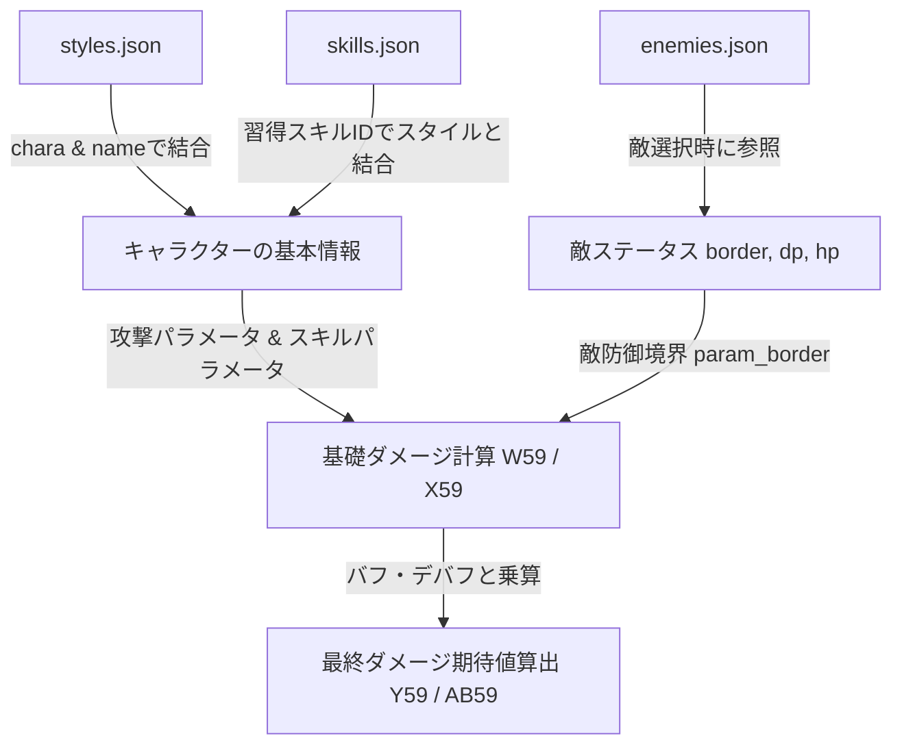

# HBR計算機 マスタデータ＆解析JSONマッピング仕様書

本ドキュメントは、スプレッドシート「HBR計算機」が持つ入力パラメータ・計算用の静的マスタ（バフ・デバフ倍率、スキル威力、敵ステータス等）と、外部解析データ（`seraphdb_json/` 内の各種JSONファイル）のデータ構造を付き合わせ、将来的なデータ統合やプログラム自動化を行うためのマッピング仕様書です。

---

## 1. 全体対応マップ

スプレッドシート内の各マスタ領域が、どのJSONファイルと対応するかの全体対応表です。

| スプレッドシート側のシート / 領域 | 対応するJSONファイル | マッピングキー |
| :--- | :--- | :--- |
| **スタイルリスト改** (Hidden) | `styles.json` | `styles.json` の `chara` / `name` / `tier` |
| **能力値** (Visible) | `characters.json` | `characters.json` の `base_param` (初期値) |
| **スキルサブ情報** (Hidden) | `skills.json` | `skills.json` の `name` / `parts[].power` / `parts[].parameters` |
| **仮想敵** (Hidden) | `enemies.json` | `enemies.json` の `name` / `base_param` |
| **パッシブ** (Hidden) | `passives.json` | `passives.json` |
| **スコアタ計算機** (Visible) | `score_attack.json` | `score_attack.json` |

---

## 2. コア計算ロジックとJSONの付き合わせ詳細

スプレッドシートが手動（またはテキストパース）で行っている処理は、解析JSONの構造化されたデータを直接参照することで、完全に自動化・高精度化が可能です。

### ① スキル適用能力値の計算 (`AJ8` vs `skills.json`)
* **スプレッドシートでの処理**:
  * スキルの種類（通常攻撃、知性依存スキルなど）に応じて、攻撃者のどのステータスをどのような比率で適用するかを判定する複雑な分岐ロジックが存在します。
* **JSON (`skills.json`) での定義**:
  * 各スキルオブジェクトの `parts[].parameters` 内に、適用能力値の重み（ウェイト）が最初からデータとして定義されています。
  * **例（通常攻撃のパラメータ重み）**:
    ```json
    "parameters": {
      "str": 1,   // 力 (Strength)
      "dex": 1,   // 器用さ (Dexterity)
      "wis": 0,   // 知性 (Wisdom)
      "spr": 0,   // 精神 (Spirit)
      "luk": 0,   // 運 (Luck)
      "con": 0    // 体力 (Constitution)
    }
    ```
    重みがある項目の平均（この場合は `(力 + 器用さ) / 2`）が適用能力値になるというロジックを、コード側で動的に判定可能です。

### ② スキル特効倍率のパース (`BF50 / BF51` vs `skills.json`)
* **スプレッドシートでの処理**:
  * `__xludf.DUMMYFUNCTION("IF(countif(..., ""対HP*""), REGEXEXTRACT(...))")`
  * スキルのテキスト説明欄から、「対HP+50%」などの文字列を正規表現で探して抽出しています。
* **JSON (`skills.json`) での定義**:
  * 各スキルの `parts[].multipliers` に、パース済みのクリーンな倍率値が定義されています。
  * **例（対HP特効を持つスキルパーツ）**:
    ```json
    "multipliers": {
      "dp": 1.0,  // 対DPダメージ倍率 (100%)
      "hp": 1.5,  // 対HPダメージ倍率 (150% = 対HP+50%特効)
      "dr": 1.0   // 破壊率上昇倍率
    }
    ```
  * **対応**: `multipliers.hp - 1.0` を計算することで、スプレッドシートの `BF50`（対HP特効値）に直接マッピングできます。

### ③ 敵の防御ステータス境界 (`AY5 / AY6` vs `enemies.json`)
* **スプレッドシートでの処理**:
  * 仮想敵シートにあらかじめ設定された敵ごとの防御パラメータ（「精神」などに対応する境界値）を `VLOOKUP` で引き当てています。
* **JSON (`enemies.json`) での定義**:
  * `enemies.json` の各エネミー情報における `base_param.param_border` が、ダメージ基礎計算の基準となる防御境界ステータスに完全に対応します。
  * **例（スモールホッパーのステータス）**:
    ```json
    "base_param": {
      "dp": 480,
      "hp": 3400,
      "param_border": 250, // ステータス境界値 (AY5などにマッピングされる値)
      "atk_rate": 100.0,
      "d_rate": 5
    }
    ```

---

## 3. 移植時におけるデータ統合（Join）の流れ

他のシステムやPythonライブラリに移植する際、これら分割されたJSONデータをメモリ上で以下のように結合してダメージ計算ロジックに流し込みます。



### 結合アルゴリズム（Python疑似コード）
```python
# 1. 攻撃キャラクターの選択 (手塚咲)
character_name = "手塚咲"
style_name = "天駆の鉄槌のスタイル名"

# 2. スタイルJSONから基本属性を取得
chara_style = next(s for s in styles_data if s["chara"] == character_name and s["name"] == style_name)
weapon_type = chara_style["type"] # Slash/Pierce/Strike

# 3. 使用するスキル情報をスキルJSONから引き当て
skill_name = "天駆の鉄槌"
skill_info = next(sk for sk in skills_data if sk["name"] == skill_name)

# 4. 適用能力値の重みを抽出して攻撃者のステータスから計算
weights = skill_info["parts"][0]["parameters"]
# weightsに基づいて攻撃者の適用ステータス値を算出

# 5. 特効値を取得
hp_mult = skill_info["parts"][0]["multipliers"]["hp"]
hp_special_effect = hp_mult - 1.0  # 対HP特効割合
```
