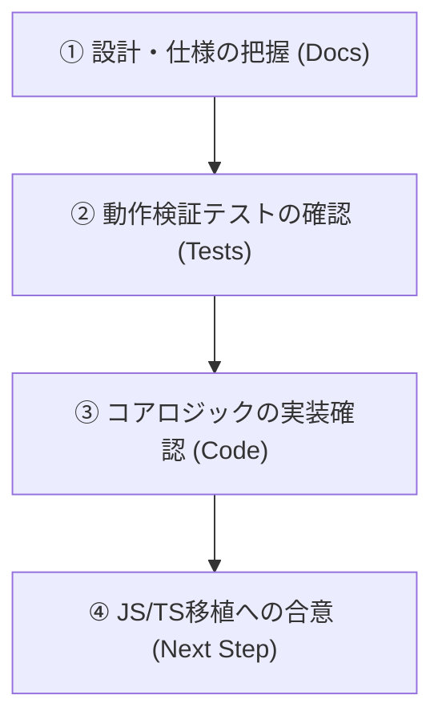

# ダメージ計算モデル（Python版）レビュー準備資料

本ドキュメントは、グラフィカル戦闘シミュレータ `hbr_battle_simulator` へのダメージ計算機能の移植に向けた、Python版計算コアエンジン（フェーズ1・フェーズ2）のレビュー用準備資料です。
本段階では、スプレッドシート上の高精度なダメージ計算数式の完全コード化、知性・運依存の動的バフ効果解決器、および重複上限適用ロジックが完成し、自動テストによって **スプレッドシートの計算結果との完全一致** が保証されています。

---

## 🗺️ 推奨レビュー順序 (Review Roadmap)

レビュアー（開発者またはシステム）は、以下の順番でレビューを行うことで、設計意図からコード実装、テスト検証までを最も効率よく理解・確認できます。



1. **[① 設計・仕様 of 把握]**: 
   - [damage_calculation_model.md](file:///Users/ram4/git/hbr_calc/docs/damage_calculation_model.md) で基礎数式の仕様を把握する。
   - [phase2_design_specification.md](file:///Users/ram4/git/hbr_calc/docs/phase2_design_specification.md) でバフ・デバフの知性スケーリングおよび重複上限の仕様を把握する。
2. **[② 動作検証テストの確認]**:
   - `run_regression_tests.py` (スプレッドシート突合) および `test_phase2.py` (個別ロジック検証) のコードと、その実行結果を確認する。
3. **[③ コアロジックの実装確認]**:
   - `damage_calc_engine.py` の実装コードを読み、仕様通りに数式や分岐、集約処理が書かれているか確認する。
4. **[④ JS/TS移植への合意]**:
   - 確定した入出力JSONスキーマ（TypeScript型定義）に基づき、フェーズ3（TypeScript移植）の実施可否を判断する。

---

## 🗂️ ソースコード・構成ファイルの役割

本リポジトリの主要なファイルとその役割の一覧です。

### ① コアコード
- **[damage_calc_engine.py](file:///Users/ram4/git/hbr_calc/damage_calc_engine.py)**
  - **役割**: ダメージ計算エンジンのコアロジック。
  - **内容**: キャラクターの最大ステータス自動補完、基礎ダメージ計算（通常・クリティカル）、バフ・デバフの動的解決、および重複上限集約フィルタ処理を実行する。
- **[pyproject.toml](file:///Users/ram4/git/hbr_calc/pyproject.toml) / [uv.lock](file:///Users/ram4/git/hbr_calc/uv.lock)**
  - **役割**: パッケージ・依存環境管理（`uv` ツールによる仮想環境構成）。

### ② テスト・検証用コード
- **[run_regression_tests.py](file:///Users/ram4/git/hbr_calc/run_regression_tests.py)**
  - **役割**: スプレッドシートとの突合回帰テスト。
  - **内容**: スプレッドシート `HBR計算機🎭Ver.4.31.03.xlsx` 内の115個のスキルデータ行すべてについて、Pythonの計算値がスプレッドシートの値と完全に一致するかをアサーション検証する。
- **[test_phase2.py](file:///Users/ram4/git/hbr_calc/test_phase2.py)**
  - **役割**: フェーズ2の個別仕様に特化したユニットテスト。
  - **内容**: 知性/運スケーリングの補間、単独バフと通常バフの優先度判定、デバフ・脆弱のカテゴリ別重複上限ルールなどを網羅的にテストする。

### ③ 静的マスタデータ (`seraphdb_json/` フォルダ)
外部の解析データ。エンジンは起動時にこれらのJSONをロードして計算に利用します。
- `styles.json`: キャラクタースタイルの武器属性、最大ステータス、限界突破ボーナス情報。
- `skills.json`: スキルの基礎威力（powerスパン）、依存パラメータ重み、知性依存閾値、成長率情報。
- `enemies.json`: 敵（シャドウ等）のDP/HPおよび防御基準境界値 (`param_border`) 情報。
- `skill_sp_mapping.json`: スキル名と消費SPの対応マップ。

---

## 🔬 数式モデルとロジックの解説

### 1. 基礎通常/クリティカルダメージの算出ロジック
スプレッドシートの数式を元に、攻撃者のステータス（力・器用さなど）と敵の防御値の「差分」に基づいて2次線形補間を行います。

- **通常時境界値**: $Diff_{normal} = Status_{atk} - Border_{def}$
- **クリティカル時境界値**: $Diff_{crit} = Status_{atk} - (Border_{def} - 50)$ （敵防御が50低下した状態として補正）

それぞれの差分が `0` 未満の場合（下限側スパン）と、`0` 以上の場合（上限側スパン、かつ `diff_for_max` が上限）で計算式が分岐します。この仕様はゲーム内のダメージ変化特性（防御が勝っている敵へのダメージ減退と、防御を抜いた後のダメージ増加）を正確に再現しています。

### 2. バフ・デバフの知性・運依存スケーリング
スプレッドシートの非表示マスタシートから解明した、知性・運に応じた線形補間モデルです。
使用者の依存ステータス $X$（知性または運）と、スキルに定義された閾値 $T$（`diff_for_max`）から、以下のように効果量を求めます。

$$
Effect = 
\begin{cases} 
V_{max, L} & (X > T_{final}) \\
\frac{V_{max, L} - V_{min, L}}{T_{final}} \times X + V_{min, L} & (X \le T_{final})
\end{cases}
$$

- $V_{min, L}$ / $V_{max, L}$ : スキルレベル（成長率 `growth`）および宝珠強化レベル（効果量上限+4%/Lv）を適用した下限・上限効果量。
- $T_{final}$ : 宝珠強化による閾値上昇（+60/Lv）を加算した最終閾値。

### 3. カテゴリ別の重複上限（集約ロジック）
ゲーム内の複雑なバフ・デバフ重複ルールを網羅しています。

- **攻撃バフ枠**: `通常バフ（上位2枠の合計）` と `[単独発動]バフ（最大値1枠）` のいずれか大きい方を採用。
- **防御デバフ枠**: 通常防御（上位2枠合計）、永続防御（上位2枠合計）、属性防御（上位2枠合計）、永続属性防御（上位2枠合計）、DP防御（無制限にすべて合計）をそれぞれ集約し、最後に合算。
- **脆弱デバフ枠**: 通常脆弱（上位2枠合計、**弱点攻撃時のみ有効**）、永続脆弱（上位2枠合計、常時有効）を個別に集約して合算。

---

## 🛠️ テスト方法と検証結果のレビュー

実装の正しさは、環境を用意して以下のコマンドを実行することでいつでも再検証が可能です。

### ① スプレッドシート突合回帰テストの実行
スプレッドシートの実データと突合し、期待値にズレがないことを確認します。

```bash
uv run python run_regression_tests.py
```

**期待される出力**:
```text
=== Running Exhaustive Damage Calculator Regression Tests ===
Loading workbook: HBR計算機🎭Ver.4.31.03.xlsx ...
Excel Active State - Attacker: 手塚咲 | Skill: 天駆の鉄槌 | Enemy: #96 シャドウキャンサー・オリジン40
Starting row-by-row validation...

Validation summary: Passed=115 | Mismatches=0 | Skipped=0

🎉 SUCCESS! Python damage calculator matches Excel perfectly!
```

### ② 個別スケーリング・重複上限仕様のユニットテスト実行
フェーズ2で追加した線形補間や重複制限ルールが設計通りに動いているかをアサーション検証します。

```bash
uv run python test_phase2.py
```

**期待される出力**:
```text
.....
----------------------------------------------------------------------
Ran 5 tests in 0.829s

OK
```

---

## 🚪 レビュアーへの確認依頼事項 (Checklist for Reviewers)

レビューの際は、特に以下のポイントに問題がないかご意見を求めてください。

- [ ] **数式の移植精度**: 基礎ダメージおよびクリティカル基礎ダメージの分岐計算式の移植に漏れはないか。
- [ ] **バフ・デバフ集約ロジック**: 通常バフ vs 単独発動バフや、通常脆弱が「弱点攻撃時のみ適用される」仕様の再現に不整合はないか。
- [ ] **JSONスキーマの設計**: シミュレータ側（JS/TS）が管理する戦闘データ構造から、`DamageInputContext` に無理なくパース・構築できそうか。
