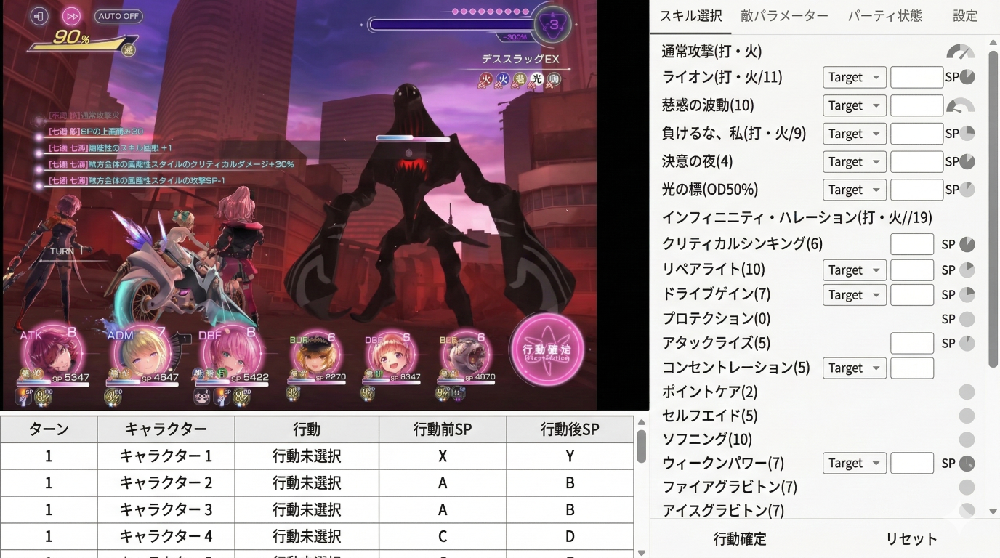

# 戦闘シミュレータ GUIデザイン設計書

本ドキュメントは、ヘブンバーンズレッドの戦闘シミュレータのWebアプリケーションに向けた画面レイアウトおよびデザイン設計を定義するものです。
フロントエンド実装（主にReact + Tailwind CSS）において、コンポーネントの配置やレイアウト構成を生成AIが解釈・実装しやすくなるように構造化されています。

## 目指すデザインモックアップ
YouTubeなどのモダンな動画・情報サイトを参考にした、視認性の高いクリーンな「ライトテーマ」を基調としています。



*※ 上記モックアップは雰囲気・配色の参考です。実際のゲーム画面エリアの画像は、提供された「ヘブンバーンズレッドの実際のゲーム操作画面のスクリーンショット（ラフ画像で提示されたもの）」をそのまま維持して使用します。*

---

## 全体レイアウト構成 (Tailwind CSS Base)

画面全体は「左側（メインビュー）」と「右側（サイドバー・操作パネル）」の2カラムで構成されます。無駄なスクロールを防ぐため、ビューポート全体を占有するSPA（Single Page Application）レイアウトを基本とします。

**Root Container:**
```html
<div class="flex h-screen w-full overflow-hidden bg-gray-50 text-gray-900 font-sans">
  <!-- Left Column -->
  <main class="flex flex-col flex-grow min-w-0 border-r border-gray-200">...</main>
  
  <!-- Right Column -->
  <aside class="flex flex-col w-96 flex-shrink-0 bg-white overflow-y-auto">...</aside>
</div>
```

---

## 1. 左側カラム（メインエリア）

左側カラムは上下2つのエリアに分割されます。
上部はゲーム画面を配置する「グラフィカルビューエリア」、下部は過去の行動履歴などを表示する「レコードテーブルエリア」です。

### 1-1. ゲーム画面ビュー（上部）
実際のゲーム画像（ラフ画像の左上部分）を配置するエリアです。各種ゲージやキャラクターアイコンは、このゲーム画面上に `absolute` ポジションを用いてオーバーレイ配置します。

**Container (Game View):**
```html
<!-- 上部エリア: アスペクト比を固定し、背景にゲーム画像を配置 -->
<div class="relative w-full aspect-video bg-black overflow-hidden shadow-sm">
  
  ...
</div>
```

**【配置パーツとTailwind構成案】**
※ このエリアの背景画像は **提供された実際のゲーム画面（ラフ画像左上）をそのまま使用** し、以下の要素はその画像内にオーバーレイで配置される配置座標の定義とします。

- **最上部 (ゲージ類)**:
  - 場所: 画面上部
  - スタイル: `<div class="absolute top-4 w-full px-8 flex justify-between">`
  - 内容: 
    - **左上**: 黄色い超越ゲージ（パーセンテージと雷アイコンが特徴的）
    - **右上**: 横長バーと、中に数字（例：「-3」）が入った丸アイコンを持つODゲージ
- **左中央下 (ターン情報)**:
  - 場所: 画面の左側寄りの中央から少し下部
  - スタイル: `<div class="absolute top-[60%] left-[15%]">`
  - 内容: 現在のターン数（「TURN 1」など）
- **最下部 (キャラクターアイコン群)**:
  - 場所: 画面下部、横一列に **6人並ぶ**
  - スタイル: `<div class="absolute w-full bottom-4 flex justify-between items-end px-12">`
  - **アイコン構造**: 
    丸いアイコンの中に顔画像（スタイル画像）を入れ、**その右上に白い文字でSPの数字**を表示します。アイコンの真下にはDPなどのステータス数値を配置します。
    ```html
    <!-- キャラクター個別アイコンの基本構造 -->
    <div class="relative w-16 h-16 md:w-20 md:h-20 flex flex-col items-center">
      <div class="relative w-full h-full rounded-full border-2 border-fuchsia-500 shadow-md overflow-hidden cursor-pointer hover:ring-2 ring-fuchsia-400 transition-all bg-gray-200">
        <!-- 顔の画像 -->
        
        
        <!-- 右上のSP表示 (必須: 丸枠内または枠上に重なる白文字) -->
        <div class="absolute top-0 right-0 bg-black/60 rounded-full w-6 h-6 flex items-center justify-center border border-gray-400">
          <span class="text-white text-xs font-bold leading-none">8</span>
        </div>
      </div>
      <!-- 下部のステータス表示 (例: DP 5347) -->
      <div class="mt-1 bg-black/80 px-2 py-0.5 rounded text-[10px] sm:text-xs font-bold text-white whitespace-nowrap">
        DP 5347
      </div>
    </div>
    ```

### 1-2. ターンレコードテーブル（下部）
行動ログを詳細に確認するためのリストビューです。白背景に薄いグレーの罫線を用いたクリーンなデザインで、縦スクロール可能とします。

**Container (Record Table):**
```html
<div class="flex-1 overflow-y-auto bg-white p-6">
  <table class="w-full text-left text-sm whitespace-nowrap border-collapse">
    <thead class="sticky top-0 bg-gray-100 text-gray-700 shadow-sm z-10">
      <tr>
        <th class="py-3 px-4 border-b border-gray-200 font-semibold">ターン</th>
        <th class="py-3 px-4 border-b border-gray-200 font-semibold">キャラクター</th>
        <th class="py-3 px-4 border-b border-gray-200 font-semibold">行動</th>
        <th class="py-3 px-4 border-b border-gray-200 font-semibold">行動前 SP</th>
        <th class="py-3 px-4 border-b border-gray-200 font-semibold">行動後 SP</th>
      </tr>
    </thead>
    <tbody class="divide-y divide-gray-200 text-gray-800">
      <!-- レコード行 -->
      <tr class="hover:bg-gray-50 transition-colors">...</tr>
    </tbody>
  </table>
</div>
```

---

## 2. 右側カラム（サイドバー / 操作パネル）

右側のサイドバーは、タブによって情報を切り替え、ユーザーがシミュレータの各種設定やスキル選択を行う操作エリアです。YouTubeのサイドバーやコメント欄のような、白背景でフラットな構造を持ちます。

**Container (Sidebar):**
```html
<aside class="w-96 flex flex-col bg-white border-l border-gray-200 shadow-sm overflow-hidden">
  ...
</aside>
```

**【配置パーツとTailwind構成案】**
- **タブ切り替えヘッダ**:
  - スタイル: `<header class="flex w-full bg-white border-b border-gray-200 px-4 pt-4 gap-4">`
  - 内容: 「スキル選択」「部隊設定」などのタブ。アクティブ状態は黒い太めの下線（YouTubeライク）で表現。
  ```html
  <button class="pb-2 text-sm font-medium text-gray-900 border-b-2 border-gray-900">スキル選択</button>
  <button class="pb-2 text-sm font-medium text-gray-500 hover:text-gray-700">部隊設定</button>
  ```
- **コンテンツエリア**:
  - スタイル: `<div class="flex-1 overflow-y-auto p-4 flex flex-col gap-4">`
- **スキル一覧要素 (リスト表現)**:
  - 選択可能なスキルが縦に並ぶUI。テキストベースでシンプルなリスト構造。
  ```html
  <ul class="flex flex-col">
    <li class="flex flex-col py-3 border-b border-gray-100 cursor-pointer hover:bg-gray-50 px-2 rounded transition-colors group">
      <h4 class="text-sm font-bold text-gray-900 group-hover:text-blue-600">通常攻撃(打・火)</h4>
      <p class="text-xs text-gray-500 mt-1">消費SP: 0</p>
    </li>
    <li class="flex flex-col py-3 border-b border-gray-100 cursor-pointer hover:bg-gray-50 px-2 rounded transition-colors group">
      <h4 class="text-sm font-bold text-gray-900 group-hover:text-blue-600">ライオンハート</h4>
      <p class="text-xs text-gray-500 mt-1">消費SP: 4</p>
    </li>
  </ul>
  ```
- **部隊選択丸ボタン**:
  ラフ画像にある緑の「0〜8」の部隊選択ボタン。
  ```html
  <div class="flex flex-wrap gap-2 mb-4">
    <button class="w-8 h-8 rounded-full bg-green-600 hover:bg-green-700 text-white text-sm font-bold flex items-center justify-center shadow-sm">1</button>
    <button class="w-8 h-8 rounded-full bg-white border border-gray-300 hover:bg-gray-50 text-gray-700 text-sm font-bold flex items-center justify-center">2</button>
  </div>
  ```
- **各種フォーム（Select）**:
  ライトテーマに合わせたシンプルでフラットなフォーム要素。
  ```html
  <select class="w-full bg-white border border-gray-300 text-gray-900 text-sm rounded-md px-3 py-2 outline-none focus:ring-2 focus:ring-blue-500 focus:border-blue-500 transition-shadow">
    <option>火撃ピアス</option>
  </select>
  ```

---

## 開発時のAI連携ガイド (Prompt Tips)

のちにフロントエンド生成AIへこのレイアウト構造を渡す場合、以下の指示を付与すると精度の高いUIが得られます。

> **AIへの指示プロンプト例：**
> 「このマークダウンの Tailwind CSS ガイドをベースに、画面レイアウトを React で組んでください。YouTubeのようなクリーンで視認性の高いライトテーマ（背景色は白 `bg-white` や薄いグレー `bg-gray-50`）を採用してください。左下キャラクターアイコンのドラッグ＆ドロップ機能は `dnd-kit` もしくは `react-beautiful-dnd` を使用して実装し、アイコン内には `absolute` でSP/EPのバッジを配置してください。」
