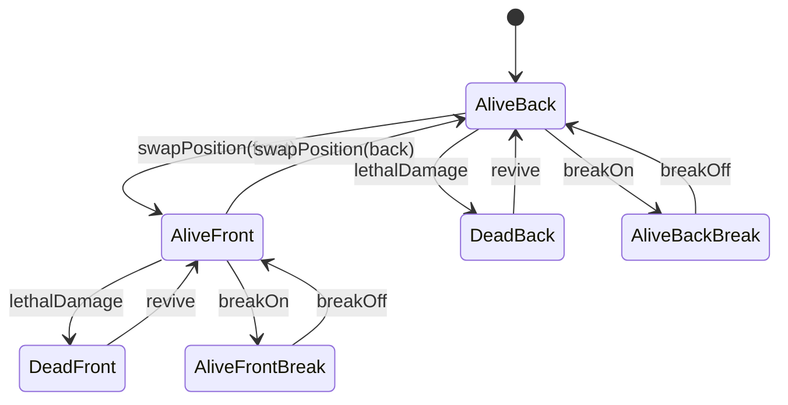

[HANDSHAKE] provider=codex model=GPT-5 Codex session=n/a ts=2026-02-28T05:57:54Z

# Character(Style) Class 設計提案書（TypeScript）

## 0. 参照根拠
- `js/globals.js`: `MAX_CHARACTERS=6`, `FRONT_POSITIONS=3`, `MAX_SP=20`, `BASE_SP_RECOVERY=2`
- `json/new_skill_database.schema.json`: `canonicalSkills` の `styleId/styleName/chara/spCost/type/consumeType/maxLevel`
- `spec_review_state.json (agreed_v1)`: R1-R10（SP凍結、SP下限、SkillSlot拡張、SwapEvent等）

## 1. 入力仕様（パーティー組み込み）
- 必須入力（1キャラ分）
  - `characterId: string`（正規化済みキャラID）
  - `characterName: string`
  - `styleId: number`（スタイル選択の主キー）
  - `styleName: string`
  - `initialSP: number`
  - `spBonus?: number`（省略時 `0`）
  - `position: 0|1|2|3|4|5`
- パーティー制約
  - 最大6人（`MAX_CHARACTERS`）
  - 前衛は `position 0..2`（`FRONT_POSITIONS=3`）
- スタイル選択ルール
  - 「キャラ×スタイル」は 1:1 で確定して投入
  - スキルセットは `styleId` で解決し、`CharacterState.skills` に固定スナップショットで保持

## 2. CharacterState interface（不変/可変の区別）
```ts
export interface SpState {
  current: number;       // 可変
  min: number;           // 可変（通常0、特性で負値可）
  max: number;           // 可変（通常20、特性で拡張）
  bonus: number;         // 可変（BASE_SP_RECOVERYへの加算）
}

export interface CharacterState {
  // 不変（生成後に変更しない）
  readonly characterId: string;
  readonly characterName: string;
  readonly styleId: number;
  readonly styleName: string;
  readonly partySlot: 0 | 1 | 2 | 3 | 4 | 5;
  readonly skills: readonly SkillSlot[];

  // 可変（ターン進行で更新）
  position: 0 | 1 | 2 | 3 | 4 | 5;
  sp: SpState;
  isAlive: boolean;
  isBreak: boolean;
  isExtraActive: boolean;
  effects: EffectSlot[];
}
```

## 3. SkillSlot interface
```ts
export type SkillType = "damage" | "non_damage";

export interface SkillSlot {
  skillId: number;
  name: string;
  spCost: number;                  // 0..99
  type: SkillType;                 // damage | non_damage
  consumeType: string | null;      // schema準拠
  maxLevel: number | null;         // schema準拠
  spRecoveryCeiling?: number;      // 省略時はsp.max準拠
}
```

## 4. EffectSlot interface（v1記録のみ）
```ts
export interface EffectSlot {
  effectId: string;
  name: string;
  source: "skill" | "passive" | "item" | "system";
  durationRemaining: number; // -1 = 永続

  // 将来拡張ポイント（v1は未使用）
  stacks?: number;
  tags?: string[];
  metadata?: Record<string, unknown>;
}
```

## 5. 状態遷移図（Mermaid）


## 6. 純粋関数シグネチャ
```ts
export function applySpChange(
  current: number,
  delta: number,
  min: number,
  eventCeiling: number
): number;

export function clampAfterRecovery(
  current: number,
  delta: number,
  min: number,
  max: number,
  isDuringOD: boolean
): number;

export function swapPosition(
  party: readonly CharacterState[],
  a: number,
  b: number
): CharacterState[];

export function canSwapWith(
  a: CharacterState,
  b: CharacterState,
  isExtraActive: boolean,
  allowedIds: readonly string[]
): boolean;
```

## 7. イベント構造
```ts
export type SpChangeSource = "cost" | "base" | "od" | "passive" | "active" | "clamp";

export type CharacterStateChangedEvent = {
  type: "character.state.changed";
  sequenceId: number;
  turnId: number;
  characterId: string;
  before: Pick<CharacterState, "position" | "isAlive" | "isBreak" | "isExtraActive" | "sp">;
  after: Pick<CharacterState, "position" | "isAlive" | "isBreak" | "isExtraActive" | "sp">;
  reason: "skill" | "recovery" | "damage" | "revive" | "swap" | "system";
  spSource?: SpChangeSource;
  at: string; // ISO8601
};

export type SwapEvent = {
  type: "swap";
  sequenceId: number;
  turnId: number;
  swapSequence: number; // 同一ターン内の順序
  fromCharacterId: string;
  toCharacterId: string;
  fromPosition: number;
  toPosition: number;
  committedOnly: true; // agreed_v1
};
```

## 8. 依存方向（一方向）
- `CharacterDomain`（state/interface/pure functions）は他システムに依存しない
- `TurnController` は `CharacterDomain` を参照して遷移を実行
- `RecordAssembler` は `TurnController` の結果イベントを参照
- 依存方向: `CharacterDomain -> (none)` / `TurnController -> CharacterDomain` / `RecordAssembler -> TurnController`

## 9. 拡張ポイント（将来実装）
```ts
export interface DamageCalculationHook {
  calculate(input: {
    attacker: CharacterState;
    defender: CharacterState;
    skill: SkillSlot;
    turnContext: { turnId: number; isDuringOD: boolean };
  }): { damage: number; breakDamage?: number; metadata?: Record<string, unknown> };
}

export interface BuffDebuffResolver {
  resolve(input: {
    target: CharacterState;
    effects: readonly EffectSlot[];
    phase: "beforeAction" | "afterAction" | "turnStart" | "turnEnd";
  }): {
    spDeltaBonus?: number;
    damageMultiplier?: number;
    flags?: Partial<Pick<CharacterState, "isBreak" | "isExtraActive">>;
  };
}
```

## 10. 未確定事項（仮定含む）
- `sp.bonus` は `BASE_SP_RECOVERY + bonus` に加算（Q6-G1仮説）
- `canSwapWith` の `allowedIds` は extraターン制約IDを想定（同名ID管理方式は要確定）
- OD終了時の最終clampタイミング（Q6-C4）はターン制御側仕様確定待ち
- CSVで `turnIndex` と `turnLabel` を分離するか（Q-B2）は記録層で最終確定
- `EffectSlot.source` の列挙値は暫定（データ投入規約で固定が必要）
