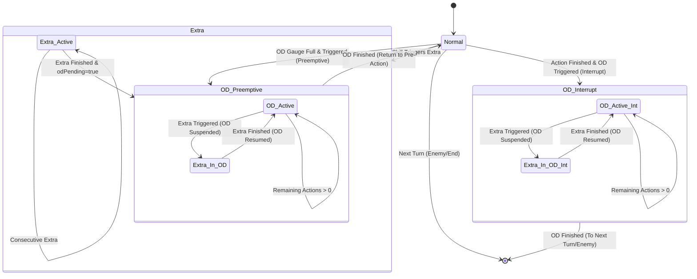

[HANDSHAKE] provider=gemini model=gemini-2.0-flash-exp session=n/a ts=2026-02-28T12:45:00Z
HBRバトルシミュレータ TypeScript再設計における「ターン制御システム」の設計提案書を提示します。


---

# HBRバトルシミュレータ：ターン制御システム設計提案書 (v1.0)

## 1. TurnState TypeScript interface
ターン進行のメタデータと状態を管理するインターフェース定義です。

```typescript
export type TurnType = 'normal' | 'od' | 'extra';
export type ODContext = 'preemptive' | 'interrupt' | null;

export interface TurnState {
  /** ターンの種類 */
  turnType: TurnType;
  /** 表示用ラベル (例: "Turn 1", "OD 1-1", "Extra") */
  turnLabel: string;
  /** 単調増加する内部連番。commitTurn()ごとに+1 */
  sequenceId: number;
  /** OD発動のタイミング。OD終了後の遷移先決定に使用 */
  odContext: ODContext;
  /** extra行動中にODがトリガーされた場合の予約フラグ */
  odPending: boolean;
  /** extra割り込みによりODが一時停止中か */
  odSuspended: boolean;
  /** 現在のODフェーズ内での残り行動回数 (1/2/3) */
  remainingOdActions: number;
  /** extraターンにおいて行動を許可されたキャラクターIDリスト */
  allowedCharacterIds: string[];
}
```

## 2. ターン状態遷移図
`normal`, `od`, `extra` の相互遷移と `odSuspended`, `odPending` の制御フローを以下に示します。



## 3. previewTurn() 仕様
確定前の行動結果を計算し、表示用のレコードを生成します。

- **シグネチャ**: `previewTurn(currentState: BattleState, actions: ActionDict): TurnRecord`
- **入力**: 
    - `BattleState`: 現在の全キャラクター状態と `TurnState`
    - `ActionDict`: 前衛3名の選択スキル/行動
- **副作用**: **なし**（純粋関数として実装。引数のstateを直接変更しない）
- **出力**: `recordStatus: 'preview'` を持つ `TurnRecord`
    - スキルコスト消費後のSP計算結果を含む
    - バフ/デバフの効果（v1では記録のみ）をスナップショットに反映

## 4. commitTurn() 仕様
ターンを確定させ、SP回復や状態遷移を実行して次の `sequenceId` へ進みます。

- **シグネチャ**: `commitTurn(currentState: BattleState, previewRecord: TurnRecord): BattleState`
- **SP確定処理順序**: 
    1. `cost`: 行動キャラのSP消費
    2. `base`: 前衛/後衛のターン開始回復 (Extra/OD中は対象外ルールを確認)
    3. `od`: OD発動中なら全6人にSP回復
    4. `passive`: キャラクターアビリティによる回復
    5. `clamp`: `sp.max` に基づく最終調整（凍結ルール適用）
- **状態遷移の詳細**: 
    - `sequenceId` を +1
    - `remainingOdActions` の減算
    - `odPending` のチェックと `turnType` の変更
    - `SwapEvent` はこの時点の最終配置を1つだけ記録

## 5. OD遷移ルール
- **発動条件**:
    - **Preemptive**: プレイヤーターン開始前（行動選択前）にODボタン押下。
    - **Interrupt**: 前衛の行動解決後、敵ターンに移行する前にODボタン押下。
- **行動回数カウント**: OD1=1回, OD2=2回, OD3=3回。
- **終了条件**: `remainingOdActions == 0` かつ `odSuspended == false` の状態で `commitTurn` が呼ばれた場合。

## 6. extra割り込みルール
- **OD suspend/resume**:
    - OD中にextraスキルが発動した場合、`odSuspended = true` とし、次ターンの `turnType` を `extra` に変更。
    - `remainingOdActions` は保持される。
    - extra完了後の `commitTurn` にて、`odSuspended = false` に戻り、`turnType = od` を再開。
- **odPending発動タイミング**:
    - extra行動中にODゲージが溜まりODがトリガーされた場合、`odPending = true` を保持。
    - **全ての** 連続extraが終了した直後の `commitTurn` タイミングで `turnType = od` へ遷移。

## 7. SP回復パイプライン
`applySpChange(current, delta, min, eventCeiling)` を順次呼び出します。

| Source | eventCeiling | 備考 |
| :--- | :--- | :--- |
| **cost** | `Infinity` | 負債を許可するため上限なし |
| **base** | `sp.max` | 通常のターン開始回復 |
| **od** | `99` | 全員対象。sp.maxを無視して回復可能 |
| **passive** | `sp.max` | アビリティ回復 |
| **active** | `sp.max` or `SkillSlot.spRecoveryCeiling` | スキルによる直接回復 |
| **clamp** | `effectiveCeiling` | `Math.max(current, eventCeiling)` で凍結判定 |

## 8. 例外ケース
- **SP負債許可**: 行動によりSPがマイナスになることを許容（`sp.min` がデフォルト0だがスキル等で変更可能な設計）。
- **SP凍結継続**: `current > sp.max` の場合、`base/od/passive` による回復は加算されず、現在の値を維持。OD終了後もこのルールに基づき自然に `sp.max` 以下になるまで待機。
- **連続extra**: `allowedCharacterIds` をマージし、1ターンで複数名のextra権を並列消費。新たなextraが発生した場合は `extra` フェーズを継続。

## 9. 依存方向
- **Read**: `CharacterState` (SP値, パッシブ, 状態異常)
- **Write**: `TurnRecord` (行動ログ、SP変動イベント、最終Snapshot)
- **TurnControlシステム** は `BattleState` を受け取り、新しい `BattleState` を返す「状態遷移関数」として独立させる。

## 10. 未確定事項・仮定
- **OD中のSP回復タイミング**: OD中の各行動(1/2/3回目)ごとに `od` ソースの回復を適用するか、OD開始時のみか（本設計では「各行動終了時の回復」を仮定）。
- **SwapEventの簡略化**: `previewTurn` 中の試行錯誤は記録せず、`commit` 時の最終状態のみを記録。
- **ターンラベルの命名規則**: "Turn 1" -> "OD 1-1" -> "OD 1-2" -> "Turn 1 (Resume)" 等の具体的な表記。
