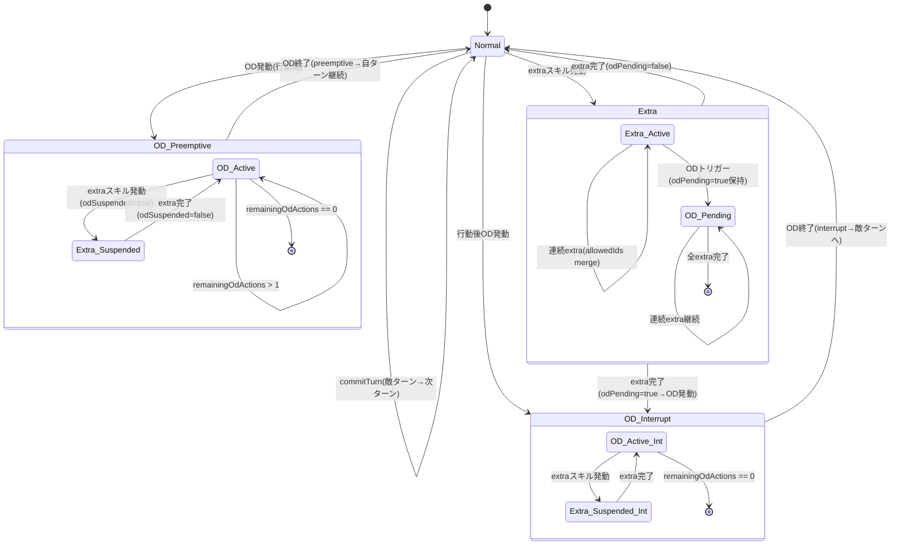

[HANDSHAKE] provider=claude model=claude-sonnet-4-6 session=n/a ts=2026-02-28T00:10:00Z

# 統合アーキテクチャ仕様

**RUN**: RUN_20260228_001
**策定**: Claude（リーダー）、Codex・Geminiのレビュー知見を統合
**参照**: codex_character_class_design.md, gemini_turn_control_design.md, claude_action_record_design.md + 全レビュー

---

## 1. システム境界と責務分割

```
┌─────────────────────────────────────────────────────────────────────────┐
│                         HBR Battle Simulator v1                         │
│                                                                          │
│  ┌──────────────────────┐                                                │
│  │  CharacterDomain     │  ← 純粋関数 + イミュータブル型定義             │
│  │  ・CharacterState    │    他システムへ依存しない（最下層）             │
│  │  ・SpState           │                                                │
│  │  ・SkillSlot         │                                                │
│  │  ・EffectSlot        │                                                │
│  │  ・applySpChange()   │                                                │
│  │  ・canSwapWith()     │                                                │
│  └────────┬─────────────┘                                                │
│           │ 参照（read-only）                                             │
│  ┌────────▼─────────────────────────┐                                    │
│  │  TurnController                  │  ← ターン状態機械                  │
│  │  ・TurnState / BattleState       │    CharacterDomainを参照           │
│  │  ・previewTurn()                 │    RecordAssemblerへ書き込む        │
│  │  ・commitTurn()                  │                                    │
│  │  ・OD/extra状態機械             │                                    │
│  └────────┬─────────────────────────┘                                    │
│           │ TurnContextInput + CharacterSnapshot（スナップショット経由）   │
│  ┌────────▼─────────────────────────┐                                    │
│  │  ActionRecordSystem              │  ← 行動記録・編集・CSV出力          │
│  │  ・BattleRecordStore             │    BattleState依存を排除           │
│  │  ・RecordAssembler               │    スナップショット入力のみ受理      │
│  │  ・RecordEditor                  │                                    │
│  │  ・CsvExporter                   │                                    │
│  └────────┬─────────────────────────┘                                    │
│           │ BattleRecordEvent                                             │
│  ┌────────▼─────────────────────────┐                                    │
│  │  UI Layer                        │  ← DOM/表示（既存ResultsManager）  │
│  └──────────────────────────────────┘                                    │
└─────────────────────────────────────────────────────────────────────────┘

依存方向: CharacterDomain → (なし)
         TurnController → CharacterDomain
         ActionRecordSystem → CharacterDomain（型定義のみ）
         UI Layer → ActionRecordSystem, TurnController
```

---

## 2. 共有型定義（全システムが参照）

```typescript
// ========================
// 共有集約型 BattleState
// (Q-BS1解決: TurnControllerが所有、CharacterDomainと共に shared-types.ts に配置)
// ========================
interface BattleState {
  readonly party: readonly CharacterState[];  // [0..5] 固定長6
  readonly turnState: TurnState;
  readonly positionMap: readonly [number, number, number, number, number, number];
  readonly initialParty: readonly CharacterSnapshot[]; // バトル開始時固定（CSV列用）
}
```

---

## 3. CharacterDomain（Codex設計 + Claudeレビュー反映）

```typescript
// ========== SP型 ==========
interface SpState {
  current: number;  // 可変（負債も許可: R10確定）
  min: number;      // 可変（デフォルト0、特性でマイナス可）
  max: number;      // 可変（デフォルト20、特性で25/30拡張可）
  bonus: number;    // 可変（BASE_SP_RECOVERY=2 への加算: Q6-G1仮採用）
}

// ========== スキル ==========
type SkillType = 'damage' | 'non_damage';

interface SkillSlot {
  skillId: number;
  name: string;
  spCost: number;               // 0..99
  type: SkillType;
  consumeType: string | null;
  maxLevel: number | null;
  /**
   * スキルによるSP回復の上限値。省略時は sp.max を使用（通常ルール）。
   * 指定時は eventCeiling にこの値を適用（R10確定）。
   */
  spRecoveryCeiling?: number;
}

// ========== エフェクト（v1=記録のみ）==========
interface EffectSlot {
  effectId: string;
  name: string;
  source: 'skill' | 'passive' | 'item' | 'system'; // (Q-EF1: 仮確定、要ユーザー確認)
  durationRemaining: number; // -1 = 永続（v1デフォルト）
  // 将来拡張ポイント（v1は未使用）
  stacks?: number;
  tags?: string[];
}

// ========== キャラクター状態 ==========
interface CharacterState {
  // --- 不変（生成後に変更しない）---
  readonly characterId: string;     // 正規化済みキャラID
  readonly characterName: string;
  readonly styleId: number;
  readonly styleName: string;
  readonly partyIndex: 0|1|2|3|4|5; // 初期パーティーインデックス（不変）
  readonly skills: readonly SkillSlot[];

  // --- 可変（ターン進行で更新）---
  position: 0|1|2|3|4|5;           // 現在のポジション（交代で変化）
  sp: SpState;
  isAlive: boolean;
  isBreak: boolean;
  isExtraActive: boolean;
  effects: EffectSlot[];
}

// ========== キャラクタースナップショット（不変コピー）==========
type CharacterSnapshot = Readonly<{
  characterId: string;
  characterName: string;
  partyIndex: number;               // 初期インデックス（CSV列固定用）
  positionIndex: number;            // スナップショット時点のポジション
  isFront: boolean;
  sp: Readonly<SpState>;
  isAlive: boolean;
  isBreak: boolean;
  isExtraActive: boolean;
}>;

// ========== 純粋関数 ==========

/**
 * SP変動統一関数（R10確定）
 * 凍結ルール: effectiveCeiling = Math.max(current, eventCeiling)
 * delta > 0（回復）の場合のみ凍結ルールが適用される
 */
function applySpChange(
  current: number,
  delta: number,
  min: number,
  eventCeiling: number
): number {
  if (delta > 0) {
    const effectiveCeiling = Math.max(current, eventCeiling); // 凍結ルール統一式
    return Math.max(min, Math.min(current + delta, effectiveCeiling));
  }
  return Math.max(min, current + delta); // 消費はceilingなし（負債許可）
}

/**
 * eventCeiling取得（R10確定の一覧）
 */
function getEventCeiling(
  source: SpChangeSource,
  spMax: number,
  skillCeiling?: number
): number {
  switch (source) {
    case 'cost':    return Infinity; // 負債許可
    case 'od':      return 99;       // OD回復は sp.max を無視して最大99
    case 'active':  return skillCeiling ?? spMax;
    default:        return spMax;    // base/passive/clamp
  }
}

/**
 * 交代可否判定（純粋関数: BattleState依存排除）
 */
function canSwapWith(
  a: CharacterState,
  b: CharacterState,
  isExtraActive: boolean,
  allowedCharacterIds: readonly string[]
): boolean;

/**
 * ポジション交代（イミュータブル: 新配列を返す）
 */
function swapPosition(
  party: readonly CharacterState[],
  posA: number,
  posB: number
): readonly CharacterState[];
```

---

## 4. TurnController（Gemini設計 + Codexレビュー反映）

```typescript
// ========== OD ==========
type ODContext = 'preemptive' | 'interrupt' | null;

// ========== ExtraTurnState（Codexレビュー提案採用）==========
interface ExtraTurnState {
  active: boolean;
  remainingActions: number;   // 同時並列付与でも1固定（R7確定）
  allowedCharacterIds: string[];
  grantTurnIndex: number;
}

// ========== TurnState ==========
interface TurnState {
  turnIndex: number;          // 敵ターン遷移で+1（表示用ターン番号）
  sequenceId: number;         // commitTurnごとに+1（単調増加内部連番: R7確定）
  turnType: TurnType;
  turnLabel: string;          // 表示値（"T1", "OD1-1", "EX": 生成はTurnControllerが担当）

  // OD管理
  odLevel: 0 | 1 | 2 | 3;    // 0=非OD (Codexレビューで追加)
  remainingOdActions: number; // OD1=1, OD2=2, OD3=3
  odContext: ODContext;
  odSuspended: boolean;       // extra割り込み中にtrue
  odPending: boolean;         // extra中にODトリガー→extra完了後に発動

  // Extra管理
  extraTurnState: ExtraTurnState | null; // null=extra非活性
}

// ========== previewTurn ==========
interface ActionDict {
  [positionIndex: number]: { skillId: number; characterId: string };
}

/**
 * previewTurn: 純粋関数（副作用なし）
 * BattleStateを受け取り、recordStatus='preview'のTurnRecordを返す
 */
function previewTurn(
  state: BattleState,
  actions: ActionDict,
  enemyAction: string | null
): TurnRecord;

/**
 * commitTurn: ターン確定（新しいBattleStateを返す）
 * SP確定処理順: cost → base → od → passive → clamp
 */
function commitTurn(
  state: BattleState,
  previewRecord: TurnRecord,
  swapEvents: SwapEvent[]  // commitTurn時点の最終交代状態
): { nextState: BattleState; committedRecord: TurnRecord };
```

---

## 5. ActionRecordSystem（Claude設計 + Geminiレビュー反映）

```typescript
// ========== SP変動 ==========
type SpChangeSource = 'cost' | 'base' | 'od' | 'passive' | 'active' | 'clamp';

interface SPChangeEntry {
  source: SpChangeSource;
  delta: number;
  preSP: number;
  postSP: number;
  eventCeiling: number;
}

// ========== 行動エントリ ==========
interface ActionEntry {
  characterId: string;
  characterName: string;
  partyIndex: number;          // 初期パーティーインデックス（CSV列固定用: Geminiレビュー採用）
  positionIndex: number;       // 行動時のポジション
  isExtraAction: boolean;      // extraターン内の行動か（Geminiレビュー提案採用）
  skillId: number;
  skillName: string;
  spCost: number;
  spChanges: SPChangeEntry[];
  startSP: number;
  endSP: number;
}

// ========== 交代イベント ==========
interface SwapEvent {
  swapSequence: number;
  fromPositionIndex: number;
  toPositionIndex: number;
  outCharacterId: string;
  outCharacterName: string;
  inCharacterId: string;
  inCharacterName: string;
}

// ========== TurnRecord ==========
type RecordStatus = 'preview' | 'committed';

interface TurnRecord {
  turnId: number;              // = sequenceId（R7確定: turnIdとsequenceIdを統一）
  turnIndex: number;
  turnLabel: string;
  turnType: TurnType;
  recordStatus: RecordStatus;

  odContext: ODContext;
  isExtraTurn: boolean;
  remainingOdActionsAtStart: number;

  // スナップショット（snapBeforeはpreviewTurn呼び出し直前: Q-CL1仮採用）
  snapBefore: CharacterSnapshot[];
  snapAfter: CharacterSnapshot[];   // committedでのみ有効（previewはnull可）

  enemyAction: string | null;
  actions: ActionEntry[];
  swapEvents: SwapEvent[];          // previewでも保持可（Geminiレビュー採用）
  effectSnapshots: EffectSnapshot[];

  createdAt: string;
  committedAt: string | null;
}

// ========== RecordAssembler ==========
interface TurnContextInput {
  turnIndex: number;
  turnLabel: string;
  turnType: TurnType;
  odContext: ODContext;
  isExtraTurn: boolean;
  remainingOdActionsAtStart: number;
  enemyAction: string | null;
}

interface RecordAssembler {
  fromSnapshot(
    snapBefore: CharacterSnapshot[],
    context: TurnContextInput,
    actions: ActionEntry[],
    swapEvents: SwapEvent[],   // previewでも渡す
    sequenceId: number
  ): TurnRecord;

  commitRecord(
    preview: TurnRecord,
    snapAfter: CharacterSnapshot[],
    swapEvents: SwapEvent[],   // commitTurn時の最終状態で上書き
    committedAt: string
  ): TurnRecord;
}

// ========== RecordEditor（表計算ライク）==========
interface RecordEditor {
  upsertRecord(store: BattleRecordStore, record: TurnRecord): BattleRecordStore;
  deleteRecord(store: BattleRecordStore, turnId: number, opts?: { cascade: boolean }): BattleRecordStore;
  insertBefore(store: BattleRecordStore, targetTurnId: number, record: TurnRecord): BattleRecordStore;
  reindexTurnLabels(store: BattleRecordStore): BattleRecordStore;
}

// ========== CsvExporter ==========
interface CsvExporter {
  /**
   * Google Spreadsheet互換CSV生成
   * 列固定: initialPartyのpartyIndex順（交代があっても同キャラは同列: Geminiレビュー採用）
   */
  exportToCSV(store: BattleRecordStore, initialParty: CharacterSnapshot[]): string;
  recordToRow(record: TurnRecord, initialParty: CharacterSnapshot[]): string[];
}

// CSV列構造:
// [turnLabel, enemyAction,
//  char[partyIndex=0].startSP, char[partyIndex=0].action, char[partyIndex=0].endSP,
//  char[partyIndex=1].startSP, char[partyIndex=1].action, char[partyIndex=1].endSP,
//  ...,
//  char[partyIndex=5].startSP, char[partyIndex=5].action, char[partyIndex=5].endSP]
```

---

## 6. ターン状態遷移（統合）



---

## 7. SP変動パイプライン（commitTurn内）

```
per キャラクター per ターン:

1. cost:  applySpChange(sp.current, -skill.spCost, sp.min, Infinity)
          → SP負債許可（R10確定）

2. base:  applySpChange(sp.current, BASE_SP_RECOVERY + sp.bonus, sp.min, sp.max)
          → 凍結ルール適用（current > sp.max なら回復無効）

3. od:    (OD中のみ) applySpChange(sp.current, odRecovery, sp.min, 99)
          → current > 99 の場合も回復可（R10確定のOD例外）
          → 全6人に適用

4. passive: applySpChange(sp.current, passiveDelta, sp.min, sp.max)
            → 各キャラのパッシブ効果

5. clamp: Math.max(sp.min, Math.min(sp.current, effectiveCeiling))
          → effectiveCeiling = Math.max(sp.current, sp.max)（凍結ルール）
          → OD終了時のclampは発生しない（凍結継続: R10確定）
```

---

## 8. 未確定事項（統合後の残課題）

| ID | 優先度 | テーマ | 質問 | 仮採用 | 出典 |
|----|--------|--------|------|--------|------|
| Q-B2 | Should | CSV | turnIndex（内部連番）とturnLabel（表示値）をCSV列として分離するか | turnLabelのみ | R7 |
| Q-G1 | Should | キャラクター | sp.bonusの用途はBASE_SP_RECOVERY+bonusへの加算で確定か | 加算仮採用 | R6 |
| Q-C4 | Should | ターン制御 | OD終了時のSP clampはOD最終行動の全回復適用後か | 全回復後にclamp | R6 |
| Q-CL1 | Should | 記録 | snapBeforeはpreviewTurn呼び出し直前か | 直前スナップショット | 本設計 |
| Q-EF1 | Should | エフェクト | EffectSlot.source確定値（skill/passive/item/system） | 仮確定 | Codexレビュー |
| Q-BS1 | Must | 共有型 | BattleState共有型の所有モジュール | shared-types.ts | Claudeレビュー |
| Q-OD1 | Should | OD | OD中のSP回復タイミング（各行動後か/OD開始時のみか） | 各行動後 | Gemini設計 |
| Q-CSV1 | Should | CSV | Swap時のCSV列表現（skillName列に[Swap]を記入か専用列か） | skillName列に記入 | Geminiレビュー |
